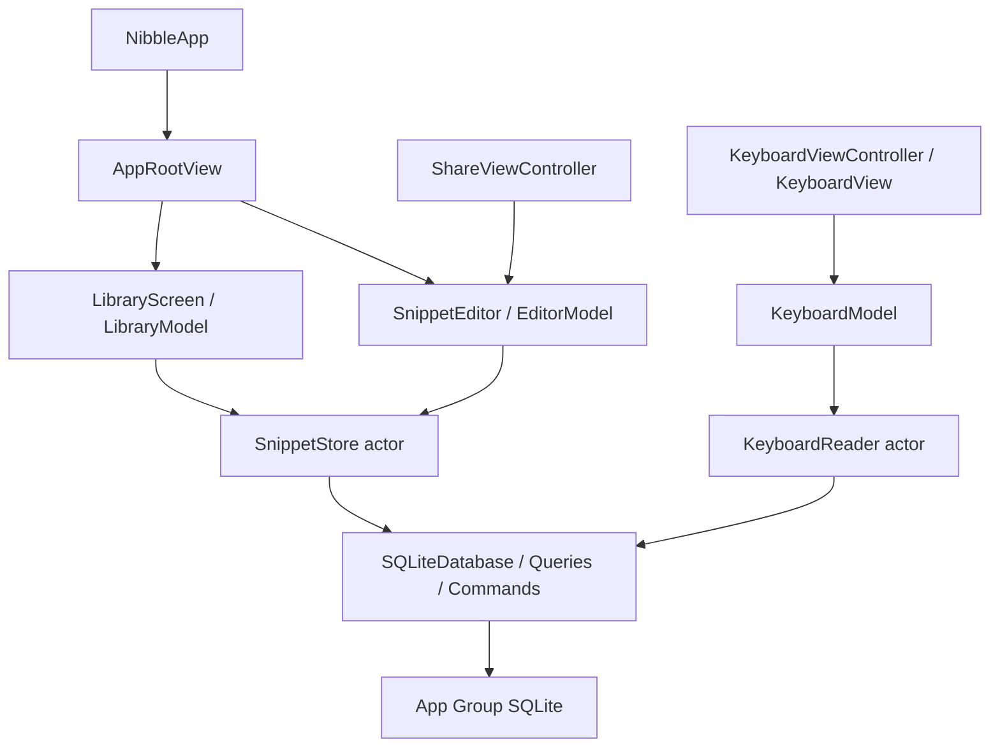

# アプリケーションの構成

nibbleは、本体・共有拡張・キーボードの三つの入口と、App Group内のSQLiteで構成する。各入口が依存を生成して渡し、保存層をUIから探索しない。製品の成立条件は[製品仕様](../product-specification.md)に定める。

## コードの配置

| 配置 | 責務と主な型 |
| --- | --- |
| `app/Nibble/NibbleApp.swift` | 本体の依存生成とsceneの入口 |
| `app/Nibble/Navigation/` | `AppRootView`のタブ・シート・scene、`AppRoute`、共通見出し、`FloatingTabBar`とスクロール状態 |
| `app/Nibble/Library/` | 一覧・検索・削除一覧、操作モデル、タスク所有者、行と通知 |
| `app/Nibble/Settings/` | 設定、製品情報、キーボード利用案内 |
| `app/Nibble/Presentation/` | 説明イラストの読込・可視性・配色・再生状態 |
| `app/NibbleShare/` | `SharedDraftLoader`の取込・下書き保存、失敗文言、controllerの共通エディター提示 |
| `app/NibbleKeyboard/` | OS入力先・権限・キーボードのViewとcontroller |
| `app/Shared/Domain/` | 項目、下書き、原文の検証、保存エラー、一覧・キーボードの要求と読込protocol |
| `app/Shared/Persistence/` | SQLite接続、schema、同期SQL、`SnippetStore`と既存DB専用の`KeyboardReader` actor |
| `app/Shared/Editing/` | `EditorModel`、`EditorTaskOwner`、`SnippetEditor`と入力・操作・補足の表示部品。本体と共有拡張で使用 |
| `app/Shared/Keyboard/` | `KeyboardModel`とOS作用を渡す`KeyboardEffects` |
| `app/Shared/Interface/` | 色、文字役割、固定表示のSwiftUI・UIKit境界 |
| `app/Shared/Resources/` | 配布する第三者ライセンスの告知 |
| `app/Packages/RivePresentation/` | 製品に依存しないRiveのResource・Session・Canvas |

`Shared`はソースの共有単位であり、すべてを全targetへリンクするという意味ではない。Xcode projectのSourcesが各targetの必要な部分を選ぶ。キーボードは編集StoreとRiveをリンクせず、本体・共有拡張だけがDB作成とschema移行を行う。本体のテストはKeyboardのモデルとReaderも検査する。

## 依存と操作の境界

モデルのasync APIは受理した処理と状態反映まで待つ。Viewはタスクの開始・寿命・重複を、モデルは要求と結果の整合性を、actorは接続とtransactionを所有する。SQL実行中にawaitしない。本体のコピーと読み上げは`LibraryEffects`、Keyboardの挿入・コピー・終了は`KeyboardEffects`へ分離する。OSの作用とDBの確定は同じtransactionにはできないため、コピー完了と使用記録の失敗を別の結果にする。

一覧は要求に対応する一つの`LibraryPage`を表示する。保存層で絞った結果をUIでピン別に再分割せず、使用回数順とsnapshotの意味を保つ。削除・復元・完全削除は`mutate(_:id:)`が対象名の取得と変更を同じtransactionへ収める。

新規DBはschema 2で作成する。schema 1は原文・UUID・下書き・削除状態を維持して2へ移行する。配布済みデータの継続利用のためにこの互換性を持ち、未対応schemaを初期化で置き換えない。Keyboardはschema 1/2を読み、移行は行わない。

## 表示と状態の所有

`AppRootView`は一覧・検索それぞれのモデル、選択タブ、検索フォーカス、編集シートを保持する。scene・タブ・シートの状態が通知の表示資格を決める。通知は成功イベントと対応し、Viewの再生成では成功を発火しない。[通知の契約](../design/rationale/result-notices.md)に表示と振動の寿命を定める。

一覧・検索・設定は`LibraryHeading`が見出しと右上の作成操作を配置する。文字表示は`ScreenHeading(title:subTitle:)`が担い、指定した場合だけ補足行と間隔を表示する。フォントは`Font.nibbleScreenTitle`、操作との間隔と外側の余白はコンテナが所有する。本文、項目名、補足、通知などは[F03](../design/foundations.md#f03-文字と図記号)の役割で指定する。

本体・共有拡張・キーボード・表示PackageのViewは、責務ごとの型とファイルへ分けている。Viewを返す補助関数・算出プロパティへの分割ではなく、入力と更新境界を型で表す。`body`・`equatableBody`、Modifier・Style・representableの必須メソッドは各protocolの定義として保持する。`LibraryScreen`は画面の状態と寿命、`LibraryList`は読込状態とリスト、`LibrarySections`は集合と行、`LibrarySearchBar`は検索入力を担当する。共通のリスト外観は`LibraryListStyle`、スクロールの観測は`TabBarScrollTracking`が担う。

設定配下は`AboutSection`・`AboutURL`・`KeyboardGuideSection`が表示を担い、`GuidePageStyle`が背景・標準見出し・スクロール観測を共通化する。説明内容と各ページの余白はページに残す。RiveのSwiftUI表示とUIKitの生成・更新・破棄は`RiveCanvas`と`RiveViewport`へ分け、Sessionの所有と再生状態を維持する。

編集は`SnippetEditor`が入力・シートの寿命と終了結果を観測し、`EditorForm`、タイトル・本文の入力、`EditorToolbar`、補足に表示を分ける。保存・保持・破棄の業務処理は`EditorModel`、開始・重複・取消は`EditorTaskOwner`にある。操作完了をモデルのterminal stateで受けて、成功した場合だけ画面を閉じる。

共有取込は`SharedDraftLoader.load`が入力providerの選択・原文の取得・検証・下書き保存を完了まで待つ。`ShareViewController`はextensionの寿命、タスク開始と取消、編集画面・失敗の提示、共有元への終了を担当する。保存後に共有元が離脱していた場合は提示を中止し、保存済みの下書きは残す。

レイアウトは親からのサイズ提案、内容の自然な大きさ、alignment、safe areaを使う。見出しと操作の関係はStackで表し、本文は伸長・折返し・スクロールを許す。固定寸法は記号、最小操作領域、スクロール中に動かさないバーの確保領域など、意味のある制約に限定する。部品化だけで描画性能の改善を断定せず、操作と同条件の測定を分けて確認する。

## 分野ごとの契約

- [キーボード](keyboard.md)：権限、既存DB、入力先と可視性の寿命。
- [説明イラスト](presentation.md)：RML、再生位置、停止・復帰、解放。
- [検証基盤](verification.md)：計画、ビルドキャッシュ、実行と観測。
- [配布](distribution.md)：署名、送信、担当者と秘密情報の境界。

## 開発ツール

`scripts/ios_project.py`が対象configを検査し、`scripts/verification_catalog.py`が検証工程のID・実行コマンド・期待scheme・runの種類を定義し、`verify.py`が差分から選択して直列実行する。製品回帰、基盤fixture、性能測定は目的で分ける。`validation/`は基盤試験と製品の保存層測定・共有入力に必要なfixtureだけを持つ。

文書は相対リンク、Swift例、設計台帳を共通検査で照合する。UIの採用仕様は`docs/design/`、製品に依存しない照合処理は`tools/ui-design/`、nibble固有の対象選択はpolicyとAdapterに置く。結果のJSONと進捗表示は[CLIの契約](../script-tooling.md)に従って分離する。
