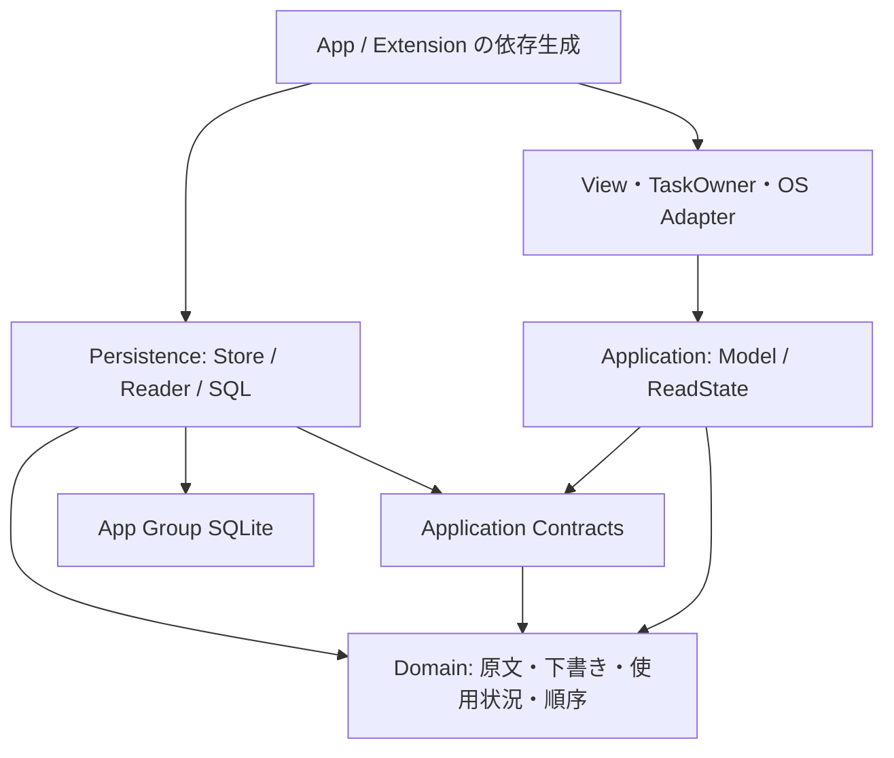

# アプリケーションの構成

nibbleは、本体・共有拡張・キーボードの三つの入口と、App Group内のSQLiteで構成する。各入口が依存を生成して渡し、保存層をUIから探索しない。製品の成立条件は[製品仕様](../product-specification.md)に定める。

## コードの配置

| 配置 | 責務と主な型 |
| --- | --- |
| `app/Nibble/NibbleApp.swift` | 本体の依存生成とsceneの入口 |
| `app/Nibble/Navigation/` | `AppRootView`の設定階層・編集シート・scene、`AppRoute`、作業画面の見出し |
| `app/Nibble/Library/` | 画面・行・通知、タスク所有者、`LibraryPresentation`による文言、`SystemLibraryEffects`によるOS作用 |
| `app/Nibble/Settings/` | 設定、製品情報、キーボード利用案内 |
| `app/Nibble/Monetization/` | StoreKitで検証したPro権利の更新と、作業画面の広告接続 |
| `app/Nibble/Presentation/` | 説明イラストの読込・可視性・配色・再生状態 |
| `app/NibbleShare/` | `SharedDraftLoader`の取込・下書き保存、失敗文言、controllerの共通エディター提示 |
| `app/NibbleKeyboard/` | OS入力先・権限・キーボードのViewとcontroller |
| `app/Shared/Domain/` | 項目・使用状況・並び順、下書きの入力順序と置換資格、原文の検証、変数の展開、機能アクセス、保存エラー |
| `app/Shared/Application/Contracts/` | 一覧・編集・Keyboardの要求と結果、読書込とOS作用のprotocol。具体的な接続や表示形式を持たない |
| `app/Shared/Application/` | `LibraryModel`・`EditorModel`・`KeyboardModel`の操作、`LibraryReadState`の取得結果と採否、型で表した成功・失敗・回復 |
| `app/Shared/Persistence/` | SQLite接続、schema、同期SQL、`SnippetStore`と既存DB専用の`KeyboardReader` actor |
| `app/Shared/Editing/` | `EditorTaskOwner`、`SnippetEditor`と入力・操作・補足の表示部品、`EditorPresentation`の文言。本体と共有拡張で使用 |
| `app/Shared/Editing/Markdown/` | 原文からの解析、共通の文字スタイル、入力とプレビュー、UIKitの編集接続 |
| `app/Shared/Interface/` | 項目名・上限・失敗の表示形式、共通見出しとピン操作、色、文字役割、操作領域、固定表示のSwiftUI・UIKit境界 |
| `app/Shared/Resources/` | 配布する第三者ライセンスの告知 |
| `runtime/rive/` | 描画先取得を専用キューへ分離するRive基盤の固定ソース定義・Package定義 |
| `app/Packages/RivePresentation/` | 製品に依存しないRiveのResource・Session・Canvas |

`Shared`はソースの共有単位であり、すべてを全targetへリンクするという意味ではない。Xcode projectのSourcesが各targetの必要な部分を選ぶ。キーボードは編集StoreとRiveをリンクせず、本体・共有拡張だけがDB作成とschema移行を行う。本体のテストはKeyboardのモデルとReaderも検査する。

## 依存と操作の境界

矢印はソースの依存を示す。入口は具体的なStore・ReaderとOS Adapterを生成してprotocolでモデルへ渡す。Domainは他のレイヤーを参照せず、Applicationは保存形式やUI frameworkを知らない。PersistenceはContractsを実装する。

モデルのasync APIは受理した処理と状態反映まで待つ。Viewはタスクの開始・寿命・重複を、モデルは要求と結果の整合性を、actorは接続とtransactionを所有する。SQL実行中にawaitしない。本体のコピーと読み上げは`LibraryEffects`、Keyboardの挿入・コピー・終了は`KeyboardEffects`へ分離する。OSの作用とDBの確定は同じtransactionにはできないため、コピー完了と使用記録の失敗を別の結果にする。

`LibraryReading.libraries(_:)`は要求順のページを一つのDB読取transactionから返す。単一ページの`library(_:)`もこの入口を使う。統合された本体の`LibraryReadState`は、選択集合、原文の検索語、集合ごとの取得上限、検索の取得上限を正本とし、要求を導出する。閲覧の3集合と検索結果は別の読取snapshotであり、検索だけの読込は閲覧結果を置換しない。検索語を消すと元の集合と取得上限へ戻る。コピー等の変更後と明示更新では閲覧の3集合と必要な検索を同時に取得する。検索結果の採否と集合更新の採否は分ける。変更後の読取中に検索を消しても、最新の集合読取は保持先へ反映する。古い検索結果を現在画面へ出さず、後発の集合読取がある場合は先発の結果で上書きしない。

`LibraryModel.showAll()`は選択集合と検索語の変更を`LibraryReadState`へ委譲する。URLと空状態の操作は同じ入口を使い、Viewは検索・集合の変更手順を組み立てない。`LibraryRequest`は読取条件の値であり、見出しや読込文言は本体の`LibraryPresentation`が要求・画面種別から作る。

表示は選択した要求に対応する`LibraryPage`を使う。選択中のページを別の可変状態へ複製せず、保持辞書から導出する。保存層で絞った結果をUIでピン別に再分割せず、使用回数順とsnapshotの意味を保つ。削除・復元・完全削除は`mutate(_:id:)`が対象の要約取得と変更を同じtransactionへ収め、項目名の整形は表示側が担う。

新規DBはschema 2で作成する。schema 1は原文・UUID・下書き・削除状態を維持して2へ移行する。配布済みデータの継続利用のためにこの互換性を持ち、未対応schemaを初期化で置き換えない。Keyboardはschema 1/2を読み、移行は行わない。

## 概念ごとの正本と更新経路

DomainはSwiftの標準ライブラリとFoundation/Darwinを使い、SwiftUI・SQLite・Viewを参照しない。ApplicationのモデルはContractsのprotocolを通じて保存と外部作用を調整する。永続化層はSQLの形式と原子的な更新を所有し、原文の検証や下書きの置換資格をDomainへ委譲する。表示層はDomainの値とApplicationの結果から文言を作る。`Notice`・`Failure`・`Message`は操作、理由、対象を保持し、回復の可否はApplication、文言・日付・数値形式はPresentationが所有する。読み上げも同じ結果から生成する。

| 概念 | 正本・更新経路 | 派生値と保持の責務 |
| --- | --- | --- |
| 保存済み本文・UUID・revision・削除状態 | SQLiteの`snippets`。`SnippetStore` / `KeyboardReader`から同期Commandsを実行する | `Snippet`は全文、`SnippetSummary`は上限付き要約。別の編集可能データとして扱わず、操作時にUUID・必要なrevisionで読み直す |
| 原文の保存資格・UTF-8上限 | `SnippetText`。共有取込と最終保存が同じ検証を呼ぶ | `EditorModel.hasBody`も同じ空白判定を使用する。UTF-8全体を数える上限検証は保存時に行い、入力のたびに本文全体を走査しない。上限案内・失敗文言は`SnippetInputLimits`から生成する |
| 下書きの同一性・入力順序 | `Draft.Checkpoint`の下書きID・対象ID・開始revisionとsequence。`Draft`がUTF-8変更時にsequenceを進め、置換資格を判定する | `DraftQueries`はwrite transactionで保存済みcheckpointと照合する。自動保存は同一sessionの新しい入力だけを受理する。保持・保存・破棄は同一sequenceの同一原文も受理する。欠落した下書きを自動保存で復活させない |
| 使用回数・最後のコピー日時 | `SnippetCommands.recordUse`。使用IDごとの`snippet_uses`と`snippets`の集計列を同じtransactionで更新する | 集計列は永続化した派生値。再試行は同じ使用IDを使い、二重加算しない。完全削除は履歴も同時に除く。`SnippetUsage`が経過時間による削除候補を判定し、`LibraryModel`が読込時点の時計を渡す。未使用は候補にしない |
| 一覧の意味と並び順 | `LibraryFilter`・`SnippetOrdering`。本体は使用回数順、削除一覧は更新順、Keyboardはピン優先を要求する | SQLは要求された順序をクエリーへ変換する。Viewで再び並べ替えない |
| 操作結果と失敗回復 | Applicationの型付き結果。`StoreError`と操作を受けて回復経路を決める | 文言は`LibraryPresentation`・`EditorPresentation`・`KeyboardPresentation`・`SnippetPresentation`。モデル内に文言と判定を重複させない |
| 使用記録の再試行 | `LibraryModel.PendingUse`ごとのpending / recording / failed | 記録中IDと失敗を別集合へ同期しない。コピー作用は再実行せず、確定後に一覧・検索を更新する |
| 一覧の取得結果・選択 | `LibraryReadState`のselection・query・取得上限と、collections・searchSnapshot | Requestは入力状態から導出し、検索結果で閲覧の集合を上書きしない。件数・hasMoreは同じsnapshotのSQL結果。操作・編集終了・明示更新で集合と検索を更新する。Viewは検索対象の決定や結果の再抽出をしない |
| Keyboardの一覧・詳細 | `KeyboardModel.rows`がUUIDごとの要約を一つだけ保持する | ページはID列、詳細は選択IDと本文読込状態。ピン変更は一つの要約を更新し、一覧と詳細へ導出する。詳細中のピン解除は選択を維持する。revision更新時は取得済み本文を無効にし、旧revisionの遅延結果を拒否する。使用状況を取得しない投影はnilで表し、0回と混同しない |
| 項目名・ピン操作の表示 | `SnippetTextPresentation`、`SnippetHeading`、`PinButton` | 本文代替名・明示タイトルの判定を共通化する。本体とKeyboardの字級・行数・ピン位置は明示的なstyleとして保持する。保存可否や操作資格は共通Viewに持ち込まない |

`revision`は保存項目の変更、`sequence`は下書き入力、Markdownの解析番号は本文解析要求を識別する。意味と寿命が違うため一つの番号へ統合しない。選択・折り畳み・フォーカスなどの表示状態も永続データと分ける。

## 表示と状態の所有

`AppRootView`は一つのLibraryModel、設定とシートの提示状態、検索フォーカスを保持する。scene・設定・シートの状態が通知の表示資格を決める。通知は成功イベントと対応し、Viewの再生成では成功を発火しない。[通知の契約](../design/rationale/result-notices.md)に表示と振動の寿命を定める。

`RootScreenHeading`は作業画面の製品名と設定への入口を配置する。文字表示は`ScreenHeading`、作成は下部の`CreateSnippetButton`が担う。本文、項目名、補足、通知などは[F03](../design/foundations.md#f03-文字と図記号)の役割で指定する。

本体・共有拡張・キーボード・表示PackageのViewは責務ごとの型とファイルへ分ける。Viewを返す補助関数・算出プロパティを作らず、入力と更新境界をView型で表す。`LibraryScreen`は表示と寿命、`LibraryList`は状態に対応する描画、`LibrarySections`は集合と行、`LibrarySearchBar`は検索入力を担当する。空状態の成立、検索範囲、下書きの対象資格はApplicationから受け取る。標準NavigationStackを使い、設定を階層、編集と削除一覧をシートで開く。

設定配下は`AboutSection`・`AboutURL`・`KeyboardGuideSection`が表示を担い、`GuidePageStyle`が背景と標準見出しを共通化する。説明内容と各ページの余白はページに残し、各イラストが自身の可視性を観測する。RiveのSwiftUI表示とUIKitの生成・更新・破棄は`RiveCanvas`と`RiveViewport`へ分け、Sessionの所有と再生状態を維持する。

編集は本体と共有拡張が同じ`SnippetEditor`を使う。`EditorModel`が入力・永続化・終了結果、`EditorTaskOwner`が操作の開始・重複・取消、画面がフォーカス・表示モード・補足シートの寿命を所有する。Markdownの解析・装飾・閲覧は`Shared/Editing/Markdown/`へまとめる。原文を保持する表現、解析結果の採否、スクロールとUIKitの接続は[編集の設計](editing.md)に定める。

共有取込は`SharedDraftLoader.load`が入力providerの選択・原文の取得・検証・下書き保存を完了まで待つ。`ShareViewController`はextensionの寿命、タスク開始と取消、編集画面・失敗の提示、共有元への終了を担当する。保存後に共有元が離脱していた場合は提示を中止し、保存済みの下書きは残す。

レイアウトは親からのサイズ提案、内容の自然な大きさ、alignment、safe areaを使う。見出しと操作の関係はStackで表し、本文は伸長・折返し・スクロールを許す。固定寸法は記号、最小操作領域、スクロール中に動かさないバーの確保領域など、意味のある制約に限定する。部品化だけで描画性能の改善を断定せず、操作と同条件の測定を分けて確認する。

## 分野ごとの契約

- [編集とMarkdown](editing.md)：原文、解析、表示モード、入力の寿命。

- [キーボード](keyboard.md)：権限、既存DB、入力先と可視性の寿命。

- [収益と機能アクセス](monetization.md)：無料/Proの判定、StoreKit権利、広告と計測の境界。
- [説明イラスト](presentation.md)：RML、再生位置、停止・復帰、解放。
- [検証基盤](verification.md)：計画、ビルドキャッシュ、実行と観測。
- [配布](distribution.md)：署名、送信、担当者と秘密情報の境界。

## 開発ツール

`scripts/ios_project.py`が対象configを検査し、`scripts/verification_catalog.py`が検証工程のID・実行コマンド・対象configへの参照・runの種類を定義し、`verify.py`が差分から選択して直列実行する。証跡のproject情報は同じconfigの全フィールドと照合する。製品回帰、基盤fixture、性能測定は目的で分ける。`validation/`は基盤試験と製品の保存層測定・共有入力に必要なfixtureだけを持つ。

文書は相対リンク、Swift例、設計台帳を共通検査で照合する。UIの採用仕様は`docs/design/`、製品に依存しない照合処理は`tools/ui-design/`、nibble固有の対象選択はpolicyとAdapterに置く。結果のJSONと進捗表示は[CLIの契約](../script-tooling.md)に従って分離する。
