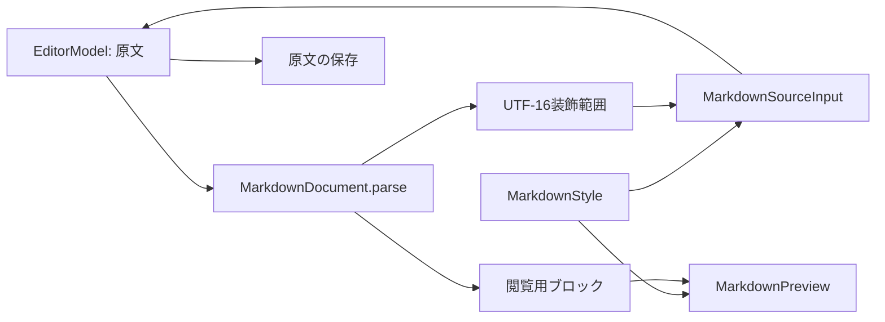

# 原文の編集とMarkdown表示

本体と共有拡張は、同じ原文を編集・確認・保存する。利用者が保存したいテキストが正本であり、Markdownの解析結果は表示用の派生データである。保存条件と終了操作は[製品仕様](../product-specification.md#原文と検索用の値)、配置・操作領域は[C20〜C32](../design/components.md#編集)に定める。

## 表現と責務

| 所有者 | 入力・出力と寿命 |
| --- | --- |
| `EditorModel` / `Draft` | タイトル・本文の原文、下書きIDとsequence、保存・保持・破棄の結果。表示モードに依存しない |
| `MarkdownDocument.parse` | 一つの原文から、原文を装飾するUTF-16範囲と、記号を含まない段落・見出し・リスト等のブロックを生成する |
| `MarkdownStyle` | 構文の意味を表す文字スタイル。入力用のUIKit属性とプレビュー用のSwiftUI書式に同じサイズ・太さを適用する |
| `MarkdownEditor` | 本文の解析要求・結果採否と`MarkdownEditorMode`。表示状態は編集画面の寿命に閉じる |
| `MarkdownSourceInput` / `MarkdownSourceTextView` | 原文と選択範囲のBinding、UIKitのfirst responder、IME・選択・Undo、文字属性と自然な高さ |
| `MarkdownPreview` / `MarkdownPreviewBlock` | ブロックをネイティブTextへ表示し、見出しを読み上げ上も区別する |
| `SnippetEditor` / `EditorTaskOwner` | フォーカス・補足シート・終了操作の開始と取消。終了成功を受けて呼出元へ戻る |

実装は[Shared/Editing](../../app/Shared/Editing/SnippetEditor.swift)とその`Markdown/`に配置する。保存層はMarkdownを解釈せず、Keyboardは原文を挿入する。本体と共有拡張に同じソースを組み込み、表示専用の本文をDBへ保存しない。

## 解析と結果の採用

本文のUTF-8が変わると`bodyRevision`が進み、80msの待機後にMainActor外でFoundationのMarkdown解析を行う。タイトル変更は本文解析を始めない。SwiftUIのtaskを本文の解析番号に結び付け、取消されておらず原文のバイトが現在値と一致する結果だけを採用する。

Foundationの行・UTF-8列位置は、原文を変更せずUTF-16範囲へ変換する。CR・LF・CRLF、結合文字、絵文字、NULを含む入力でもUIKitの文字位置と対応させる。解析用のNUL置換は表示用のコピーに限る。解析できない内容は原文の文字列として表示する。未完成の構文も入力から失わない。

原文、下書きsequence、本文解析番号、項目revisionは意味が異なる。下書きsequenceは保存順序、本文解析番号は解析要求、項目revisionは保存済み項目の競合判定に使う。表示切替や補足の開閉はこれらを進めない。

## 入力とプレビューの寿命

「入力」は記号を含む原文を表示し、構文の本文へ書式を付ける。「プレビュー」は記号を隠し、見出し・強調・段落・リスト・引用・コード・リンクを読む。プレビュー中に原文が変わり、解析が追い付いていなければ進行表示を出す。

入力Viewは表示切替で作り直さず、プレビュー中は高さ・可視性・操作・アクセシビリティを抑える。同じUITextViewを保つことで選択とUndoの履歴を維持する。IMEの未確定文字がある間は原文の置換や属性の更新を行わない。装飾更新はtextStorageの属性だけを変え、原文・選択を保つ。

フォーカス要求は`FocusState<EditorField?>`で共有する。SwiftUIのfocused指定はスクロール上の入力対象を表し、UIKit接続は実際のfirst responderを変更する。本文を更新するたびにフォーカスを取り返さず、要求が変わったときに反映する。入力のスクロールは外側のScrollViewに統一し、下部操作とキーボード補助行はsafeAreaInsetで配置する。

変数選択のシートを開く前に本文のUTF-16選択範囲を保持する。印の追加はその範囲を置き換え、本文の入力位置がまだないときだけ末尾へ追加する。シートを閉じたら印の直後にカーソルを戻す。末尾ペーストは独立した操作であり、本文の選択位置にかかわらず末尾に追記する。変数の入力と展開の責務は[変数の編集と利用](variables.md)に定める。

プレビューでは入力フォーカスを外し、「入力」へ戻ると本文へ復帰する。補足シートは開く前の入力先を保持し、閉じたときに戻す。保存・閉じる・破棄は表示モードにかかわらず最新の原文を対象とし、永続化が失敗したら入力を残す。

## 開発と検証

文字の意味や書式は`MarkdownDocument`と`MarkdownStyle`、配置と読み上げは各View、原文の保存はDomain・Application・Persistenceで変更する。責務をまたぐ仕様は[製品仕様](../product-specification.md)と[UI設計](../design/README.md)にも対応付ける。

[Markdownテスト](../../app/NibbleTests/EditorMarkdownTests.swift)はバイト位置、表示ブロック、IME、選択、Undo、保存後の原文を確認する。`ViewTestHost`はSwiftUI・UIKitの画面を同じMainActorのwindowへ載せ、Rive固有のログ観測は`RivePlaybackLog`が担当する。操作の成立は[controls-uiと共有の手順](../ios-verification.md#検索設定編集操作の検証)、必要な工程の選択は[検証計画](../ios-verification.md#変更から検証を実行する)に従う。見た目の確認と保存バイトの照合は別に行う。
