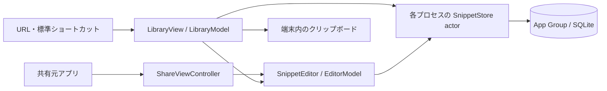

# 0002：nibble MVPの製品設計

状態：採用。対象は日本語UIのiPhoneアプリ`Nibble`と共有拡張`NibbleShare`。最低対応OSはiOS 26.0、実行評価はiOS 26.5 Simulatorとする。

## プロダクトの目的

nibbleは、メッセージの定型文やWebフォームに使うテキストを端末内に保存し、必要なときに探してコピーするツールである。利用者は入力先のアプリへ戻り、本文をペーストして作業を続ける。必要な本文へ少ない操作で到達できること、原文を変えないこと、入力・検索・描画を待たせないことを設計の判断基準とする。

この文書は提供機能、画面、データ、処理の所有者、採用技術を定義する。日常の使い方と開発時の操作は[MVP手順](../mvp.md)、APIの実装規則は[非同期処理とアニメーション](../library-policy.md)、実施済みの確認と適用限界は[製品の検証結果](../mvp-validation.md)を参照する。

## 提供範囲

| 領域 | MVPの契約 |
| --- | --- |
| 保存対象 | プレーンテキストの本文と任意のタイトル。アカウントと通信を必要としない端末内保存 |
| 探す・使う | タイトルと本文の部分一致検索、ピン留め、保存済み本文のコピー |
| 作成・編集 | 明示的な保存、入力ごとの下書き保存、下書きの再開と破棄、編集競合の通知 |
| 削除・回復 | 削除した項目の復元、確認付きの完全削除。削除項目の自動消去は行わない |
| 取り込み | 他アプリの共有シートからテキストまたはURLを1件読み、編集・保存する |
| 呼び出し | 本体の起動と、Appleの「ショートカット」の標準URLアクションによる一覧・作成画面の表示 |

同期、独自バックアップ、書式付きテキスト、画像・ファイル、変数展開、AI、課金は提供範囲外とする。キーボード拡張、Widget、Controls、App Shortcutsの自動登録は構成に含めない。任意のアプリへの重ね合わせ表示や入力欄への自動挿入は行わず、入力先への復帰とペーストは利用者の操作とする。

## 採用構成

| 構成 | 役割と条件 |
| --- | --- |
| SwiftUI・Observation | 一覧と編集画面、UI状態の観測。UI状態をMainActorへ明示隔離する |
| Swift Concurrency | 保存層のactor隔離とasync API。Swift language mode 6、strict concurrency complete、default isolation nonisolated |
| swift-tasking 0.3.0 | 非構造化タスクの所有・キャンセル・重複方針。UI所有者に`ViewTaskStore`を保持する |
| swift-scoped-animation 0.2.1 | `AnimationScope`による表示変化の適用範囲と`animationBarrier`による伝播制御 |
| Apple同梱SQLite | App Group内の保存、部分一致検索、revisionによる競合判定、下書きとのatomicな確定 |
| Share Extension・UIKit | 他アプリの共有providerを読み、共通のSwiftUI編集画面を表示する入口 |
| Swift Testing | 製品の保存層と操作の所有者を直接検査するテスト |
| Nix・Apple CLI・sim-use | 共通Lint、ローカルビルド・テスト、Simulator操作と撮影。役割は[検証基盤](0001-local-ios-verification.md)で定義する |

本体と共有拡張には同じSwift Packageの版をリンクする。exact versionと共有`Package.resolved`でrevisionを固定し、MITライセンス通知を両bundleへ含める。構造化された`async/await`・task groupやSwiftUI `.task`はその寿命管理を利用する。生のTask生成・保持、別scheduler、直接のアニメーション指定はLintで禁止する。

## 画面と操作

本文を読むこととコピーすることを画面の中心に置く。背景はライトでクリーム色、ダークで暗いグレー、操作のアクセントはそれぞれ錆色と明るいオレンジとする。システムフォントとDynamic Typeを使い、一覧・入力・シート・メニュー・確認ダイアログは標準のSwiftUI部品で構成する。

| 画面 | 表示と主要操作 | 状態の扱い |
| --- | --- | --- |
| 一覧 | 検索欄、「すべて／ピン留め」、スニペット行、作成ボタン。行右端でコピー、行タップで編集 | 空の一覧には作成への入口、検索0件には別の語句の案内を表示。検索語が空で削除一覧以外の場合に下書きを表示 |
| 編集 | 任意タイトル、複数行本文、保存・閉じる・キーボードを閉じる操作。その他メニューに本文共有と下書き破棄 | 本文領域は内容に合わせて伸び、ページ全体をスクロールできる。保存処理中は操作を無効化し、失敗時は入力とエラーを保持 |
| 削除した項目 | 一覧のその他メニューから開き、復元または確認付きの完全削除を行う | 通常の一覧・コピーからは除外。完全削除は関連下書きも消去 |
| 共有拡張 | 取り込んだ本文を本体と共通の編集画面に表示 | 保存・閉じる処理が成功したら共有元へ戻る。閉じた下書きは本体で再開可能 |

ピン留め・削除は行の長押しメニューまたはスワイプから行う。スワイプし切るだけでは実行しない。コピー・検索クリア・復元の操作領域は44 pt以上とする。コピー完了は2秒間の通知と触覚、削除完了は6秒間の取り消し操作で伝え、通知文をアクセシビリティのannouncementにも送る。

通知の表示・消去は`Library.Notice`という名前のscopeに限定し、0.16秒のopacity遷移を使う。Reduce Motion有効時のdurationは0秒とする。画面の外側でOSのシートtransactionを遮断し、内側のscopeがアプリの表示変化を管理する。入力領域には警告付きbarrierを置く。標準シート・メニュー・キーボード自体の遷移はOS部品が管理する。

## モジュールとデータフロー

本体と共有拡張は別プロセスで動き、App Groupの同じSQLiteデータベースへ接続する。表示と永続化の境界では値型を受け渡し、SQLiteの接続・statement・ポインタをUIへ公開しない。

| 所有者 | 責務 |
| --- | --- |
| `LibraryView` | `@State`で一覧modelを保持し、表示・フォーカス・シート・sceneイベント・通知scopeを接続する |
| `LibraryModel` | MainActor上の一覧・検索・編集入口、検索世代、コピー、ピン・削除・復元、通知期限と対応するTasking操作 |
| `SnippetEditor` | 編集model、入力・フォーカス、保存・閉じる・破棄をまとめた終了操作、完了通知 |
| `EditorModel` | MainActor上の入力値、下書きsnapshotの書込要求、保存・競合・エラー状態 |
| `SnippetStore` actor | プロセスごとのSQLite接続、検索、同期的なトランザクション、競合判定、永続化 |
| `Snippet` / `SnippetSummary` / `Draft` | 保存済み本文、一覧用要約、編集中の値を区別するデータ型 |
| `ShareViewController` | UIKitのextension入口、provider読込の所有、共通編集画面の表示、共有元への完了通知 |

SQLiteの操作は専用actor内で行い、トランザクション中に中断点を置かない。プロセス間の排他はSQLiteに委ねる。UIの入力snapshotと一覧の返却値はactor境界で受け渡す。

## 操作の寿命と整合性

Taskingの`ActionID`は重複判定の単位、`ActionLifetime`は明示的に終了させる操作の分類とする。これらの値がsceneやviewの状態を自動監視するわけではない。所有者がイベントに応じて`cancel(lifetime:)`を呼ぶ。

| 操作 | 所有と方針 | 結果の扱い |
| --- | --- | --- |
| 一覧の読込 | `LibraryModel`、sceneBound / cancelExisting | 表示、検索・フィルタ・取得上限の変更、active復帰、編集終了で同じActionIDから再取得。要求世代とキャンセル状態を確認して反映 |
| 編集開始 | `LibraryModel`、screenBound / ignoreNew | 二重開始を抑止。開始前にキャンセルを確認し、受理済みの下書きDB処理は完了させる |
| コピー | `LibraryModel`、sceneBound / cancelExisting | DBから保存済み本文を読み、読込の前後でキャンセルを確認してpasteboardへ書く |
| ピン・削除・復元・完全削除 | `LibraryModel`、sceneBound / ignoreNew | 操作種別と項目UUIDをIDに含め、同じ項目の同じ操作だけ重複を抑止。受理済みDB書込は完了させる |
| 通知の消去 | `LibraryModel`、screenBound / cancelExisting | 通知の発生ごとに期限を更新。background化時に登録済みの消去操作をキャンセルし、通知と取り消し操作を消す |
| 下書き書込 | `EditorModel`、screenBound / allowConcurrent | 入力snapshotを受理し、SQLiteのsequence比較で最新の値を保持。保存・破棄済み下書きを再生成しない |
| 保存・閉じる・破棄 | `SnippetEditor`、screenBound / ignoreNew | 共通IDで終了操作を一つに制限。画面終了時にキャンセルし、永続化が成功した操作には完了通知を返す |
| 共有provider読込 | `ShareViewController`、screenBound / ignoreNew | `viewDidDisappear`でキャンセル。provider読込の前後で確認し、キャンセルを業務エラーとして表示しない |

一覧のmodelはscene内のルートviewが保持する。viewの表示・非表示はsceneの終了条件として使わず、background化を編集開始と通知の終了契機にする。sceneBound操作は一時的な非active化やシート表示をまたいで実行する有限の処理とする。キャンセルは協調的であり、確定したDB変更を巻き戻さない。具体的なAPIの使い方とLintの範囲は[実装規約](../library-policy.md)で定義する。

## 保存・検索・下書きの契約

保存先はApp Group `group.dev.nibble.app`の`Library/snippets.sqlite`。WAL、`synchronous=FULL`、2秒のbusy timeoutを設定する。schema version 1は`snippets`と`drafts`で構成し、起動時に`user_version`を確認する。未知の新しい版や破損DBはエラーとし、既存データを削除して空のストアを作り直さない。

| 項目 | 契約 |
| --- | --- |
| スニペット | UUID、タイトル、本文、検索キー、ピン留め、revision、更新日時、削除状態 |
| 原文 | タイトルと本文の空白・改行・タブ・Unicodeを保存。コピーは本文のUTF-8を保持 |
| 入力上限 | 保存時にタイトル512 bytes、本文1,000,000 bytesまで。空白・改行だけの本文は保存不可。UTF-8 bytesで判定し、失敗時は入力を保持 |
| 検索キー | タイトルと本文からNFC・日本語localeのcase/width foldingで生成し、原文と別に保存 |
| 検索の一致 | 検索語の前後空白・改行を除き、`instr`で部分一致。日本語1文字から検索でき、`%`・`_`・バックスラッシュは通常文字として扱う。ひらがな／カタカナ、清音／濁音は区別 |
| 一覧順 | ピン留め優先、更新日時降順、UUID昇順。先頭100件から「さらに表示」で取得上限を100件ずつ増やす。本文プレビューは`substr(body,1,180)` |
| 編集競合 | 下書きの読込revisionと保存時のrevisionが一致し、項目が削除されていない場合のみ更新。競合時は入力を保持し、「新しい項目として保存」を提示 |
| 削除と復元 | 同じUUIDの削除状態を更新。復元は本文とピン留めを保持。完全削除は項目と関連下書きを1トランザクションで消去 |

検索キーは保存時に生成し、入力ごとに全本文を正規化しない。一覧へ渡す件数と本文プレビューを制限する。追加表示は取得上限を増やして先頭から再取得する方式である。下書き一覧は本文を含めて取得するため、件数と長文に対するメモリ評価をスニペット一覧と分ける。

編集開始時に下書きのUUIDを作り、入力変更ごとに増加するsequenceを付けて保存する。既存項目に下書きがあれば再開し、作成ボタンは新しい下書きを作る。閉じる操作は下書きを保持する。タイトル・本文がともに空の入力と、変更していない保存済み項目の編集は、閉じる際に下書きを除去する。

スニペットの保存と当該下書きの除去は1トランザクションで確定する。下書き更新はsequenceが新しい既存行だけに適用し、保存・破棄後の遅れた書込では再生成しない。永続化に失敗した場合はエラーを表示する。異常終了直前に永続化を終えていない入力の保持は保証しない。

## 呼び出しと共有の境界

| 入口 | 契約 |
| --- | --- |
| `nibble://library` | 検索語を空にし、「すべて」の一覧を表示 |
| `nibble://new` | 新しい下書きを作成して編集画面を表示 |
| 編集中のURL受信 | 開いている編集内容を維持し、別の編集画面で置き換えない |
| URL検証 | 上記2種類だけを受理。path・query・fragment・認証情報・port付きURLは拒否。本文や保存・削除指示を受け取らない |
| Share Extension | 共有元が渡す最初の対応providerから1件を読む。plain textを優先し、URLは文字列として扱う。非対応形式・無効入力はエラーを表示 |
| コピー | 一覧のプレビューではなくDBから本文を読み、`localOnly`でpasteboardへ書く。読み取り・自動取り込みはしない |

共有元のアプリをhostと呼ぶ。共有できる形式はhostに依存し、URLの取り込みでWebページをダウンロードしない。custom URL schemeには所有権の保証がないため、本文や機密情報の輸送路として使わない。標準ペースト操作と`PasteButton`による取り込みは利用者が開始する。

## 技術選定と見直す条件

| 採用 | 比較と理由 | 見直す条件 |
| --- | --- | --- |
| SwiftUI + Observation | 標準部品と明示的なUI状態を組み合わせる。UIKit全面実装に比べ表示と状態の記述を小さく保ち、extension入口だけUIKitで扱う | IME・フォーカス・表示の問題を標準部品で解決できない場合 |
| Tasking + ScopedAnimation | 生のTask・transaction管理に比べ、所有者・寿命・重複方針・表示範囲を共通APIで宣言できる。外部API追従と操作管理のコストを負う | 保守停止、対応条件の不適合、測定した応答・描画の悪化、scopeで必要な表現を扱えない場合 |
| Apple同梱SQLite | revision付き更新、共有ストア、下書きとのatomicな確定を直接検査できる。SwiftData/Core Dataの履歴・移行機能に対し、SQLとmigrationの手動管理を選ぶ | 同期やschema変更により手動管理の負担が増す場合 |
| 保存済み検索キー + `instr` | 日本語1〜2文字の部分一致を原文保持と両立。FTS5 trigram MATCHの短い語句の制約と派生index管理を避ける | 想定データでの遅延、高度な検索やランキングの必要性 |
| Share Extension | hostの共有シート内で内容を確認・保存でき、キーボード切替や入力欄の制御を要しない | 対応host・形式・取り込み件数を増やす場合 |
| 標準ショートカットのURLアクション | 一覧・作成の2種類を利用者が設定する。App Intents登録やシステムへのデータ公開を要しない | 自動登録、音声操作、引数付きアクションが必要な場合 |
| 端末内保存 | 日常操作に通信・アカウント・同期競合を持ち込まない | 複数端末での利用が対象になる場合 |

保存方式と検索の比較根拠は[研究用実行結果](../../research/experiments/ios-26-5-validation.md)、入口の能力は[公開APIの研究](../../research/01-invocation-and-platform.md)、ライブラリの契約と更新条件は[実装規約](../library-policy.md)に記載する。比較試作の観測を製品の動作保証へ転用しない。

## データ保護と保守運用

保存先ディレクトリとDBにData Protectionのcompleteを指定する。本体は非activeの一覧とbackgroundの編集画面に本文を隠す表示を重ねる。共有拡張は独立したapp sceneを持たないため、このscene状態による隠蔽を適用しない。ロック中のアクセス制御やアプリ切替画面の実際の露出は実機評価の対象である。

本文や検索語をログ、システム検索、analyticsへ送らない。本体と共有拡張にデータ収集・trackingなしのPrivacy Manifestを含める。依存更新時は実際のAPI・データフロー・ライセンス通知と宣言の整合性を確認する。

schema変更にはトランザクション内の明示的なmigrationと旧版fixtureを用意する。保存層の置換時もUUID・本文・下書き・削除状態の移行結果を照合する。WALを欠くDB本体のコピーをバックアップとして扱わない。独自のexport/import・バックアップ復旧は提供せず、アプリ削除後のデータ復旧は保証範囲外とする。

## 検証と配布の境界

Ubuntu CIはNixで固定した静的検査を行い、ローカルMacはApple CLIによるビルド・テスト・撮影とsim-useによる操作を行う。GitHub ActionsのmacOS runnerは間接起動を含めて禁止する。iOS 26.0への適合はdeployment targetとAPI availabilityで確認し、実行検証はiOS 26.5に限定する。

MVPの受け入れ範囲はSimulatorでの評価とし、実機検証は含めない。製品の検証結果には対象ソース・端末・手順・観測を記録する。実機性能、ロック時の保護、Handoff、署名配布・審査は個別の評価を要する。Simulatorの測定値や未署名archiveは実機性能・配布可否を示さない。

配布する構成では、本体と共有拡張に同じDeveloper TeamとApp Groupを設定し、bundleのAPI・宣言・署名を点検する。配布方法、App Privacy回答、privacy policy、利用者のサポート窓口を配布判断に含める。コード公開の権限運用とPRの受け入れ条件は[開発ガイド](../../CONTRIBUTING.md)に従う。
