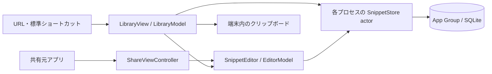

# 0002：nibble MVPの製品設計

- 状態：採用
- 決定日：2026-09-13
- 対象：日本語UIのiPhoneアプリ`Nibble`と共有拡張`NibbleShare`
- 最低対応OS：iOS 26.0。実行検証：iOS 26.5 Simulator

## 目的と提供範囲

nibbleは、メッセージの定型文やWebフォームに使うテキストを端末内に保存し、必要なときに探してコピーするツールである。利用者は入力先のアプリへ戻り、本文をペーストして作業を続ける。この往復で、原文を変えないこと、操作を少なくすること、入力と検索を待たせないことを優先する。

本体は作成・編集・検索・ピン留め・コピー・削除・復元を提供する。編集内容は下書きとして保持し、明示的な保存でスニペットへ反映する。共有拡張は他アプリの共有シートからテキストまたはURLを取り込む。Appleの「ショートカット」からは標準の「URLを開く」アクションで一覧・作成画面を呼び出す。

保存対象はプレーンテキストと任意のタイトル。アカウント、通信、同期、独自バックアップ、書式付きテキスト、画像・ファイル、変数展開、AI、課金は提供しない。キーボード拡張、Widget、Controls、App Shortcutsの自動登録もMVPの対象外とする。任意のアプリへの重ね合わせ表示や入力欄への自動挿入を前提にしない。

操作手順は[MVPの操作と検証](../mvp.md)、実施済みの確認と未検証項目は[MVPの検証結果](../mvp-validation.md)を参照する。

## 画面と操作

背景はライトでクリーム色、ダークで暗いグレー、操作のアクセントはそれぞれ錆色と明るいオレンジを使う。文字はシステムフォントとDynamic Type、リスト・シート・メニュー・確認ダイアログは標準のSwiftUI部品で構成する。本文を読むこととコピーすることを主役にし、装飾による操作の増加を避ける。

| 画面 | 表示と操作 | 状態の扱い |
| --- | --- | --- |
| 一覧 | 検索欄、「すべて／ピン留め」、スニペット行、作成ボタン。行右端で本文をコピー、行をタップして編集 | 空の一覧には作成への入口、検索0件には別の語句の案内を表示。検索語が空で削除一覧以外の場合に下書きを表示 |
| 編集 | 任意タイトルと複数行本文、保存・閉じる・キーボードを閉じる操作。その他メニューに本文共有と下書き破棄 | 本文領域は内容に合わせて伸び、ページ全体をスクロールできる。保存処理中は操作を無効化し、失敗時は内容とエラーを表示 |
| 削除した項目 | 一覧のその他メニューから開き、復元または確認付きの完全削除を行う | 自動消去なし。通常の一覧・コピーからは除外。完全削除は関連する下書きも消去 |
| 共有拡張 | 取り込んだ本文を本体と共通の編集画面に表示 | 保存・閉じる処理が成功したら共有元へ戻る。閉じた下書きは本体で再開可能 |

ピン留め・削除は行の長押しメニューまたはスワイプから行う。スワイプし切るだけでは実行しない。コピー完了は2秒間の通知と触覚、削除完了は6秒間の取り消し操作で伝える。通知はアクセシビリティのannouncementにも送る。コピー・検索クリア・復元の操作領域は44 pt以上とする。

## 呼び出しと共有の境界

| 入口 | 契約 |
| --- | --- |
| `nibble://library` | 一覧の検索語を空にし、「すべて」を表示する |
| `nibble://new` | 新しい下書きを作成して編集画面を開く |
| 編集中のURL受信 | 開いている編集内容を維持し、別の編集画面で置き換えない |
| URLの入力検証 | 上記2種類だけを受理。path・query・fragment・認証情報・port付きURLは拒否。本文や保存・削除指示を受け取らない |
| Share Extension | 共有元が渡す最初の対応providerから1件を読む。plain textを優先し、URLは文字列として扱う。非対応形式・無効入力はエラーを表示 |
| コピーとペースト | 保存済み本文を`localOnly`でpasteboardへ書く。元のアプリへの復帰とペーストは利用者が行う |

共有元のアプリをhostと呼ぶ。共有できる内容や形式はhostに依存する。URLの取り込みでWebページをダウンロードしない。custom URL schemeには所有権の保証がないため、本文や機密情報の輸送路として使わない。

## モジュールとデータフロー

本体と共有拡張は別プロセスで動き、App Groupの同じSQLiteデータベースへ接続する。表示と永続化の境界では値型だけを受け渡し、SQLiteの接続・statement・ポインタをUIへ渡さない。

| 構成 | 責務 |
| --- | --- |
| `LibraryView` / `SnippetEditor` | 表示、フォーカス、シート、標準メニュー、スクロール、通知・エラーの提示 |
| `LibraryModel` | MainActor上の一覧・検索・編集入口。検索結果の世代管理、コピー、削除と復元 |
| `EditorModel` | MainActor上の入力状態、下書きの書込要求、保存・閉じる・破棄、競合からの回復 |
| `SnippetStore` actor | プロセスごとのSQLite接続、検索、トランザクション、競合判定、永続化 |
| `Snippet` / `SnippetSummary` / `Draft` | 保存済み本文、一覧用の要約、編集中の値を区別するモデル |
| `ShareViewController` | UIKitのextension入口。providerを読み、SwiftUIの編集画面を表示し、hostへ完了を返す |

Swift language modeは6、strict concurrencyはcomplete、default isolationはnonisolatedとする。UI状態はMainActorへ明示隔離する。SQLiteの処理は専用actor内、トランザクションは中断点を持たない同期処理として実行する。プロセス間の排他はSQLiteが担当する。

一覧は表示時、検索・フィルタ・取得上限の変更時、本体がactiveになった時、編集画面を閉じた時に再取得する。共有拡張からの変更も本体の再取得で取り込む。古い検索結果が遅れて返っても最新の要求を上書きしない。コピー時には一覧のプレビューではなくDBから本文を読む。

非構造化処理の所有者・キャンセル・重複実行方針はTaskingで宣言する。一覧・編集・共有の所有者が`ViewTaskStore`を保持し、構造化された検索・保存APIはasyncのまま扱う。通知の表示・消去はScopedAnimationの`AnimationScope`、入力領域への伝播防止は`animationBarrier`で定義する。寿命とLintの具体的な契約は[非同期処理とアニメーションの実装規約](../library-policy.md)を参照する。

## 保存・検索・下書きの契約

保存先はApp Group `group.dev.nibble.app`の`Library/snippets.sqlite`。Apple同梱SQLiteを使い、WAL、`synchronous=FULL`、2秒のbusy timeoutを設定する。schema version 1は`snippets`と`drafts`で構成し、起動時に`user_version`を確認する。未知の新しい版や破損DBはエラーとし、既存データを削除して空のストアを作り直さない。

| 項目 | 契約 |
| --- | --- |
| スニペット | UUID、タイトル、本文、検索キー、ピン留め、revision、更新日時、削除状態 |
| 原文 | タイトルと本文の空白・改行・タブ・Unicodeを保存。コピーは本文のUTF-8を保持 |
| 入力上限 | 保存時にタイトル512 bytes、本文1,000,000 bytesまでを許可。空白・改行だけの本文は保存不可。上限はUTF-8 bytesで判定し、失敗時は編集内容を保持 |
| 検索 | タイトルと本文からNFC・日本語localeのcase/width foldingを用いた検索キーを生成。検索語の前後空白・改行を除いて部分一致。日本語1文字から検索でき、`%`・`_`・バックスラッシュは通常文字として扱う。ひらがな／カタカナ、清音／濁音は区別 |
| 一覧順 | ピン留め優先、更新日時降順、UUID昇順。最初の100件を表示し、「さらに表示」で取得上限を100件増やす。本文プレビューはSQLiteの`substr(body,1,180)`で取得 |
| 編集競合 | 下書きの読込revisionと保存時のrevisionが一致し、項目が削除されていない場合のみ更新。競合時は下書きを保持し、「新しい項目として保存」を提示 |
| 削除と復元 | 同じUUIDの削除状態を更新する。復元は本文とピン留めを保つ。完全削除は項目と関連下書きを1トランザクションで消去 |

検索キーはスニペットの保存時に生成し、入力ごとに全本文を正規化しない。検索は`instr`による部分一致で、件数と本文プレビューを制限してUIへ返す。追加表示は取得上限を増やして先頭から再取得する方式であり、カーソルによるページ取得ではない。下書き一覧は本文を含めて取得するため、スニペット一覧とは異なるメモリ特性を持つ。

編集を始めると下書きのUUIDを作り、入力変更ごとに増加するsequenceを付けて保存する。既存項目に下書きがあればその編集を再開し、作成ボタンは常に新しい下書きを作る。閉じる操作は下書きを保持するが、空の新規入力と、変更していない保存済み項目の編集は下書きを残さない。

スニペットの保存と当該下書きの除去は1トランザクションで確定する。下書き更新はsequenceが新しい既存行だけに適用し、保存・破棄後の遅れた書込では再生成しない。下書きの永続化に失敗した場合もエラーを表示する。異常終了直前に永続化を終えていない入力の保持は保証しない。

## 技術選定と見直す条件

| 採用 | 比較と理由 | 見直す条件 |
| --- | --- | --- |
| SwiftUI + Observation | 標準の一覧・入力・シートと明示的なUI状態を組み合わせる。UIKit全面実装より表示と状態管理の記述を小さく保ち、extensionの入口だけUIKitで扱う | IME・フォーカス・表示の問題を標準部品で解決できない場合 |
| Tasking + ScopedAnimation | 画面ごとの生のTask・transaction管理と比較し、処理の所有者・寿命・重複方針と表示の適用範囲を共通APIで宣言する。exact versionとLintで入口を統一する | 保守停止、対応条件の不適合、測定した応答・描画の悪化、scopeで必要な表現を扱えない場合 |
| Apple同梱SQLite | revision付き更新、共有ストア、下書きとのatomicな確定を直接検査できる。SwiftData/Core Dataの履歴・移行機能と比較し、SQLとmigrationを自前で管理する負担を引き受ける | 同期やschema変更が複雑になり、手動管理の負担が増す場合 |
| 保存済み検索キー + `instr` | 1〜2文字を含む日本語の部分一致を原文保持と両立する。FTS5 trigram MATCHの短い語句の制約や派生index管理を持ち込まない | 想定データで検索が遅い、ランキングや高度な検索が必要な場合 |
| Share Extension | hostの共有シート内で内容を確認・保存できる。キーボード切替や入力欄の制御を必要としない | 対応host・共有形式・取り込み件数を増やす場合 |
| 標準ショートカットのURLアクション | 一覧・作成という2つのナビゲーションを提供し、初回の設定を利用者が行う。App Intentsの登録・実行やシステムへのデータ公開を構成に含めない | 自動登録、音声操作、引数付きアクションが必要になり、対象OSで実行条件を検証できる場合 |
| 端末内保存 | 日常の操作に通信・アカウント・同期競合を持ち込まない | 複数端末での利用が製品の対象になる場合 |

保存方式の比較条件は[研究の実行結果](../../research/experiments/ios-26-5-validation.md)、入口の公開APIは[呼び出し導線の研究](../../research/01-invocation-and-platform.md)を根拠とする。研究用アプリの成功・失敗はその構成に対する観測であり、製品の結果は[MVPの検証結果](../mvp-validation.md)で判定する。

## データ保護と保守運用

保存先ディレクトリとDBにData Protectionのcompleteを指定する。本体は非activeの一覧とbackgroundの編集画面に本文を隠す表示を重ねる。共有拡張は独立したapp sceneを持たないため、このscene状態による隠蔽を適用しない。ロック中のアクセス制御やアプリ切替画面の実際の露出は、設定・実装だけで保証しない。

pasteboardの読み取りは利用者による標準ペースト操作と`PasteButton`に限定し、監視・自動取り込みをしない。本文や検索語をログ、システム検索、analyticsへ送らない。本体と共有拡張に、データ収集・trackingなしのPrivacy Manifestを含める。TaskingとScopedAnimationはexact versionと共有lockで固定し、両bundleにMITライセンス通知を含める。依存更新時はAPI・データフローとPrivacy Manifestの整合性を確認する。

schemaを変更する場合はトランザクション内の明示的なmigrationと旧版fixtureを用意する。保存層を置き換える場合も、UUID・本文・下書き・削除状態の移行結果を照合する。WALを欠くDB本体のコピーをバックアップとして扱わない。独自のexport/import・バックアップ復旧は提供せず、アプリ削除後のデータ復旧はMVPの保証範囲外とする。

補助ツールはNixで固定し、Ubuntu CIが静的検査、ローカルMacがビルド・テスト・操作・撮影を担当する。MVPの実行評価はiOS 26.5 Simulatorに限定し、実機検証を受け入れ範囲に含めない。実機性能、ロック時の保護、Handoff、署名配布・審査には個別の評価が必要となる。Simulatorの測定値や未署名archiveは、実機の性能保証・配布可否を示さない。

配布時は本体と共有拡張に同じDeveloper TeamとApp Groupを設定し、配布bundleのAPI・宣言・署名を点検する。配布方法、App Privacy回答、privacy policy、利用者のサポート窓口は配布判断に含める。
