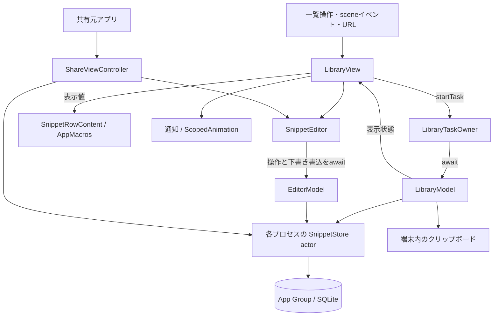

# 0002：nibble MVPの製品設計

状態：採用。設計基準日：2026-09-16。対象は日本語UIのiPhoneアプリ`Nibble`と共有拡張`NibbleShare`。最低対応OSはiOS 26.0、実行評価はiOS 26.5 Simulatorとする。

## 目的と設計原則

nibbleは、よく使うテキストを端末内に保存し、必要なときに探してコピーするツールである。利用者は入力先のアプリへ戻り、本文をペーストして作業を続ける。少ない操作で本文へ到達できること、作成・編集・削除に迷わないこと、入力・検索・描画を待たせないことを優先する。

データ、操作、表示には次の契約を設ける。

| 領域 | 契約 |
| --- | --- |
| データ | 原文と検索用の値を分け、空白・改行・Unicodeを保存・編集・コピーで保持する |
| 操作の完了 | モデルは受理した処理と結果反映を完了まで待つ`async` APIを提供する |
| タスクの所有 | UIが非構造化タスクの開始・寿命・重複方針をswift-taskingで管理する |
| 表示の比較 | 値だけで決まる表示部分はswift-app-macrosで比較し、状態と操作を通常のViewに保持する |
| アニメーション | swift-scoped-animationで範囲を指定し、入力やスクロールへの不要な伝播を防ぐ |
| 編集の終了 | 保存・閉じる・破棄は永続化の結果が確定してから画面を閉じる |

この文書は機能・画面・データ・実行時の責務と採用理由を定義する。コードの構文とLintは[実装規約](../library-policy.md)、操作と期待結果は[MVP手順](../mvp.md)、確認したソースと条件は[検証結果](../mvp-validation.md)を参照する。

## 利用シーンと提供範囲

| 利用シーン | 提供する機能 |
| --- | --- |
| 定型文を探して使う | タイトル・本文の部分一致検索、ピン留め、保存済み本文のコピー |
| テキストを作成・編集する | 任意タイトルとプレーンテキスト本文、明示保存、下書きの保存・再開・破棄、編集競合からの回復 |
| 不要な項目を整理する | 削除、直後の取り消し、削除一覧からの復元、確認付きの完全削除 |
| 他アプリの内容を保存する | 共有シートからテキストまたはURLを1件読み、内容を確認・編集して保存 |
| 作業中にnibbleを開く | 本体起動、Apple「ショートカット」の標準URLアクションによる一覧・作成画面の表示 |

日常操作にアカウントと通信を必要としない。入力先への復帰とペーストは利用者が行う。同期、独自バックアップ、書式付きテキスト、画像・ファイル、変数展開、AI、課金はMVPの提供範囲外とする。キーボード拡張、Widget、Controls、App Shortcutsの自動登録、任意アプリへの重ね合わせ表示、自動挿入も構成に含めない。

## 画面とフィードバック

本文の読み取りとコピーを画面の中心に置く。システムフォントとDynamic Type、標準の一覧・入力・シート・メニュー・確認ダイアログを使う。ライト外観はクリーム色の背景と錆色のアクセント、ダーク外観は暗いグレーの背景と明るいオレンジのアクセントとする。

| 画面 | 表示・操作 | 状態と回復 |
| --- | --- | --- |
| 一覧 | 検索欄、「すべて／ピン留め」、スニペット行、作成ボタン。行右端でコピー、行タップで編集 | 空の一覧には作成への入口、検索0件には語句変更の案内を表示。検索語が空で削除一覧以外の場合に下書きを表示 |
| 編集 | 任意タイトル、複数行本文、保存・閉じる・キーボードを閉じる操作。その他メニューに本文共有と下書き破棄 | 本文領域は内容に応じて伸び、ページ全体をスクロール可能。保存処理中は終了操作を無効化し、失敗時は入力とエラーを保持。シートのスワイプ終了は無効 |
| 削除した項目 | 一覧のその他メニューから開き、復元または確認付きの完全削除を行う | 通常の一覧・コピーから除外。自動消去は行わず、完全削除時は関連下書きも消去 |
| 共有拡張 | 取り込んだ本文を本体と共通の編集画面で確認・編集する | 永続化に成功したら共有元へ戻る。閉じる操作で残した下書きは本体で再開可能 |

ピン留め・削除は長押しメニューまたはスワイプから選ぶ。スワイプし切るだけでは実行しない。コピー・検索クリア・復元の操作領域は44 pt以上とする。

コピー完了は触覚と2秒間の通知、削除完了は6秒間の取り消し操作で伝える。通知文はアクセシビリティのannouncementにも送る。コピー処理の完了と通知の表示期間は独立させ、コピーの呼出元を通知消去まで待たせない。

## 構成と責務

SwiftUI・Observationで表示状態を扱い、UIモデルには`@MainActor`を明示する。Swift language mode 6、strict concurrency complete、default isolation nonisolatedを使う。本体と共有拡張は別プロセスで動作し、App Group内のSQLiteを共有する。各プロセスの`SnippetStore` actorが接続を管理し、プロセス間の排他はSQLiteが担う。

| 構成要素 | 保持するものと責務 |
| --- | --- |
| `LibraryView` | `@State`の一覧モデルと`LibraryTaskOwner`、フォーカス、シート。操作を所有者へ渡し、一覧行と通知へ表示値を渡す |
| `LibraryTaskOwner` | Tasking store。`startTask`で開始を受理し、ID・寿命・重複方針・キャンセルを管理 |
| `LibraryModel` | MainActor上の検索条件・一覧・編集入口・通知状態。読込、コピー、項目更新を待機可能な操作として提供 |
| `SnippetRowContent` | タイトル・本文プレビュー・ピン状態の3つの値。AppMacrosの比較境界内で行の内容を表示 |
| `SnippetEditor` | 編集モデルと終了操作のTasking store。入力の書込をSwiftUI `.task`で待ち、終了操作の成功後にdismissまたは共有元へ完了通知 |
| `EditorModel` | MainActor上の入力、編集中・終了処理中・終了済みのphase、回復方法を含む失敗。`finish`で保存・閉じる・破棄の完了を提供 |
| `ShareViewController` | UIKitの拡張入口とprovider読込タスク。入力検証、共通編集画面の表示、共有元への完了通知 |
| `SnippetStore` actor | 接続、検索、トランザクション、更新順序の検査、永続化。接続・statement・ポインタをUIへ公開しない |

モデルはTaskingのstoreや開始用closureを持たない。表示専用の行はモデルや操作closureを持たない。actor間では値型を渡し、SQLiteのトランザクション中には中断点を置かない。

## データの意味と永続化

| 用語・型 | 意味 |
| --- | --- |
| スニペット / `Snippet` | 保存済みのUUID・タイトル・本文・ピン留め・revision・更新日時・削除状態を持つ項目 |
| 一覧用要約 / `SnippetSummary` | 一覧に必要な属性と本文プレビュー。コピー時には保存層から本文全体を読む |
| 下書き要約 / `DraftSummary` | 一覧に必要なUUIDと最大180文字のタイトル。本文を保持せず、再開時にDBから読む |
| 一覧要求 / `LibraryRequest` | 検索語・フィルタ・取得上限をまとめた不変値。検索語・フィルタの変更で上限を100件へ戻す |
| 一覧結果 / `LibraryPage` | 同じ読取トランザクションから得たスニペット要約・下書き要約・追加ページの有無 |
| 下書き / `Draft` | 独立したUUIDを持つ編集内容。既存項目の編集では対象UUIDと読込時のrevisionを持つ |
| revision | 保存済み項目の変更を識別し、編集開始後の競合を検出する値 |
| sequence | 下書きの入力変更ごとに増える番号。遅れて届いたsnapshotによる上書きを防ぐ値 |
| snapshot | ある時点の下書きを値として固定したもの。非同期の書込中にUIの入力が進んでも変化しない |

保存先はApp Group `group.dev.nibble.app`の`Library/snippets.sqlite`。WAL、`synchronous=FULL`、2秒のbusy timeoutを設定する。schema version 1は`snippets`と`drafts`で構成し、起動時に`user_version`を確認する。未知の新しいschemaや破損DBではエラーを返し、既存データを削除して空のストアを作らない。

タイトルと本文は空白・改行・タブ・Unicodeを保持する。保存時の上限はタイトル512 UTF-8 bytes、本文1,000,000 bytes。空白・改行だけの本文は保存不可とし、失敗時は入力を編集画面に残す。

既存項目の編集は、保存層の1つの書込トランザクションで対象の削除状態を確認し、最新の下書きを再開するか新規作成する。下書き行からの再開もUUIDでDBを読み直し、一覧取得後の入力更新・削除を反映する。作成ボタンは新しい下書きを作る。保存は、対象項目が削除されておらず読込時のrevisionと一致する場合に受理する。競合時は入力を保持し、「新しい項目として保存」で別UUIDへ保存できる。

スニペットの保存と下書きの除去は1トランザクションで確定する。下書きの更新はsequenceが新しい既存行だけに適用する。入力の実バイト列が変わったときだけDraft自身がsequenceを増やす。保存・閉じる・破棄はDBの下書きとidentity・baseRevision・sequenceを照合し、古い入力や同じsequenceの異なる原文では終了しない。同じsequenceの原文照合にはSwift Stringの正準等価比較ではなくUTF-8を用いる。新しい項目としての保存は入力を別UUIDへ救済し、より新しい下書きがあれば保持する。下書きが他の操作で除去済みの場合も、明示した救済保存で入力を残せる。保存・破棄後の遅れた書込で下書きを再生成しない。削除と復元は同じUUIDの削除状態を変更し、本文とピン留めを保持する。完全削除は項目と関連下書きを1トランザクションで消去する。

## 非同期操作の完了契約

モデルの`async` APIは、受理した操作の処理と結果反映を待ってから戻る。呼出元は既存タスクから直接awaitでき、同期UIイベントではUI所有者に開始を要求する。モデルはTaskingのstoreや開始用closureを保持しない。同期setter・initializerは同期的な状態初期化・更新だけを行う。

| 操作 | 呼出元が待つ範囲 |
| --- | --- |
| `refresh()` | 検索・下書き取得と、有効な要求世代の状態反映 |
| `open(_ source:)` | 新規・保存済み項目・下書きの入口を指定し、DB読込または作成と編集状態への反映。既に開いている場合や二重開始は受け付けない |
| `copy(_:)` | 保存済み本文の読込、pasteboardへの書込、通知状態の更新。通知の期限待ちは含めない |
| `pin`・`delete`・`restore`・`permanentlyDelete` | DB更新と一覧の再取得。表示するエラー・通知も操作内で扱う |
| `persist(_ snapshot:)` | 指定した不変snapshotのDB更新。終了済みeditorや別の下書きIDは受け付けない |
| `finish(_ operation:)` | 保存・救済保存・閉じる・破棄の入力を固定し、永続化と終了状態を確定。処理中・終了後の入力変更を拒否し、成功をBoolで返す |
| `expireNotice(id:)` | 通知の期限待ちと、同じ通知IDの場合の消去 |

編集開始・コピー・項目更新・編集終了操作は開始時にキャンセルを確認する。重複・終了済み状態などで受け付けない要求は処理を始めず戻る。下書きのsnapshot書込は呼出元のキャンセルで破棄せず、DBのsequence比較で適用を判断する。業務上の失敗はモデルの表示状態へ変換し、入力を保持して再試行や競合からの回復を可能にする。

### 入力から編集終了まで

タイトル・本文のsetterは編集中のみ入力を更新し、Draftが実バイト列の変更に応じてsequenceを増やす。`SnippetEditor`は描画時のsnapshotを取得し、`.task(id: snapshot.sequence)`から`persist(snapshot)`を直接awaitする。SwiftUIが入力更新を集約するため、全キーストロークを独立して永続化する契約にはしない。

保存・閉じるは自動保存の開始に依存せず、その時点の入力を直接永続化する。閉じる際は下書きを保持し、タイトル・本文がともに空の場合と、変更していない既存項目の編集では下書きを除去する。保存・閉じる・破棄を同じ終了操作IDで扱い、複数の終了操作を同時に受理しない。

受理済みのSQLite書込は完了まで進める。永続化が成功した終了操作には、途中でキャンセルが届いてもUIの終了通知を返す。異常終了直前に永続化が終わっていない入力の保持は保証しない。

## 操作の寿命と整合性

Taskingの`ActionID`は重複判定の単位、`ActionLifetime`はキャンセル対象を分類する値とする。lifetimeはsceneやviewを自動監視しない。所有者が終了イベントを`cancel(lifetime:)`へ接続する。

| 操作 | 所有者・ID | 寿命 / 重複方針 |
| --- | --- | --- |
| 一覧読込 | `LibraryTaskOwner` / `library.refresh` | sceneBound / cancelExisting |
| コピー | `LibraryTaskOwner` / `library.copy` | sceneBound / cancelExisting |
| 編集開始 | `LibraryTaskOwner` / `library.open` | screenBound / ignoreNew |
| ピン・削除・復元・完全削除 | `LibraryTaskOwner` / 操作種別と項目UUID | sceneBound / ignoreNew。同じ項目の同じ操作を抑止 |
| 保存・閉じる・破棄 | `SnippetEditor` / `editor.finish` | screenBound / ignoreNew |
| 共有provider読込 | `ShareViewController` / `share.load` | screenBound / ignoreNew |
| 下書き書込 | `SnippetEditor`の`.task(id: snapshot.sequence)` | SwiftUIが入力ID変更とview終了に応じてキャンセル |
| 通知期限 | `LibraryView`の`.task(id: notice?.id)` | SwiftUIが通知ID変更とview終了に応じてキャンセル |

一覧読込は表示、検索・フィルタ・取得上限の変更、active復帰、編集終了で要求する。sceneBound操作はシート表示や一時的な非active化をまたいで完了する有限処理であり、一覧viewの`onDisappear`でキャンセルしない。sceneのbackground化では`endScreen()`で編集開始をキャンセルし、`clearNotice()`で通知値（ID・本文・取り消し対象）を消す。

編集の終了操作は`SnippetEditor.onDisappear`、共有provider読込は`ShareViewController.viewDidDisappear`でscreenBoundをキャンセルする。コピーとprovider読込は読込の前後でキャンセルを確認し、通知期限は待機後にキャンセルと通知IDを確認する。キャンセルは停止要求であり、確定済みDB変更を取り消さない。

## 検索と一覧の性能

検索キーはタイトルと本文からNFCと日本語localeのcase/width foldingで生成し、原文と別に保存する。検索入力のたびに全本文を正規化しない。

| 項目 | 契約 |
| --- | --- |
| 一致条件 | 検索語の前後空白・改行を除き、SQLiteの`instr`で部分一致。日本語1文字から検索可能 |
| 文字の扱い | 英字大小・半角/全角を同一視。ひらがな／カタカナ、清音／濁音は区別。`%`・`_`・バックスラッシュは通常文字 |
| 並び順 | ピン留め優先、更新日時降順、UUID昇順 |
| 取得範囲 | 先頭100件。「さらに表示」で上限を100件増やし、先頭から再取得。次ページの有無を調べるため追加1件を読む |
| 一覧の本文 | `substr(body,1,180)`のプレビュー。コピーはDBから本文全体を取得 |
| 結果の反映 | 要求世代・検索条件・キャンセル状態を照合し、有効な要求だけ一覧・loading状態へ反映 |

下書き一覧はUUIDと最大180文字のタイトルだけを取得し、本文の長さに比例する転送・保持を避ける。本文全体は編集開始時に対象1件だけ取得する。下書きの件数は制限しないため、件数に比例する一覧メモリは別途評価する。検索測定は保存層の要求から返却までと、IME・状態更新・描画を含むUI応答を分ける。[検証結果](../mvp-validation.md)のSimulator測定値を実機の性能保証へ換算しない。

## 値による表示更新の制御

比較境界とは、表示に必要な入力値の等価比較でSwiftUIの更新を制御するViewの範囲を指す。一覧行の`SnippetRowContent`は`@Equatable`を付けた`EquatableBodyView`とし、タイトル・本文プレビュー・ピン状態の3つの`let`入力をすべて比較する。同じstructの`equatableBody`に内容を書き、ライブラリの既定の`body`が比較を適用する。

行のButton、アクセシビリティの操作ラベル、編集・コピー・復元・メニューのクロージャは`LibraryView`に保持する。比較境界へ渡す値にクロージャ・参照モデル・DynamicPropertyを含めず、比較から入力を除外しない。表示値が等しい場合も、操作は現在のモデル・項目を参照する。

状態や入力を持つ一覧全体・編集画面は通常のViewとする。標準部品の外観・文字サイズはSwiftUIのenvironmentで更新される。比較項目の変更と復元、入力が等しい状態での外観・文字サイズの追従をマウント済みViewでテストし、製品の操作を画像・録画で確認する。比較による描画回数や応答時間への効果は、同じ条件で測定して判断する。

## アニメーションの適用範囲

通知の表示・消去を`Library.Notice`という名前の`AnimationScope`で囲み、0.16秒のopacity遷移を使う。Reduce Motion有効時はdurationを0秒にする。通知文の更新と通知の有無を分け、scopeは表示の有無を監視する。

`LibraryView`と`SnippetEditor`の外側には`animationBarrier(warnsOnLeaks: false)`を置き、OSのシートtransactionが内容へ伝わるのを防ぐ。内側の`detectAnimationLeaks`と、入力領域の警告付きbarrierでアプリ内部の伝播をDebug実行時に診断する。標準シート・メニュー・キーボード自体の遷移はOS部品が管理する。

比較境界は表示値の一致、アニメーションscopeは表示変化の適用範囲を扱う。それぞれの役割を独立させ、診断と製品の画像・録画の両方で確認する。

## 呼び出しと共有の契約

| 入口 | 契約 |
| --- | --- |
| `nibble://library` | 検索語を空にし、「すべて」の一覧を表示 |
| `nibble://new` | 新しい下書きを作成し、編集画面を表示 |
| 編集中のURL受信 | 開いている編集内容を維持 |
| URLの許可条件 | 上記2種類だけを受理。path・query・fragment・認証情報・port付きURLを拒否し、本文や保存・削除指示を受け取らない |
| Share Extension | 共有元が渡す最初の対応providerから1件取得。plain textを優先し、URLは文字列として扱う。非対応形式・無効入力はエラー表示 |
| コピー | DBから読んだ本文を`localOnly`でpasteboardへ書込。pasteboardの読取・自動取り込みは行わない |

共有元のアプリをhostと呼ぶ。対応形式はhostの提供内容に依存し、URLを受け取ってWebページをダウンロードすることはない。providerのcallbackはchecked continuationで待機可能な読込に接続する。custom URL schemeに所有権の保証はないため、本文や機密情報の輸送には使わない。標準ペースト操作と`PasteButton`による取り込みは利用者が開始する。

## 技術選定と保守

技術は使いやすさ、描画・応答性能、OS/API制約、保守・運用、移行の負担を比較して選ぶ。標準APIと外部依存の成熟度や置き換えやすさを評価し、新しさだけを採用理由にしない。

| 採用 | 比較・判断理由 | 見直す条件 |
| --- | --- | --- |
| SwiftUI + Observation | 標準部品と明示的なUI状態で一覧・編集を構成。UIKitは共有拡張の入口で使用 | IME・フォーカス・表示の問題を標準部品で解決できない場合 |
| swift-tasking 0.3.0 | 個別のTask handle管理に対し、所有・寿命・重複方針を共通APIで表現。モデルの操作は独立したasync APIとする | 保守停止、対応条件の不適合、測定した応答の悪化 |
| swift-scoped-animation 0.2.1 | 個別のtransaction管理に対し、表示変化の範囲と伝播を共通APIで表現 | 保守停止、対応条件の不適合、描画の悪化、必要な表現を扱えない場合 |
| swift-app-macros 0.2.0 | 表示入力から比較を生成し、View定義側にゲートを設ける。手書き比較の項目漏れと呼出側の付け忘れを防ぐ。Mac上のマクロ実行とswift-syntaxのビルドを必要とする | 比較コスト・ビルド時間の悪化、Swift / SDKとの不適合、保守停止 |
| Apple同梱SQLite | SwiftData・Core Dataに対し、共有ストア、revision付き更新、下書きとのatomicな確定を直接検査可能。SQLとmigrationは手動管理 | 同期やschema変更で手動管理の負担が増す場合 |
| 保存済み検索キー + `instr` | 日本語1〜2文字の部分一致を原文保持と両立。FTS5 trigram MATCHの短い検索語の制約を避ける | 対象データ量での遅延、高度な検索・ランキングの必要性 |
| Share Extension + 標準URLアクション | host内での取り込みと、一覧・作成への呼び出しを公開APIで提供。利用者がショートカットを設定 | host・形式・件数の拡大、自動登録・音声操作・引数付きアクションの必要性 |
| 端末内保存 | アカウント・通信・同期競合を要しない日常操作 | 複数端末での利用を提供する場合 |

Swift Packageはexact versionと共有`Package.resolved`で固定する。Tasking・ScopedAnimationは本体と共有拡張、AppMacrosは比較Viewを使う本体とそのテストにリンクする。swift-syntax 603.0.2はMac上のマクロを構築する依存としてlockへ固定し、アプリのruntimeにはリンクしない。3つの製品ライブラリはMIT、swift-syntaxはApache-2.0とRuntime Library Exceptionで提供される。製品ライブラリの通知を両bundleへ含める。補助ツールはNix、Xcode・SDK・runtimeはローカルのApple配布物で管理する。依存更新の手順は[実装規約](../library-policy.md#依存とビルド)に従う。

比較の根拠は[研究資料](../../research/README.md)に保存する。ResearchProbeの保存3方式やAPI試作は比較条件であり、製品の採用構成と区別する。

## データ保護と配布

保存先ディレクトリとDBにはData Protectionのcompleteを指定する。本体は非activeの一覧とbackgroundの編集画面に本文を隠す表示を重ねる。共有拡張は独立したapp sceneを持たないため、このscene状態による隠蔽を適用しない。ロック中のアクセスとアプリ切替画面の実際の露出は実機で評価する事項とする。

本文・検索語をログ、システム検索、analyticsへ送らない。本体・共有拡張にデータ収集・trackingなしのPrivacy Manifestを含める。依存更新と配布時には実際のAPI・データフロー・ライセンスと宣言の整合性を確認する。

schema変更はトランザクション内の明示的なmigrationと旧版fixtureで検証する。保存層を変更する場合はUUID・本文・下書き・削除状態の移行結果を照合する。WALを欠くDB本体のコピーをバックアップとして扱わない。独自のexport/import・バックアップ復旧は提供せず、アプリ削除後の復旧は保証範囲外とする。

署名配布には、本体と共有拡張の同一Developer Team・App Group、bundleのAPI・宣言・署名の点検を要する。配布方法、App Privacy回答、privacy policy、サポート窓口を配布判断に含める。コード公開とPRの運用は[開発ガイド](../../CONTRIBUTING.md)に従う。

## 機械検査と受け入れ条件

| 検査 | 確認する契約 |
| --- | --- |
| `swift-library-policy` | Taskingの開始・ScopedAnimationの入口・AppMacrosの比較境界。直接API、隠れた開始、別名化、比較入力の除外を拒否 |
| モデル・保存層のテスト | 操作を直接awaitした時点の結果、原文保持、競合、下書き順序、保存・破棄後の遅延書込、復旧条件 |
| 所有者のテスト | 開始の受理、重複方針、寿命、キャンセル |
| 比較Viewのテスト | 全表示入力の比較、表示の更新・復元、外観・文字サイズの追従 |
| Simulatorの操作と撮影 | 日常導線、共有元への復帰、入力・通知・表示設定を含むUI/UX |

構文Lintの保証範囲は[実装規約](../library-policy.md)で定義する。Swiftの型解決・マクロ展開・外部APIの副作用・処理の完了はcompiler、テスト、レビューで確認する。構造化されたasync/await・task group・SwiftUI `.task`と協調用Task APIは利用できる。

検証対象・証跡・CI・マージ条件は[検証とレビュー基盤](0001-local-ios-verification.md)で定義する。Ubuntu CIは同じNix lockで共通検査とPR本文の照合を行い、ローカルMacはApple CLIでビルド・テスト・撮影、sim-useでSimulatorを操作する。GitHub ActionsのmacOS runnerは間接起動を含めて禁止する。26.0への適合はdeployment targetとAPI availability、実行時の確認は26.5で行う。

MVPの受け入れはSimulator評価に限定し、実機検証は含めない。実行開始・終了・コミットの入力と媒体を[証跡検査](../review-evidence.md)で照合し、実際の観測・確認方法・限界を記録する。画像・動画にはソース・端末・OS・操作手順を付けてPRへ添付し、ブラウザーで閲覧を確認する。[検証結果](../mvp-validation.md)は実施した条件と未検証条件を示す。実機性能・ロック時保護・Handoff・署名配布・審査は個別の評価を要する。
