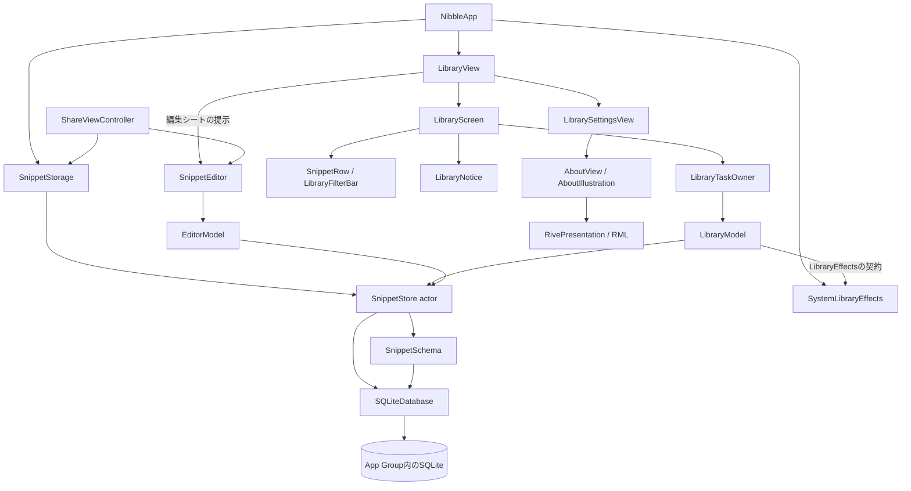
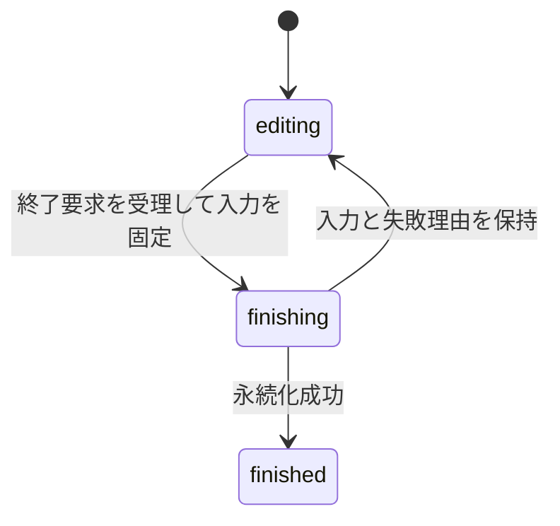

# 0002：nibbleの製品設計

状態：採用。設計基準日：2026-09-18。

nibbleは、よく使うテキストをiPhoneへ保存し、探してコピーするアプリである。本書は、製品の目的、データの意味、構成要素の責務、操作が成立する条件を定義する。

| 読みたい内容 | 正本 |
| --- | --- |
| 製品の機能、依存関係、保存と操作の契約 | 本書 |
| 画面・部品の目的、配置理由、寸法、評価条件 | [UI設計](../design/README.md) |
| Swiftの非同期処理、表示比較、アニメーションの実装規則 | [実装規約](../library-policy.md) |
| ビルド、操作、撮影の手順 | [MVP手順](../mvp.md) |
| 対象コミットごとの測定・観察・未確認条件 | [検証結果の索引](../mvp-validation.md) |

## 目的と提供範囲

利用者は「保存する → 探す → コピーする → 入力先へ戻ってペーストする」という流れでテキストを再利用する。少ない操作で作業を続けられ、編集中の原文を失わないことを優先する。

| 利用場面 | 提供する機能 |
| --- | --- |
| 定型文を利用する | タイトル・本文の部分一致検索、ピン留め、本文のコピー |
| 内容を作る | 任意タイトルとプレーンテキスト本文、明示保存、下書きの保持・再開・破棄 |
| 内容を整理する | 削除、直後の取り消し、削除一覧からの復元、確認付きの完全削除 |
| 他アプリから取り込む | 共有シートで受け取ったテキストまたはURLを確認して保存 |
| 作業中に呼び出す | 本体起動、標準ショートカットのURLアクションによる一覧・作成画面の表示 |

日本語UIの本体`Nibble`と共有拡張`NibbleShare`を提供する。最低対応OSはiOS 26.0、開発上の実行評価はiOS 26.5 Simulatorとする。日常操作は端末内で完結し、アカウントと通信を必要としない。入力先への復帰とペーストは利用者が行う。

同期、独自バックアップ、書式付きテキスト、画像・ファイル、変数展開、AI、課金は提供範囲に含めない。呼び出しは共有拡張とURLで構成し、キーボード拡張、Widget、Controls、App Shortcutsの自動登録、他アプリへの自動挿入は提供しない。

## データの意味と永続化

### 保存済み項目と下書き

保存済み項目はコピーして利用する内容、下書きは編集中の内容である。入力中は下書きだけを更新し、明示的な保存によって保存済み項目へ反映する。

| 用語・型 | 保持する値と用途 |
| --- | --- |
| `Snippet` | 保存済み項目。UUID、タイトル、本文、ピン状態、更新番号、更新日時、削除状態 |
| `SnippetSummary` | 一覧用の要約。UUID、タイトル、本文の先頭180文字、ピン状態、更新番号 |
| `Draft` | 編集セッション。下書きUUID、タイトル、本文、入力番号。既存項目の編集では対象UUIDと編集開始時の更新番号も持つ |
| `DraftSummary` | 一覧から再開対象を選ぶ値。下書きUUID、タイトルと本文の先頭180文字、更新日時 |
| `LibraryRequest` | 検索語・フィルター・取得上限を固定した一覧要求 |
| `LibraryPage` | 同じDB読取時点のスニペット要約、下書き要約、続きの有無 |
| snapshot | ある時点の値を固定したもの。編集では`Draft`、一覧では要求と結果の組を指す |

`revision`は保存済み項目の変更番号、`baseRevision`は編集開始時のその番号、`sequence`は同じ下書き内の入力順序である。保存済み内容の競合と、遅れた下書き書込を別々に検出する。

### 原文と検索用の値

タイトルと本文は、空白・改行・タブ・NUL・UnicodeのUTF-8を保持する。表示用の要約や検索用の正規化を原文へ適用しない。コピーは保存済み本文の全文を使う。

原文の同一性は`SnippetText.hasSameBytes`でバイト列を比較する。SwiftのString比較では等しい「が」と「か＋結合濁点」も、原文としては区別する。連続したUTF-8バッファの比較を使い、長文入力ごとの要素反復を避ける。

確定保存と共有の取り込みでは、本文が空白・改行だけでないこと、タイトルが512 UTF-8 bytes以内、本文が1,000,000 bytes以内であることを検査する。編集中の入力は、修正して保存できるように画面へ残す。

## 構成と責務

アプリと共有拡張の入口が依存を組み立て、UIはタスクの寿命、モデルは操作と表示状態、保存層はデータの整合性を管理する。Swift language modeは6、strict concurrencyはcomplete、default actor isolationはnonisolatedとする。UIモデルとOS操作は`@MainActor`に置く。

矢印は構成・呼出しの関係を示す。`LibraryModel`が参照するOS操作の型は`LibraryEffects`であり、UIKitを使う実装を入口から渡す。

### 所有者と依存の受け渡し

| 構成要素 | 責務・所有するもの |
| --- | --- |
| `NibbleApp` | 本体で使う保存層を保持し、`LibraryView`へ保存層とOS操作を渡す |
| `SnippetStorage` | App Group内の保存先を解決する保存層の生成。呼出しごとにインスタンスを作る |
| `LibraryView` | シーンのルート。タブ、検索フォーカス、左右設定、URL経路、一覧・検索の独立したモデルと編集シートの提示。削除一覧にも同じ保存層とOS操作を渡す |
| `LibraryScreen` | 一覧状態の配置、完全削除の確認、行の操作意図とタスク所有者の接続。編集対象はモデルが保持し、シートの提示はルートが行う |
| `SnippetRow` / `LibraryFilterBar` | 行の表示値と操作意図 / フィルター選択。行はモデル・保存層・タスク所有者を保持しない |
| `SnippetRowContent` | タイトル・要約・ピン状態だけから描画する比較境界 |
| `LibraryNotice` | モデルの通知・触覚状態を観測し、表示と期限を管理。復元の意図を画面へ返す |
| `LibraryTaskOwner` | 操作の開始、重複、キャンセル。業務処理はモデルをawaitする |
| `LibraryModel` | 一覧要求と結果、編集対象、通知、失敗。保存層と`LibraryEffects`を使う完了待ち可能な操作 |
| `SnippetEditor` / `EditorModel` | 入力・フォーカス・終了タスクの所有 / 下書き・自動保存・終了状態・回復可能な失敗 |
| `ShareViewController` | 拡張の保存層と読込タスクを保持し、取得した本文を共通編集へ渡す。終了結果を共有元へ通知 |
| `SnippetStore` | 検索、更新、競合検出、業務単位のトランザクション。UIには値型を返す |
| `SnippetSchema` / `SQLiteDatabase` | テーブル・索引・version / 接続・準備済みSQL・引数・トランザクションの資源管理 |
| `LibraryEffects` / `SystemLibraryEffects` | コピーと読み上げ通知の同期契約 / UIKitによる実行 |
| `AboutIllustration` / `RivePresentation` | 説明と表示設定・再生Sessionの保持 / 読込・接続検査・表示・フレーム停止 |

保存層を必要とする画面・モデルはinitializerで受け取る。本体の各モデルは一つの保存層を共有し、拡張は自身の保存層を持つ。App Groupの解決は最初の保存操作まで遅らせ、利用できない場合は回復可能なエラーとして表示する。テストには専用の一時URLを渡す。

### 状態の寿命

永続データは保存層、選択と表示結果は画面モデル、入力は編集セッションが持つ。シーンはアプリの一つの表示単位であり、本体は複数ウィンドウを提供しない。

| 状態 | 所有者と寿命 | 更新と読取 |
| --- | --- | --- |
| 保存済み項目・下書き | App GroupのDB。プロセス終了後も保持 | 本体・共有拡張がそれぞれの`SnippetStore`から読書きする |
| 一覧・検索の要求と結果 | `LibraryView`が保持する独立した`LibraryModel`。シーン中保持 | 各`LibraryScreen`が選択を更新し、表示時・active復帰時・編集終了時に再取得する |
| 削除一覧の要求と結果 | 削除一覧シートの`LibraryModel` | 本体と同じ保存層を使い、シート内の検索条件を保持する |
| 編集対象 | 呼出元の`LibraryModel.editor`。提示する下書きのUUIDを持つ | `LibraryView`がBindingでシートを提示する |
| 入力・フォーカス・終了処理 | 一つの`SnippetEditor`と`EditorModel`。編集セッション中保持 | 受け取ったDraftを初期値にし、親の再評価で入力を上書きしない |
| 通知・触覚 | `LibraryModel`の操作結果と、それを読む`LibraryNotice` | 操作成功時に更新する。通知はIDに対応する期限・画面離脱・背景移行で消す |
| 説明イラストの再生 | `AboutIllustration`の独立したSession | 配色・可視性・scene状態を表示層へ渡す |

一覧と検索は同じDBを参照するが、選択・検索語・表示結果を同期し続ける構成にはしない。共有拡張の書込を含む永続データの変更は、画面の再取得で反映する。表示に必要な派生値は要求とsnapshotから求め、同じ意味のBoolや配列を別のStateへ複製しない。

### 副作用の境界

| 外部状態への作用 | 実行する場所 | モデル・UIへ返す契約 |
| --- | --- | --- |
| DB読書き、保存先作成、ファイル保護 | `SnippetStore`と保存用helper | 値または`StoreError`。書込の確定単位を保つ |
| クリップボード書込、読み上げ通知 | `SystemLibraryEffects` | MainActorで同期的に完了。保存・検索の状態を保持しない |
| 触覚と通知の表示時間 | `LibraryNotice` | 成功状態に応じて表示・触覚を更新し、通知IDごとに期限を待つ |
| 共有データ取得、拡張の終了通知 | `ShareViewController` | 取得の前後でキャンセルを確認し、編集終了の成功を共有元へ返す |
| 左右設定の永続化 | `LibraryView`の`AppStorage` | 本体のUserDefaultsへ選択を保持 |
| 説明イラストの読込・再生 | `RivePresentation` | 表示ごとの独立したSessionと、読込失敗の状態 |

## 保存形式と接続

本体`nibble.9uiLe.com`と共有拡張`nibble.9uiLe.com.share`は、App Group `group.nibble.9uiLe.com`の`Library/snippets.sqlite`を使う。schema version 1には、保存済み項目の`snippets`と下書きの`drafts`がある。

各`SnippetStore` actorが一つの非Sendableな`SQLiteDatabase`を所有する。同一接続の操作はactorが直列化し、別プロセス・別接続の排他はSQLiteが担う。トランザクション内に`await`を置かず、読取には`BEGIN`、書込には`BEGIN IMMEDIATE`を使う。失敗時はrollbackを試み、元のエラーを返す。

| 設定・構造 | 目的と契約 |
| --- | --- |
| WAL、`synchronous=FULL`、busy timeout 2秒 | 共有DBの読書きと確定を管理し、競合の待機時間を制限する |
| `snippets_order` | 削除状態、ピン状態、更新日時、UUIDで一覧を取得する |
| `drafts_order` | 下書きを更新日時・UUID順に取得する |
| `drafts_snippet` | 対象スニペットの下書きの再開・除去を支える |
| schemaの確認 | 未対応version・破損DBをエラーにする。既存データを消して初期化しない |

索引は接続時に存在を確認して作成する。列構造を変更する場合はmigrationと既存データの検証を必要とする。

`SQLiteDatabase`は準備済みSQL（statement）を接続ごとに最大32件保持し、最も長く使われていないものから解放する。実行中のstatementは保持対象から外すため、入れ子の同じSQLにも独立したstatementを使う。

SQLの引数はbindingで渡し、個数不一致を拒否する。正常終了時はresetの成否を確認して全bindingを解除し、本文のバッファを保持しない。失敗したstatementは破棄する。書込は結果配列を作らず実行を完了し、接続の解放時は保持しているstatementも解放する。

## 検索と一覧の性能

### 一覧要求と表示の整合性

`LibraryModel`は、利用者が選択した`request`、取得済みの要求と結果を組にした`snapshot`、処理中の取得ID、要求ごとの完了結果を保持する。検索語・フィルターの変更時は取得上限を100件へ戻す。

1. `refresh()`が要求と取得IDを固定する。
2. `SnippetStore.library(_:)`が一つの読取トランザクションで要約を取得する。必要数より1件多く読み、続きの有無を判定する。
3. MainActorへ戻ったモデルが、キャンセル、取得ID、要求内容を照合する。
4. 有効な取得だけがsnapshotまたは完了結果を更新する。後始末も取得IDを照合する。

完了結果は成功・失敗・中断のいずれかである。選択した要求が未完了なら、UIがタスクを開始する前から読込中として扱う。空表示は、有効な結果の内容が空であるときだけ確定する。

| 状態 | 内容と操作 | 次の操作 |
| --- | --- | --- |
| 初期読込 | 進行表示。未取得を0件として扱わない | 結果を待つ |
| 検索語・フィルター変更中 | 以前の内容を操作不可で保持し、取得中の集合を示す | 選択の変更は新しい要求になる |
| 同じ集合の更新・追加取得 | 取得済みの内容を保持する。集合の一致は検索語とフィルターで判定する | 取得上限に対応する結果を待つ |
| 成功 | 要求と要約を一緒に反映し、0件案内または一覧を示す | 編集・コピー・整理・追加取得 |
| 失敗 | 要求に対応する失敗と再試行を示す。snapshot自体は保持する | 再読込 |
| 中断 | 進行表示を終え、「読み込みを再開」を示す。選択と異なる古い内容は操作不可 | 同じ要求を再実行 |

「すべて」は保存済み項目100件と直近の下書き3件を返し、残りの下書きへの入口を示す。下書き専用フィルターは下書きを100件ずつ取得する。「さらに表示」は上限を100件増やし、先頭から再取得する。

Listのidentityは表示中の結果のフィルターを使う。別フィルターの結果が届いた時点でスクロールを先頭へ戻し、取得待ちの間は表示中の集合のidentityを保つ。行は保存済み項目または下書きのUUIDで識別する。

### 検索条件と読込量

検索キーはタイトルと本文から作り、原文とは別に保存する。UnicodeのNFC正規化、日本語localeでの英字大小・半角全角のfolding、検索キー内のNULの置換を行う。検索語の前後空白・改行を除き、SQLiteの`instr`で部分一致を判定する。

| 条件 | 動作 |
| --- | --- |
| 日本語・記号 | 日本語1文字から検索可能。ひらがなとカタカナ、清音と濁音を区別し、`%`・`_`・バックスラッシュを通常文字として扱う |
| フィルター | 全項目・ピン留めは未削除、削除一覧は削除済み。下書きの検索語による絞り込みは行わない |
| 並び順 | ピン留め優先、更新日時降順、UUID昇順 |
| SQLの選択 | ピン条件・検索語の有無から固定した述語を選ぶ。ユーザー文字列は常にbindingで渡す |
| 読込量 | 一覧は要約、コピーと再開は対象1件の全文。検索語が空なら部分一致を評価しない |

ピン一覧は一覧用索引で絞り込む。部分一致検索には全件走査が生じ、表示件数を増やすほど要約のメモリも増える。下書き一覧へ渡すデータ量は本文の長さに依存しない。画面更新・描画と保存層の処理時間は別々に測定する。

## 編集の開始と再開

| `LibraryModel.EditorSource` | 保存層の処理 |
| --- | --- |
| `.new` | 独立したUUIDの下書きを作成する |
| `.snippet(id)` | 保存済み項目の未削除状態を確認し、最新の対応下書きを読む。なければ作成する |
| `.draft(id)` | 指定した下書きの全文をDBから読む。存在しなければエラーを表示する |

既存項目の下書きの検索と作成は、`editingDraft(for:)`の一つの書込トランザクションで行う。同時に再開しても重複して作成しない。`beginDraft`は独立した編集セッションを作るAPIである。

再開時には一覧の要約を編集値として使わず、その時点のDBを読む。モデルは編集画面の表示中・有効な編集開始要求の処理中の追加開始を受け付けず、URLを受信しても表示中の入力を保持する。

編集開始の所有者は提示要求へIDを割り当てる。離脱時には自分の要求IDを無効にし、タスクへキャンセルを要求する。保存層から戻ったモデルはIDとキャンセルを確認し、有効な結果だけを`editor`へ反映する。失敗の表示と後始末にも同じIDの照合を使う。

この契約により、古いDB処理が完了していなくても再入場時の新しい要求を受理できる。提示していない新規の空下書きは通常の保持操作で可能な範囲で除去する。既存項目の下書きと、再開対象の下書きは保持する。

### 編集セッションの提示

本体の編集シートはシーンのルート`LibraryView`が提示し、一覧・検索のモデルが持つDraftへのBindingを使う。入力とフォーカスはシート内の`SnippetEditor`が所有する。タブ内容の一時的な離脱や背景移行を、提示済みの編集セッションの終了条件にしない。シート終了時は呼出元のモデルを再取得する。

共有拡張では`ShareViewController`が`UIHostingController`を保持し、同じエディターを表示する。編集の保存契約は共通で、画面の提示と終了通知はそれぞれの入口が担当する。

## 入力の保存と編集の終了

### 自動保存

タイトル・本文のsetterはメモリ上の値だけを変更する。`Draft`はUTF-8の変化に応じて`sequence`を増やし、`SnippetEditor`は固定したsnapshotを`.task(id: snapshot.sequence)`から`persist(_:)`へ渡す。

自動保存は同じUUIDの既存行へ、DBより大きい入力番号だけをUPDATEする。同じ番号・小さい番号・除去済みの下書きには書き込まない。保存・破棄の後に遅れた書込が届いても、下書きを再生成しない。

SwiftUIによる入力更新の集約を許容する。全キーストロークの個別保存と、異常終了直前の未確定書込は保証しない。保存・閉じるは自動保存の開始に依存せず、現在の入力を固定して永続化する。

### 終了状態と確定条件

`EditorModel.finish(_:)`は入力を固定し、一つの終了結果を確定する。

`editing`だけが入力変更と終了要求を受け付ける。画面は`finished`となった成功結果を受け取って閉じる。終了処理中の入力と二重終了、シートのスワイプ終了は受け付けない。

| 終了操作 | 成功時の結果 |
| --- | --- |
| `.save` | 保存済み項目の作成・更新と、対応下書きの除去を同時に確定 |
| `.saveAsNew` | 別UUIDへ保存し、置き換え可能な下書きだけ除去 |
| `.keep` | 下書きを保持。ただしタイトルと本文がともに空文字、または既存項目の編集で`sequence == 0`なら除去 |
| `.discard` | 下書きを除去し、保存済み項目を維持 |

通常の保存・保持・破棄は、トランザクション内で下書きUUID、対象UUID、`baseRevision`を照合する。入力番号はDBより大きいか、同じ番号かつタイトル・本文のUTF-8が一致する必要がある。既存項目への保存は、未削除で現在の`revision`が`baseRevision`と等しいことも要求する。

### 失敗と回復

| 失敗 | 扱い |
| --- | --- |
| 更新競合、下書きの照合不一致、対象消失 | 入力を保持し、「新しい項目として保存」を提示 |
| 空本文・サイズ超過 | 入力を保持し、修正後に再試行 |
| 保存先・DB・schemaの問題 | エラーを表示し、データを維持したまま再試行可能にする |

別項目への保存は画面にある入力を独立した項目へ残す。DBの下書きを置き換えられない場合はその下書きも保持し、除去済みの場合も明示的な別項目保存を許可する。自動保存の失敗は、snapshotの入力番号と現在の編集状態を確認してから表示する。

## 非同期操作の完了契約

モデルの操作APIは、受理した処理と結果反映を待ってから戻る。既存の非同期処理はモデルを直接awaitし、同期UIイベントは所有者の`startTask`から開始する。モデルはタスクを開始するstoreやclosureを受け取らない。

| 操作 | awaitが待つ範囲 |
| --- | --- |
| 一覧取得・再試行 | 読込と、有効な要求に対する結果または失敗の反映 |
| 編集開始 | 下書きの読込・作成と編集対象の設定 |
| コピー | 最新の保存済み本文の読込、クリップボード書込、完了通知の設定 |
| ピン・削除・復元・完全削除 | DB更新、一覧の再取得、該当する通知または失敗の反映 |
| 下書き書込 | 受理したsnapshotの条件付き更新 |
| 編集終了 | 入力の固定、永続化、成功・失敗状態の確定 |
| 通知期限 | 指定時間の待機と、同じIDの通知の消去 |

コピーは読込の前後でキャンセルを確認し、対象が未削除である場合だけ`LibraryEffects.copy`を呼ぶ。書込後に触覚用の状態を更新し、通知を設定する。コピー失敗を成功通知へ変換しない。

削除・復元は同じUUIDの削除状態を変更し、本文とピン状態を保持する。完全削除は削除済み項目と関連下書きを一つのトランザクションで除去する。

`Notice`はID、メッセージ、対象名、取り消し対象をまとめる。通常通知は2秒、取り消し付きは6秒で消す。表示期間はコピー・削除の完了に含めず、期限処理はIDを照合して新しい通知を消さないようにする。一覧読込の失敗と項目操作の失敗は別々に保持し、再読込による回復を項目操作の再実行と区別する。

## 操作の寿命と整合性

タスク所有者はTaskingのID・寿命・重複方針を設定する。`cancelExisting`は同じIDの処理へ停止を要求して次を開始し、`ignoreNew`は実行中の同じIDへの要求を受け付けない。

| 操作 | 所有者 / ID | 寿命 / 重複方針 |
| --- | --- | --- |
| 一覧読込 | `LibraryTaskOwner` / `library.refresh` | sceneBound / cancelExisting |
| コピー | `LibraryTaskOwner` / `library.copy` | sceneBound / cancelExisting |
| 編集開始 | `LibraryTaskOwner` / `library.open` | screenBound / ignoreNew |
| ピン・削除・復元・完全削除 | `LibraryTaskOwner` / 操作種別とUUID | sceneBound / ignoreNew |
| 編集終了 | `SnippetEditor` / `editor.finish` | screenBound / ignoreNew |
| 共有読込 | `ShareViewController` / `share.load` | screenBound / ignoreNew |
| 下書き書込 | `SnippetEditor` / `.task(id: snapshot.sequence)` | SwiftUIがID変更・View終了でキャンセルを要求 |
| 通知期限 | `LibraryNotice` / `.task(id: notice?.id)` | SwiftUIがID変更・View終了でキャンセルを要求 |

lifetimeはキャンセル対象の分類であり、OSのイベントは所有者が接続する。一覧の有限なsceneBound操作はシート開閉や一時的な非active化をまたいで完了する。background化では編集開始を止め、通知を消す。編集終了と共有読込は、それぞれの画面終了時にscreenBoundをキャンセルする。

キャンセルは協調的な停止要求であり、確定済みのDB変更を取り消さない。受理済みの下書き書込は入力番号で適用を判断する。編集終了の永続化が成功した場合は、途中でキャンセルが届いても成功を返す。独立したUI操作を並行して受け付けても、同一接続の書込はactor内で直列に確定する。

キャンセル要求とUIへ結果を反映する権限は別に管理する。一覧は取得IDと要求内容、編集開始は提示要求ID、通知は通知ID、下書きは入力番号を照合する。遅れて届いた成功・失敗・後始末が、別の操作の状態を変更してはならない。具体的な状態遷移は一覧取得・編集開始・編集終了それぞれの契約に従う。

## 画面とフィードバック

### タブと片手操作

本体は`TabView`の「一覧」「設定」「検索」に、それぞれ`NavigationStack`を置く。一覧と検索のモデルは独立した要求・結果・編集対象を保持し、表示時と編集終了時に再取得する。

| 画面 | 内容と操作 |
| --- | --- |
| 一覧 | 固定した「すべて／ピン留め／下書き」フィルター、要約リスト、新規作成 |
| 設定 | 操作ボタンの左右選択、削除一覧、製品情報への入口 |
| 検索 | 未削除の保存済み項目のタイトル・本文検索、結果の編集・コピー・整理 |
| 編集 | 任意タイトル、本文、保存、閉じる、本文共有、下書き破棄 |
| 削除一覧 | 削除済みだけの検索、復元、確認付き完全削除 |
| 製品情報 | 利用の説明、コピー・保存の図、ショートカットとデータの扱い |

検索は`Tab(role: .search)`と`.searchable`を使い、タブ選択時の入力開始を`.tabViewSearchActivation(.searchTabSelection)`で指定する。`.searchPresentationToolbarBehavior(.avoidHidingContent)`で見出しを保ち、入力中は新規作成を隠す。検索語が空白のみの案内と検索0件を分ける。タブバーはスクロールで縮小せず、検索の位置はOSへ委ねる。

左右設定は新規作成と行のコピーへ同時に適用し、`ActionButtonSide.storageKey`のUserDefaultsへ保持する。既定値は右側。物理的な左右を表し、言語の表示方向と標準検索タブの位置を変えない。新規作成は下部の56 pt、コピーは行横の44 pt以上の操作領域を持つ。`safeAreaInset`で通知と作成の領域を確保する。

### 一覧の選択と行操作

「すべて」は直近の下書き、ピン留め済み、その他の順に表示し、空区分を省く。「ピン留め」はピン項目、「下書き」は未完了の編集だけを示す。フィルターは文字・塗り・枠の色で選択を表し、チェックマークを付けない。横スクロールと44 pt以上の操作領域を使う。

行の内容をタップすると編集、コピーアイコンは本文をコピーする。メニューと長押しで整理操作を選べる。保存済み行は左フルスワイプで削除、右フルスワイプでピン留め／解除を実行する。削除一覧の完全削除はフルスワイプで実行せず、確認を必要とする。

### 外観と説明

一覧・設定・検索の見出しはナビゲーションバーの左側、階層内とシートは標準inlineタイトルを使う。Listはplainスタイル、透明な行背景、共通の`nibbleCanvas`と標準の区切り線で構成する。`NibbleTheme`はライトのクリーム色・錆色と、ダークのグレー・オレンジを定義する。

[固定表示の方針](../design/decisions/0002-fixed-interface.md)に従い、文字サイズ・太字・独自配色のコントラスト・独自演出を固定する。ライト・ダークには追従し、意味情報と操作ラベルは保持する。OS所有の標準部品の内部表現はOSが管理する。

「nibbleについて」は一つのScrollViewに説明文とRiveの図を配置する。元の文章を残したまま複製を保存する流れを6.2秒周期で自動再生し、Reduce Motionでも同じ演出を使う。再生・停止ボタンは置かない。隣接する文章が意味と読み上げを担い、図はコピー・保存の実処理を行わない。配置と全要素の理由は[画面構成](../design/screens.md)と[部品台帳](../design/components.md)を参照する。

## 値による表示更新の制御

`SnippetRowContent`はタイトル・本文プレビュー・ピン状態を通常の値型`let`で受け取る。`@Equatable`と`@MainActor EquatableBodyView`で全入力の比較を生成し、同じstructの`equatableBody`に表示を定義する。

操作closureと参照モデルは通常のViewである`SnippetRow`側へ置き、操作意図を`LibraryScreen`へ返す。比較対象の入力が等しい場合も、操作は現在の項目へ接続される。通知の観測は`LibraryNotice`で行い、一覧の内容と一時的なフィードバックの責務を分ける。

標準部品はSwiftUIのenvironmentを参照する。比較View単体のテストでは、入力の変更・復元と、同じ入力での外観・文字サイズの更新を確認する。本体の固定表示方針は、比較Viewの契約とは別に画面の入口へ適用する。

## アニメーションの適用範囲

| 対象 | 管理する仕組みと契約 |
| --- | --- |
| 通知 | `Library.Notice`の`AnimationScope`で有無を監視し、0.16秒のopacity遷移。Reduce Motionでも同じ時間 |
| アプリ内部の伝播 | `LibraryScreen`と`SnippetEditor`外側の警告なしbarrierでOSのシートtransactionを遮断。内側のDebug診断と入力領域のbarrierで伝播を検査 |
| 標準シート・メニュー・キーボード | OS部品の遷移 |
| 説明イラスト | RMLが図形と時間、`RivePresentation`が読込・型付き接続・表示を担当 |

`AboutIllustration`は表示ごとのSessionを保持し、配色と`motionAllowed=true`をData Bindingで渡す。Canvasは可視性・Viewの寿命・scenePhaseに応じてフレームを停止し、同じSessionで復帰する。演出完了を業務処理の成功判定へ使わない。詳細は[演出設計](0004-rive-presentation.md)と[RivePresentation](../../app/Packages/RivePresentation/README.md)に定義する。

## 呼び出しと共有の契約

| 入口 | 成立条件と結果 |
| --- | --- |
| `nibble://library` | 検索語とフィルターを初期状態にし、一覧タブを表示 |
| `nibble://new` | 一覧から独立した下書きを開く |
| URLの許可範囲 | 上記2種類だけを受理。path・query・fragment・認証情報・port付きは拒否。編集中は入力を維持 |
| 共有拡張 | 最初の対応providerから1件取得。plain textを優先し、URLは文字列として扱う |
| コピー | 保存済み本文を`localOnly`でクリップボードへ書く |

共有拡張は提供元の読込前後と下書き作成後にキャンセルを確認する。本文を検査して下書きを保存し、有効な要求だけが同じ保存層を渡した`SnippetEditor`を表示する。離脱後は編集Viewや失敗alertを追加せず、取り込み済みの文章は下書きとして保持する。提供元のcallback自体の即時停止は保証しない。編集の終了操作が成功したら共有元へ完了を通知する。「閉じる」で保持した下書きは本体で再開できる。非対応形式と取得失敗は説明して終了できる状態にする。

共有元の形式対応は提供元アプリに依存する。callbackはchecked continuationでawait可能な処理へ接続する。Webページ本文の取得とクリップボードの自動読取は行わず、ペーストは利用者が開始する。custom URL schemeは所有権を保証しないため、本文や保存・削除指示を載せない。

## 技術選定と配布容量

| 選定 | 目的・保守条件 |
| --- | --- |
| SwiftUI・Observation | 標準UIとMainActor上の状態で画面を構成。入力・フォーカス・表示を実画面で評価 |
| Tasking | UIタスクの所有・寿命・重複管理。IDと終了イベントは製品側が定義 |
| ScopedAnimation・AppMacros | 表示変化の範囲と値比較の境界を明示。生成コード・隔離・実表示を検査 |
| RivePresentation・rive-ios | RMLから再生成する図をApple runtime APIとData Bindingで接続。本体だけにruntimeを同梱 |
| Apple同梱SQLite | 共有DB、更新番号照合、項目と下書きの同時確定。SQLとmigrationを製品側が管理 |
| 保存済み検索キー・`instr` | 原文を保持した日本語の短い部分一致。全件走査の負荷は同条件で測定 |
| Share Extension・標準URLアクション | 公開APIによる取り込み・呼び出し。共有元の形式と利用者の設定が必要 |

依存の採用版・対応条件・ライセンスは[依存とビルド](../library-policy.md#依存とビルド)で管理する。直接依存はexact version、全依存は共有`Package.resolved`で固定する。AppMacrosのswift-syntaxはMac上のビルド用であり、製品runtimeへ含めない。補助ツールはNix、Xcode・SDK・SimulatorはApple配布物を使う。

Releaseは`-Osize`、whole-module、`ENABLE_TESTABILITY=NO`とする。製品テストは`ios.py test`がテスト可能性を有効にし、`@testable`で内部契約を検査する。UI操作のbuildと配布archiveは製品の設定を使う。

容量は同じSDK・architecture・Release条件のarchive内で、本体・拡張・runtime・アセットの実バイト数を比較する。dSYM・テスト・DerivedDataは製品容量へ加えない。App Storeの圧縮・thinning後のダウンロード容量は別に扱う。索引とstatement保持によるメモリ・保存容量、サイズ最適化による応答時間の変化も評価対象とする。

保守停止、OSやツールチェーンの不適合、測定した応答・描画の悪化、同期・検索要件の拡大を見直し条件とする。比較候補は[研究資料](../../research/README.md)、計測した値は[製品基盤の検証](../product-architecture-validation.md)へ記録する。

## データ保護と配布

保存先ディレクトリとDBにData Protectionのcompleteを指定する。本体は非activeの一覧とbackgroundの編集画面で本文を隠す。独立したapp sceneを持たない共有拡張には同じscene条件の覆いを適用しない。

本文・検索語をログ、システム検索、analyticsへ送らない。本体・拡張はデータ収集・trackingなしのPrivacy Manifestを持ち、本体の左右設定用UserDefaultsには理由`CA92.1`を宣言する。依存更新と配布時に、宣言と実際のAPI・データフローを照合する。

保存形式の変更ではUUID・原文・下書き・削除状態を検査する。WALを欠くDB本体のコピーはバックアップとして扱わない。独自export/importと、アプリ削除後の復旧は提供しない。

TestFlightは[配布設計](0003-testflight-distribution.md)に従う。同じDeveloper Teamで本体と拡張を署名し、双方のprofileにApp Groupを含める。内部グループ「本人用」への配信、秘密情報の扱い、配布担当者の操作は[配布手順](../testflight.md)に定義する。

## 機械検査と受け入れ条件

| 対象 | 確認する契約 |
| --- | --- |
| `PersistenceBoundaryTests` | statement再利用、入れ子、失敗回復、他接続の更新、OS操作の順序・未実行条件 |
| `SnippetStoreTests` / `DraftLifecycleTests` | 原文・検索・削除・競合、下書き照合、再開、同時操作、終了と回復、未知schema・破損DB |
| `OperationTests` / `OwnedActionTests` | await直後の状態と永続化 / UI所有者の受理・重複・キャンセル |
| `RowComparisonTests` / `RivePresentationTests` | 入力と環境の表示反映 / 実バイナリの接続、独立した状態、再生とリソース失敗 |
| 共通検査 | Swift規約、Rive生成契約、設計と実装の照合、文書、検証ツール、workflow |
| Simulator操作・画像・録画 | 編集・コピー・検索・フィルター・整理・共有、入力と固定表示、画面の寿命 |
| 同条件の性能測定 | 保存層の応答、入力から表示までの遅延、描画、メモリ、製品容量 |

保存テストは使い捨てDBで実際のSQLiteを操作する。OS作用の順序は記録用の`LibraryEffects`、実クリップボードとマウント済みwindowは`UIIntegrationTests`配下の直列テストで確認する。構文Lintは型解決・マクロ展開・全プログラムの副作用を証明しないため、compiler、製品テスト、レビュー、実画面の確認を組み合わせる。

[検証基盤](0001-local-ios-verification.md)に従い、ローカルMacがiOSのビルド・テスト・操作・撮影を担当する。GitHub Actionsは各jobへ`runs-on: ubuntu-24.04`を直接指定し、共通検査とPR本文の照合を行う。macOS runnerは間接起動も使用しない。

最低対応OSへの適合はdeployment targetとAPI availability、実行はiOS 26.5で評価する。実機性能・ロック時保護・触覚・Handoff・署名配布・審査はそれぞれ固有の確認を必要とする。[性能検証の手順](../performance-verification.md)で計測の成立を確認する。測定条件と実施済みの範囲を[検証結果](../mvp-validation.md)へ記録し、[証跡検査](../review-evidence.md)で対象ソースと媒体を照合する。
