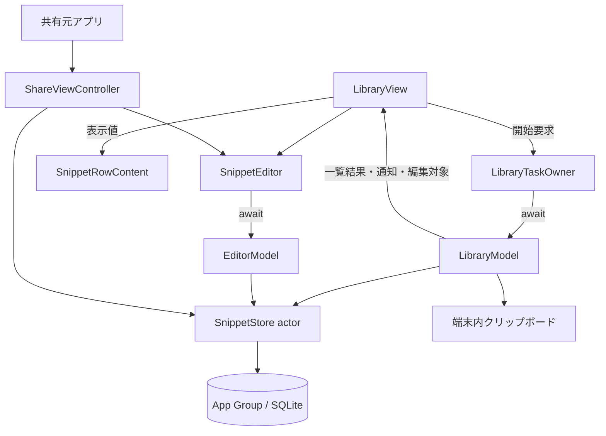
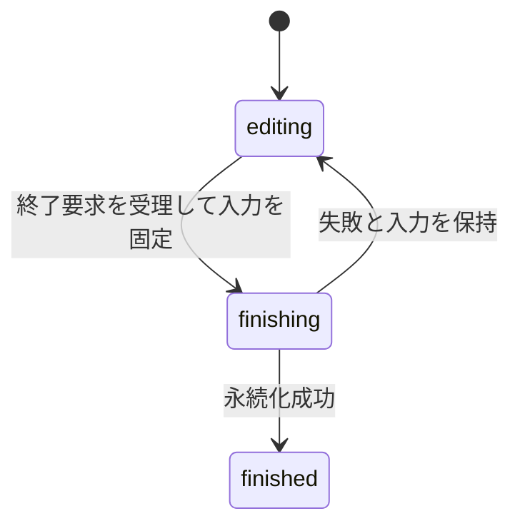

# 0002：nibble MVPの製品設計

状態：採用。設計基準日：2026-09-16。

nibbleは、よく使うテキストをiPhoneに保存し、必要なときに探してコピーするアプリである。この文書は、製品の目的、データの意味、各構成要素の責務、操作の成立条件を定義する。実装規約は[ライブラリ規約](../library-policy.md)、利用者の操作と確認手順は[MVP手順](../mvp.md)、実行したソースと観測結果は[検証結果](../mvp-validation.md)に記載する。

## 目的と設計原則

利用者の基本的な流れは「テキストを保存する → 探す → コピーする → 入力先のアプリへ戻ってペーストする」である。目的は、繰り返し入力する手間を減らし、少ない操作で作業を続けられるようにすること。

| 原則 | 設計上の扱い |
| --- | --- |
| 原文を保つ | 保存・編集・コピーで空白、改行、タブ、UnicodeのUTF-8を保持する。検索用の加工は別の値へ適用する |
| 編集内容を失わせない | 保存済み項目と下書きを分け、保存失敗時は入力を残す。競合時は別項目として保存できる |
| 操作の結果を明確にする | 永続化と画面状態の反映を待ってから操作を完了する。成功した終了操作だけが編集画面を閉じる |
| 読み込む量を用途に合わせる | 一覧には要約を渡し、編集・コピーの対象となる1件の本文を必要な時点で読む |
| 責務を局所化する | UIがタスクを所有し、モデルが処理と状態を持ち、保存層が整合性を判断する |

## 利用シーンと提供範囲

対象は日本語UIの本体アプリ`Nibble`と共有拡張`NibbleShare`。最低対応OSはiOS 26.0、実行評価はiOS 26.5 Simulatorとする。

| 利用シーン | 提供する機能 |
| --- | --- |
| 定型文を探して使う | タイトル・本文の部分一致検索、ピン留め、本文のコピー |
| テキストを作成・編集する | 任意タイトル、プレーンテキスト本文、明示保存、下書きの保存・再開・破棄 |
| 項目を整理する | 削除、直後の取り消し、削除一覧からの復元、確認付きの完全削除 |
| 他アプリの内容を保存する | 共有シートからテキストまたはURLを1件取り込み、内容を確認して保存 |
| 作業中にnibbleを開く | 本体起動、Apple「ショートカット」の標準URLアクションによる一覧・作成画面の表示 |

日常操作は端末内で完結し、アカウントと通信を必要としない。入力先への復帰とペーストは利用者が行う。

MVPの範囲はプレーンテキストの保存と再利用である。同期、独自バックアップ、書式付きテキスト、画像・ファイル、変数展開、AI、課金は提供しない。呼び出しには共有拡張とURLを使い、キーボード拡張、Widget、Controls、App Shortcutsの自動登録、任意アプリへの重ね合わせ表示や自動挿入は含めない。

## データの意味と永続化

### 保存済み項目と下書き

保存済み項目はコピーして利用する内容、下書きは編集中の内容である。編集画面への入力は下書きに保存し、明示的な保存操作で保存済み項目へ反映する。

| 用語・型 | 内容と用途 |
| --- | --- |
| スニペット / `Snippet` | UUID、タイトル、本文、ピン状態、更新番号、更新日時、削除状態を持つ保存済み項目 |
| スニペット要約 / `SnippetSummary` | UUID、タイトル、本文の先頭180文字、ピン状態、更新番号。一覧の表示と項目の識別に使う |
| 下書き / `Draft` | UUID、タイトル、本文、入力番号。既存項目を編集する場合は対象UUIDと編集開始時の更新番号も持つ |
| 下書き要約 / `DraftSummary` | 下書きUUIDとタイトルの先頭180文字。再開する下書きを一覧から選ぶために使う |
| 一覧要求 / `LibraryRequest` | 検索語、フィルタ、取得上限をまとめた不変の値 |
| 一覧結果 / `LibraryPage` | 同じDB読取時点のスニペット要約、下書き要約、続きの有無 |

UUIDは項目の一意な識別子である。下書きと保存済み項目はそれぞれ独立したUUIDを持つ。一覧用の要約には編集可能な本文全体を含めず、再開やコピーはUUIDから対象を読み込む。

### 変更を識別する値

| 値 | 意味 |
| --- | --- |
| `revision` | 保存済み項目の更新番号。保存、ピン状態、削除状態の更新で増える |
| `baseRevision` | 下書きが編集対象の項目を読み込んだ時点の`revision`。保存時の競合検出に使う |
| `sequence` | 下書きの入力番号。`Draft`のタイトルまたは本文のUTF-8が変わるたびに増える |
| snapshot | ある時点の`Draft`を固定した値。書込を待つ間に画面の入力が進んでも、この値は変わらない |

`revision`は保存済み項目の変更、`sequence`は同じ下書きに対する入力の順序を扱う。両者は別の比較に使う。

Swiftの通常のString比較では、例えば「が」と「か＋結合濁点」が等しいと判定される。原文の同一性と入力番号の更新はUTF-8で比較し、検索では文字を正規化する。

原文の比較は`SnippetText.hasSameBytes`に集約する。連続したUTF-8バッファの長さと内容を比較し、NULを含む文字列も途中で打ち切らない。長文の入力時にUTF-8の各要素をSwiftのiteratorで反復するコストを避ける。

### 保存形式と接続

本体と共有拡張は、両方からアクセスできる共有領域（App Group）`group.dev.nibble.app`の`Library/snippets.sqlite`を使う。SQLiteのschema version 1には、保存済み項目の`snippets`と下書きの`drafts`がある。

各プロセスの`SnippetStore` actorが接続・statement・ポインタを所有する。actorは同一プロセス内の操作を直列化し、SQLiteがプロセス間の排他を担う。設定はWAL、`synchronous=FULL`、busy timeout 2秒とする。

読取トランザクションには`BEGIN`、書込トランザクションには`BEGIN IMMEDIATE`を使う。処理・commit・rollbackはactor内で完了させ、トランザクション中に`await`による中断点を置かない。

接続時に`user_version`を確認する。未対応のschemaや破損DBはエラーにし、データを消して初期化する復旧は行わない。schemaの変更には明示的なmigrationと旧版データの検証を必要とする。

## 構成と責務

SwiftUIが画面を構成し、Observationがモデルの表示状態を伝える。UIモデルは`@MainActor`上で動作する。Swift language mode 6、strict concurrency complete、default isolation nonisolatedを使う。

| 構成要素 | 責務と所有する状態 |
| --- | --- |
| `LibraryView` | 一覧モデルとタスク所有者を`@State`で保持。フォーカス、シート、表示、利用者の操作を扱う |
| `LibraryTaskOwner` | 一覧操作のタスクを所有。開始、重複判定、キャンセルをTaskingで管理する |
| `LibraryModel` | 検索要求、一覧結果、編集対象、通知、エラー。読込・コピー・項目更新の待機可能なAPIを提供する |
| `SnippetRowContent` | タイトル・本文プレビュー・ピン状態の値から行の内容を描画する |
| `SnippetEditor` | 編集モデル、入力フォーカス、終了操作のタスクを所有。永続化成功後に画面または共有処理を終了する |
| `EditorModel` | 下書き、編集の状態、失敗内容と回復方法。自動保存と終了操作を実行する |
| `ShareViewController` | 共有データの取得、入力検証、共通編集画面の表示、共有元への完了通知 |
| `SnippetStore` | 検索、読込、更新、競合判定、トランザクション。UIへは値型を返す |
| `NibbleTheme` / `AboutView` | 本体・編集画面の色定義と、製品情報の表示 |

モデルはタスクを開始するstoreやclosureを持たず、呼出元のタスクで処理を完了する。表示専用の行はモデルや操作closureを持たず、渡された表示値を使う。

## 検索と一覧の性能

### 一覧の取得

1. 検索語・フィルタ・取得上限を`LibraryRequest`に固定する。初期上限は100件で、検索語またはフィルタの変更時に100件へ戻す。
2. `LibraryModel.refresh()`が要求ごとの識別子と検索条件を保持し、保存層の`library(_:)`を待つ。
3. 保存層は1つの読取トランザクションでスニペット要約と下書き要約を取得する。上限より1件多く読み、続きの有無を判定する。
4. モデルはキャンセル状態・要求識別子・検索条件を照合し、有効な結果だけを`LibraryPage`として反映する。「さらに表示」は上限を100件増やして先頭から再取得する。

検索キーはタイトルと本文をUnicode正規化形式のNFCへ正規化し、日本語localeで英字大小・半角/全角を同一視して作る。NULは検索キー上で置換文字へ変換する。キーは原文と別に保存するため、検索のたびに全本文を正規化する必要はない。

| 項目 | 契約 |
| --- | --- |
| 一致条件 | 検索語の前後空白・改行を除き、SQLiteの`instr`で部分一致。日本語1文字から検索可能 |
| 区別する文字 | ひらがなとカタカナ、清音と濁音。`%`・`_`・バックスラッシュは通常文字として扱う |
| フィルタ | 未削除の全項目、未削除のピン留め項目、削除済み項目 |
| 並び順 | ピン留め優先、更新日時降順、UUID昇順 |
| 下書き | UUIDとタイトル要約を取得。画面には検索語が空で削除一覧以外の場合に表示する |
| 全文の取得 | コピー時は保存済み本文、編集開始時は対象下書きの全文を1件取得する |

### 性能の評価範囲

一覧へ渡す下書きデータ量は本文長に依存しない。ただし下書き件数の上限はなく、要約一覧のメモリは件数に比例する。部分一致検索には全件走査が生じ、「さらに表示」も先頭からの再取得になる。

性能はデータ件数・本文量・端末・OS・構成を固定して測る。保存層の検索時間、入力から表示までの遅延、スクロール、メモリをそれぞれ評価する。構造上の読込量と実測した応答時間を区別し、Simulatorの数値を実機の保証に換算しない。測定条件と値は[一覧と編集の検証結果](../library-validation.md)に記録する。

## 編集の開始と再開

編集入口は`LibraryModel.EditorSource`で表す。

| 入口 | 保存層の処理 |
| --- | --- |
| `.new` | 独立したUUIDの下書きを作成する |
| `.snippet(id)` | 1つの書込トランザクションで保存済み項目の存在と未削除状態を確認する。対応する下書きがあれば更新日時が最新のものを読み、なければ作成する |
| `.draft(id)` | 指定された下書きの全文をDBから読み直す。存在しなければエラーを表示する |

一覧を取得してから別プロセスが下書きを更新しても、再開時には保存層にある内容を使う。既存項目の下書きの検索と作成を同じ書込トランザクションに入れることで、同時に開いた処理がそれぞれ下書きを作ることを防ぐ。`beginDraft`は独立した編集セッションを作るAPIとし、既存項目の再開には`editingDraft(for:)`を使う。

モデルは編集画面を表示中、または編集開始処理中なら別の編集開始を受け付けない。URLを受信した場合も表示中の編集内容を維持する。

## 入力の保存と編集の終了

### 自動保存

タイトル・本文のsetterは、編集中のメモリ上の入力だけを更新する。`Draft`がUTF-8の変化に応じて`sequence`を増やし、`SnippetEditor`は描画時のsnapshotを`.task(id: snapshot.sequence)`から`persist(_:)`へ渡す。

自動保存は、同じUUIDの既存行に対し、DBより大きい`sequence`だけをUPDATEする。同じ番号・小さい番号・除去済みの下書きへの書込は変更を行わない。これにより、遅れた書込が保存済みの下書きを再生成することはない。

SwiftUIによる入力更新の集約を許容する。全キーストロークの個別保存や、異常終了直前に書込が完了していない入力の保持は保証しない。保存・閉じる操作は、自動保存の開始を待たずに現在の入力を永続化する。

### 終了操作と状態遷移

`EditorModel.finish(_:)`が終了処理を担当する。`phase`は次の3状態である。

`editing`だけが入力変更と終了要求を受け付ける。`finishing`では入力と操作を無効にし、`finished`では再実行を受け付けない。画面は成功結果を受け取ってから閉じる。

| 終了操作 | 成功時の結果 |
| --- | --- |
| `.save` | 保存済み項目を作成または更新し、対応する下書きを同じトランザクションで除去 |
| `.saveAsNew` | 入力を別UUIDの保存済み項目として保存。置き換え可能な下書きだけ除去 |
| `.keep` | 下書きを保持。タイトルと本文が両方空、または既存項目の下書きで`sequence == 0`の場合は除去 |
| `.discard` | 下書きを除去。保存済み項目の本文は変更しない |

保存時には、本文が空白・改行だけでないこと、タイトルが512 UTF-8 bytes以内、本文が1,000,000 bytes以内であることを確認する。

### トランザクション内の照合

通常の保存・閉じる・破棄は、対象下書きをDBから読み、次をすべて満たす場合に実行する。

- 下書きUUID、編集対象のUUID、`baseRevision`が一致する。
- 入力の`sequence`がDBより大きい、または同じ番号でタイトル・本文のUTF-8も一致する。

既存項目への保存には、対象が未削除で、現在の`revision`と下書きの`baseRevision`が一致することも必要になる。例えば編集中に別の操作で項目が更新された場合、その編集内容を元の項目へ上書きしない。

「新しい項目として保存」は、画面にある入力を独立した項目へ保存する回復手段である。DBの下書きが上記条件で置き換え可能なら除去し、条件に合わない下書きは保持する。下書きが除去済みでも、この明示的な保存を利用できる。

### 失敗時の動作

失敗は`Failure`に説明文と別項目として保存できるかをまとめ、`phase`を`editing`へ戻す。

| 失敗 | 表示と回復 |
| --- | --- |
| 保存済み項目の更新競合 / `conflict` | 入力を保持し、「新しい項目として保存」を提示 |
| 下書きの照合不一致 / `staleDraft` | DBの下書きを保持し、画面の入力は別項目として保存可能 |
| 対象の消失 / `missing` | 成功として閉じず、画面の入力を別項目として保存可能 |
| 空本文・サイズ超過 | 入力を保持し、修正して再試行 |
| 保存先・DB・schemaのエラー | データを保持し、エラーを表示。保存先の問題を解決して再試行 |

古いsnapshotの自動保存エラーは、新しい入力や終了結果の表示を上書きしない。

## 非同期操作の完了契約

モデルの`async`操作は、受理した処理と結果反映を完了まで待つ。UIイベントから開始する場合は所有者の`startTask`を使い、既存タスクからはモデルを直接awaitする。同期setterとinitializerはタスクを開始しない。

| API | 呼出元が待つ範囲 |
| --- | --- |
| `refresh()` | 一覧読込と有効な要求の状態反映 |
| `open(_:)` | 下書きの読込または作成と編集対象への反映 |
| `copy(_:)` | 保存済み本文の読込、クリップボード書込、通知の設定 |
| `pin`・`delete`・`restore`・`permanentlyDelete` | DB更新、一覧の再取得、該当する通知またはエラーの反映 |
| `persist(_:)` | 受理したsnapshotの条件付きDB更新 |
| `finish(_:)` | 入力の固定、永続化、成功または失敗状態の確定 |
| `expireNotice(id:)` | 期限までの待機と、同じIDの通知の消去 |

削除・復元は同じUUIDの削除状態を変更し、本文とピン状態を保持する。完全削除は削除済み項目と関連下書きを1つのトランザクションで除去する。

通知は`Notice`にUUID、本文、取り消し対象をまとめる。コピー通知の期限は2秒、削除の取り消し通知は6秒。期限待ちはコピーや削除の完了に含めず、通知IDを照合して置き換わった通知を消さないようにする。

## 操作の寿命と整合性

Taskingの`ActionID`は重複判定の単位、`ActionLifetime`は所有者がキャンセル対象を分類する値である。`cancelExisting`は同じIDの実行へキャンセルを要求して次を開始し、`ignoreNew`は実行中の同じIDへの開始要求を受け付けない。

| 操作 | 所有者・ID | 寿命 / 重複方針 |
| --- | --- | --- |
| 一覧読込 | `LibraryTaskOwner` / `library.refresh` | sceneBound / cancelExisting |
| コピー | `LibraryTaskOwner` / `library.copy` | sceneBound / cancelExisting |
| 編集開始 | `LibraryTaskOwner` / `library.open` | screenBound / ignoreNew |
| ピン・削除・復元・完全削除 | `LibraryTaskOwner` / 操作種別と項目UUID | sceneBound / ignoreNew |
| 編集終了 | `SnippetEditor` / `editor.finish` | screenBound / ignoreNew |
| 共有データの読込 | `ShareViewController` / `share.load` | screenBound / ignoreNew |
| 下書き書込 | `SnippetEditor`の`.task(id: snapshot.sequence)` | SwiftUIが入力番号の変更とview終了に応じてキャンセル |
| 通知期限 | `LibraryView`の`.task(id: notice?.id)` | SwiftUIが通知IDの変更とview終了に応じてキャンセル |

lifetimeは画面やsceneを自動監視しない。所有者が終了イベントを接続する。一覧の有限なsceneBound操作はシート表示や一時的な非active化をまたいで完了する。background化では編集開始をキャンセルし、通知を消す。編集終了と共有データの読込は、それぞれの画面が消えたときにscreenBoundをキャンセルする。

キャンセルは協調的な停止要求であり、確定済みのDB変更を取り消さない。コピーと共有データの読込は取得の前後、一覧は結果反映前にキャンセルを確認する。受理済みの下書き書込はDBの条件で適用を判断する。編集終了の永続化が成功した場合、途中でキャンセルが届いても画面へ成功を返す。

## 画面とフィードバック

システムフォント、Dynamic Type、標準の一覧・入力・シート・メニュー・確認ダイアログを使う。本文領域は内容に応じて伸び、編集ページ全体をスクロールできる。永続化の結果を経ずに画面が閉じないよう、編集シートのスワイプ終了は無効とする。

| 状態・画面 | 表示と操作 |
| --- | --- |
| 空の一覧 | 作成の入口と製品の用途を表示 |
| 検索0件 | 語句を変える案内を表示 |
| 保存済み項目 | 行で編集、行右端でコピー。長押しまたはスワイプでピン留め・削除 |
| 削除した項目 | 復元、確認付きの完全削除。自動消去は行わない |
| 編集 | タイトル、本文、保存、閉じる、キーボードを閉じる操作。その他メニューに本文共有と下書き破棄 |
| 保存失敗 | 入力と説明を残し、該当する回復操作を表示 |

コピー・検索クリア・復元の操作領域は44 pt以上とする。スワイプし切るだけでは項目更新を実行しない。コピーは触覚と通知で完了を伝え、通知本文はアクセシビリティのannouncementにも送る。

色は`NibbleTheme`で定義する。ライト外観はクリーム色の背景と錆色のアクセント、ダーク外観は暗いグレーと明るいオレンジを使う。

## 値による表示更新の制御

比較境界は、入力値が等しいときに親からの表示更新を省けるViewの範囲である。一覧行の`SnippetRowContent`は、タイトル・本文プレビュー・ピン状態の3つを通常の値型`let`として受け取り、すべてを比較する。

Viewには`@Equatable`を付け、`@MainActor EquatableBodyView`へ直接準拠する。MainActorはUI処理を実行するactorであり、準拠と生成される等価比較を同じactorに限定する。内容は同じstructの`equatableBody`へ定義し、比較の適用にはライブラリが提供する`body`を使う。

`LibraryView`はButton、操作用のアクセシビリティラベル、編集・コピー・復元・メニューのclosureを保持する。表示専用の行にはclosure・参照モデル・`@State`等のDynamicPropertyを渡さない。表示値が等しくても、操作は現在のモデルと項目を参照する。状態と入力を持つ一覧全体・編集画面は通常のViewとして構成する。

標準部品の外観・文字サイズはSwiftUIのenvironmentで更新する。マウント済みViewのテストで入力の変更・復元と、入力が等しい状態での外観・文字サイズへの追従を確認する。描画回数や応答時間への効果は実測で判断する。

## アニメーションの適用範囲

通知の表示・消去は`Library.Notice`という名前の`AnimationScope`内で0.16秒のopacity遷移を使う。Reduce Motion有効時のdurationは0秒。通知本文の更新と通知の有無を区別し、scopeは有無の変化を監視する。

一覧と編集画面の外側には`animationBarrier(warnsOnLeaks: false)`を置き、OSのシートtransactionの伝播を遮断する。内側の`detectAnimationLeaks`と入力領域の警告付きbarrierがアプリ内部の伝播をDebug実行時に診断する。標準シート・メニュー・キーボードの遷移はOSが管理する。

比較境界は表示値の一致、アニメーションscopeは変化を適用する範囲を扱う。入力・スクロール・通知・Reduce Motionの実際の表示は画像と録画で確認する。

## 呼び出しと共有の契約

| 入口 | 契約 |
| --- | --- |
| `nibble://library` | 検索語を空にし、「すべて」の一覧を表示 |
| `nibble://new` | 独立した下書きを作成し、編集画面を表示 |
| 編集中のURL受信 | 表示中の編集内容を維持 |
| URLの許可条件 | 上記2種類だけを受理。path・query・fragment・認証情報・port付きURLは拒否 |
| Share Extension | 共有元が渡す最初の対応データ提供元（provider）から1件取得。plain textを優先し、URLは文字列として扱う |
| コピー | DBから読んだ保存済み本文を`localOnly`でクリップボードへ書く |

共有拡張は、取得した本文を検証して下書きに保存し、本体と同じ`SnippetEditor`を表示する。終了操作の成功時に共有元へ完了を通知する。「閉じる」で保持した下書きは本体から再開できる。非対応形式・無効入力はエラーを表示する。

対応する共有形式は共有元のアプリが渡す内容に依存する。providerのcallbackはchecked continuationでawait可能な処理へ接続する。URLのWebページ取得、クリップボードの自動読取は行わず、ペーストは利用者が開始する。custom URL schemeは所有権を保証しないため、本文や保存・削除指示をURLへ載せない。

## 技術選定と保守

| 採用技術 | 判断理由と保守上の条件 |
| --- | --- |
| SwiftUI + Observation | 標準部品とMainActor上の状態で画面を構成する。IME・フォーカス・表示の問題を標準部品で解決できることを評価する |
| swift-tasking 0.3.0 | タスクの所有・寿命・重複方針を共通APIで表す。操作ごとのIDと終了イベントは製品側で定義する |
| swift-scoped-animation 0.2.2 | 表示変化の範囲と伝播をscope・barrierで表す。OS遷移との境界とReduce Motionを確認する |
| swift-app-macros 0.3.0 | MainActor上の表示入力の比較を生成し、View定義に比較境界を置く。Mac上のマクロ実行とswift-syntaxのビルドを必要とする |
| Apple同梱SQLite | 共有DB、更新番号の照合、項目と下書きの同時確定をSQLで表現できる。SQLとmigrationを手動管理する |
| 保存済み検索キー + `instr` | 原文を保持しながら日本語1〜2文字の部分一致を扱う。件数に応じた検索遅延を測る |
| Share Extension + 標準URLアクション | 公開APIで取り込みと画面呼び出しを提供する。共有元の形式対応と利用者のショートカット設定が必要 |

Swift Package Manager（SPM）がライブラリ依存を解決する。Xcode projectは直接依存をexact versionで指定し、共有`Package.resolved`は全依存のバージョンとGit revisionを固定する。Tasking・ScopedAnimationは本体と共有拡張、AppMacrosは比較Viewを使う本体とテストへリンクする。

AppMacrosのmanifestはswift-syntax 603.0.2をexact指定する。swift-syntaxはMac上でマクロを構築する間接依存であり、iOSアプリの実行時ライブラリとしてリンクしない。マクロ実行にはmacOS 26以上・Swift 6.3以上と、対象ソースを確認した上でのXcodeの承認が必要になる。

製品の3ライブラリはMIT、swift-syntaxはApache-2.0とRuntime Library Exceptionで提供される。ライセンス通知を製品bundleへ含める。補助ツールはNix、Xcode・SDK・SimulatorはローカルのApple配布物で管理する。詳細は[依存とビルド](../library-policy.md#依存とビルド)を参照する。

保守停止、OS・ツールチェーンとの不適合、測定した応答・描画の悪化、同期や検索要件の拡大を見直し条件とする。候補技術の一次資料と比較実験は[研究資料](../../research/README.md)に置く。

## データ保護と配布

保存先ディレクトリとDBにData Protectionのcompleteを指定する。本体は非activeの一覧とbackgroundの編集画面で本文を隠す。共有拡張は独立したapp sceneを持たないため、同じscene条件の隠蔽を適用しない。ロック時の保護とアプリ切替画面の露出は実機で評価する。

本文・検索語はログ、システム検索、analyticsへ送らない。本体・共有拡張にデータ収集・trackingなしのPrivacy Manifestを含め、依存更新と配布時に実際のデータフロー・APIと照合する。

保存層の変更時はUUID・本文・下書き・削除状態の移行を検査する。WALを欠くDB本体のコピーをバックアップとして扱わない。独自export/importやアプリ削除後の復旧は保証範囲外とする。

署名配布には、本体・共有拡張の同一Developer TeamとApp Group、API・宣言・署名の点検が必要になる。配布方法、App Privacy回答、privacy policy、サポート窓口も配布判断に含める。

## 機械検査と受け入れ条件

テストは責務ごとに配置する。保存層のテストは使い捨てDBで実際のSQLiteを操作する。クリップボードやマウント済みwindowを使うテストは、プロセス共有状態の干渉を避けるため`UIIntegrationTests`の下で直列に実行する。

| 対象 | 確認する契約 |
| --- | --- |
| `SnippetStoreTests` | 原文、検索、削除・復元、競合、未知schema、破損DB |
| `DraftLifecycleTests` | 下書き照合、再開時の読込、同時再開、終了状態と回復、一覧要求と要約 |
| `OperationTests` | モデルAPIを直接awaitした時点の表示状態と永続化 |
| `OwnedActionTests` | UI所有者の受理、重複、キャンセル、寿命 |
| `RowComparisonTests` | 表示入力の比較、変更と復元、外観・文字サイズへの追従 |
| `swift-library-policy` | タスク開始・アニメーション・View比較の構文境界 |
| Simulator操作・画像・録画 | 日常導線、入力、共有元への復帰、表示設定とアクセシビリティ |

Lintは型解決・マクロ展開・全プログラムの副作用や操作の完了を証明しない。compiler、製品テスト、レビュー、実画面の確認を組み合わせる。

[検証基盤](0001-local-ios-verification.md)に従い、Ubuntu CIはNix共通検査とPR本文の照合を行う。ローカルMacはApple CLIでビルド・テスト・撮影、sim-useでSimulatorを操作する。GitHub Actionsの各ジョブは`ubuntu-24.04`を直接指定し、macOS runnerは間接起動を含めて使用しない。

最低対応OS 26.0への適合はdeployment targetとAPI availability、実行評価は26.5で確認する。受け入れはSimulator評価に限定する。実機性能・ロック時保護・Handoff・署名配布・審査は別の評価を要する。

実行記録は[検証結果](../mvp-validation.md)から参照する。対象ソースと媒体を[証跡検査](../review-evidence.md)で照合し、PRには画像・動画、端末・OS、操作、観測範囲、未確認条件を記載する。設計上の契約と実施済みの検証を区別する。
