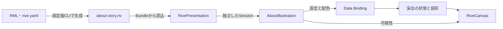

# コピー・保存を伝えるRiveアニメーション

状態：採用。設計基準日：2026-09-18。対象：iOS 26.0以上のnibble本体と、表示パッケージRivePresentation。

## 目的と体験

nibbleは、テキストを保存して繰り返し使う道具である。「nibbleについて」では、ほかのアプリの文章を選び、コピーした複製をnibbleへ保存する流れをアニメーションで伝える。コピー元の文章と保存先を同時に示すことで、文章を失わず手元へ残す関係を視覚化する。

イラストは導入文と具体的な操作説明の間に置き、本文と一緒にスクロールする。表示範囲では6.2秒の演出を自動で繰り返し、途中から見た利用者も次の周期で流れを追える。再生・停止ボタンは設けない。Reduce Motionの設定でも同じループを表示する。

操作手順とデータの扱いは、製品の標準文字と読み上げに対応するSwiftUIの文章で説明する。イラストは理解を補うものであり、読込中・失敗時も文章は読める。図形へのタッチでコピーや保存を実行する機能は持たない。

## 表現と配置の理由

| 要素 | 構成 | 意図 |
| --- | --- | --- |
| コピー元と保存先 | 左にメモ、右にnibbleを模したモバイル画面 | 一つの端末で使う二つのアプリの関係を示す |
| 選択とコピー | 選択ハンドル、コピーメニュー、元の文章を残す複製 | 対象を特定し、コピーによって複製が生まれることを示す |
| 複製の移動 | 持ち上がったカードが緩い弧を描き、保存先の行が場所を空ける | 視線を保存先へ導き、追加位置を予告する |
| 保存の結果 | 保存操作の後にチェックと「保存しました」を表示 | 操作と結果の順序を明確にする |
| 収束と反復 | 主動作を5.4秒までに落ち着かせ、完成図を保持して周期の先頭へ戻る | 結果を見届ける時間と、流れを再確認する機会を用意する |
| 背景と寸法 | 背景透過、480:300の比率、本文幅に収まる表示 | 説明文と同じ背景面を使い、小画面でも構図を保つ |
| 図の説明 | 「選ぶ → コピー → nibbleに保存」を図の下に置く | 図を見られない条件でも意味を伝える |

複製の軌道は関係を示す演出であり、アプリ間のドラッグ手順を示すものではない。二つの画面は端末間の同期も表さない。図中の短いラベルはベクター輪郭とし、意味の説明と読み上げは隣接するTextに集約する。図そのものはタッチとアクセシビリティツリーの対象から除く。

画面全体の読み順と余白は[画面S05](../design/screens.md#s05-nibbleについて)、イラストの責務と評価条件は[部品C44](../design/components.md#説明の動き)に定義する。自動ループが理解を助ける効果と、読書への注意の影響は利用者評価で確認する。

## 制作・表示・画面の分担

RMLは編集可能な制作ソース、`.riv`はRMLから生成してアプリへ同梱するバイナリである。Artboardは描画面、State Machineは演出の状態と遷移、View Modelは外部と受け渡す型付きデータを定義する。ホストとは、これらを画面へ接続するアプリ側のコードを指す。

読み込んだファイルをResource、一つの表示が保持する再生状態をSessionと呼ぶ。ファイルの共有と表示ごとの状態を分けて扱うための単位である。

| 構成 | 所有するもの | 利用契約 |
| --- | --- | --- |
| 制作ソース | 図形、タイミング、演出の状態遷移、接続名・型・初期値 | [アセットの制作と配布](../../app/Animations/README.md) |
| RivePresentation | ファイルの読込、接続検査、独立した再生状態、表示とフレーム停止 | [パッケージの利用契約](../../app/Packages/RivePresentation/README.md) |
| AboutIllustration | 読込の寿命、表示設定、配色、説明文、失敗時の再試行 | [ホスト実装](../../app/Nibble/AboutIllustration.swift) |
| 生成検査 | 登録された制作ソース・生成物・接続契約の照合 | [rive_assets.py](../../scripts/rive_assets.py) |

接続にはrive-iosのApple runtime API（`Worker`、`File`、`Rive`、`ViewModelInstance`）とData Bindingを使用する。接続先のAPI世代はこれに統一し、Legacy APIとState Machineの旧inputsは使用しない。演出のView Modelは表示用のデータであり、アプリの保存状態を管理するモデルとは独立している。

## 状態と寿命

表示は、演出がどの状態にあるかと、フレームを進められるかの二つで決まる。

| 判断 | 所有者 | 契約 |
| --- | --- | --- |
| 自動ループか完成図か | RMLのState Machine | ホストの`motionAllowed`を受け、`CopyAndSave`または`Overview`を選ぶ。動きを再び許可すると先頭からループする。nibbleはtrueに固定する |
| スクロールで見えているか | AboutIllustration | 図の可視割合が10%未満ならフレーム停止を要求する |
| 画面・アプリが表示可能か | RiveCanvas | Viewの離脱、非アクティブ、バックグラウンドではフレームを止める |
| 一時停止からの復帰 | RiveCanvasとSession | 停止条件がすべて解除されると保持した位置から進む。停止中の設定値は次のフレーム評価で反映する |
| 新しい画面での開始 | AboutIllustration | Sessionを新規生成し、現在の環境設定を適用する |

`active`はループ状態を示すアセット側の出力で、フレーム停止中もtrueを保つ。ホストはこの値を購読せず、フレームごとのSwiftUI状態更新を行わない。プロパティの名前・型・初期値・更新方向と遷移表は[接続契約](../../app/Animations/README.md#接続契約)を正とする。

### 資源と非同期処理

RiveResourceは読み込んだFileを保持し、FileがWorkerを保持する。ファイルを再利用する機能ではResourceを保持し、表示ごとに独立したArtboard・State Machine・View Model instanceを持つSessionを作る。一つのSessionを複数のCanvasへ同時に渡さない。

AboutIllustrationはMainActor上で、画面の`.task`からロードとSession生成をawaitする。キャンセルされていない結果を`@State`に保持し、bodyの再評価や外観・文字サイズの変更で再ロードしない。Sessionの生存中は再生位置を保持し、Viewの状態を破棄した後は新規Sessionで開始する。読込中は図記号を表示し、失敗時は説明文と再読み込みボタンを残す。

フレームの時計はRiveが所有する。ホストはTimer・DisplayLink・生Taskで別の時計を作らず、演出の完了表示を業務処理の成功判定に使わない。SwiftUIの通知などはScopedAnimationで管理し、RMLの時間と分ける。

### 配色と停止中の描画

アセットは面・内容・強調・補助の4色を受け取り、ホストはライト・ダークの配色を渡し、コントラスト強調設定では変更しない。背景には画面の背景面を透過して使う。

rive-ios 6.27.0では、停止中のData Binding変更だけでは描画が更新されない。配色設定後にホストが`renderingRevision`を増やし、Canvasは表示用Viewを再生成する。同じSessionを時間差0で描画するため、ファイルと再生位置を保持できる。更新番号は配色変更時にだけ進め、通常のbody評価やフレーム進行では変えない。

## 採用理由と再利用

Riveを採用する理由は、ベクターの制作ソースを再生成可能に保ち、図形と時間の設計をiOSの画面実装から分離できることにある。Data Bindingで表示設定を接続し、同じアセットへ外観と明示的な再生方針を接続する。

| 選択肢 | 適性と負担 |
| --- | --- |
| 文章と静止した図記号 | 小さな実装で意味を伝えられる。複製の軌道や時間差には動きの実装が必要 |
| SwiftUIで図と動きを制作 | 単純な状態変化に適する。複数図形のタイムラインもSwift側で管理する |
| 動画 | 固定した演出の再生に適する。配色と静止した完成図を別途管理する |
| Rive | 制作データと外部制御を分離できる。ランタイム容量、描画資源、依存更新の負担がある |

RivePresentationは製品名・アセット・配色・文章を持たない。ランタイムの`Rive`と`ViewModelInstance`を公開し、プロパティ操作やレンダラーを重複実装しない。別製品ではパッケージを導入し、製品側で制作ソース、接続契約、ホスト、評価を用意する。

## 保守と受け入れ

Rive CLI 1.0.4はNixの配布物ハッシュ、rive-ios 6.27.0はPackage.swiftのexact指定と共有Package.resolvedで固定する。CLIによる制作はApple Silicon macOS、実行検証はXcodeとiOS 26.5 Simulatorを使用する。最低対応OSは26.0である。

アセットは2D図形とタイムラインで構成し、RML内にラベルの輪郭を保持する。外部画像・フォントファイル・通信・Luauスクリプト・シェーダーは使用しない。制作と生成はCLIで完結し、Editor、`.rev`、Riveログイン、Riveの署名サービスを必要としない。

RiveRuntimeは本体に同梱・リンクし、通常起動で解決できるFramework探索経路を設定する。共有拡張にはリンクしない。MITライセンスとSDKの同梱ライセンスを保持し、iOSアプリの署名と配布は[TestFlight配布設計](0003-testflight-distribution.md)に従う。

受け入れでは、生成・構造、視覚、挙動、iOS統合、容量・描画負荷を独立して評価する。Ubuntu CIはソース・生成物・接続契約・文書の整合、ローカルMacは実バイナリのテストと画像・再生による評価を担当する。対象ソース、観測、失敗、未実施項目は[検証記録](../rive-validation.md)へ記す。

依存更新時はCLIで制作できることと、対象ランタイムで動くことを別々に確認する。所有関係、MainActor条件、Data Binding、停止中の描画と位置保持、容量・描画負荷を再評価する。スクリプト・シェーダー、API世代、最低OSの変更は採用判断を行い、制作・実行・署名の条件をそろえる。

## 根拠資料

確認日：2026-09-17。適用版：Rive CLI 1.0.4、rive-ios 6.27.0。公式資料、公開ソース、CLIのhelp・schemaによる確認を根拠とする。

- [CLIの役割](https://rive.app/docs/cli/overview)：制作、ローカル出力、画像とデータ検証。
- [Apple runtime](https://rive.app/docs/runtimes/apple/apple)：API世代、WorkerとFileの寿命、MainActorの条件。
- [Data Binding](https://rive.app/docs/runtimes/apple/data-binding)：ホストとView Modelの型付き接続。
- [6.27.0公開版](https://github.com/rive-app/rive-ios/releases/tag/6.27.0)：採用バージョン。
- [パフォーマンスの指針](https://rive.app/docs/getting-started/best-practices)：資源再利用と画面外停止。具体的な性能値は対象環境で測る。
