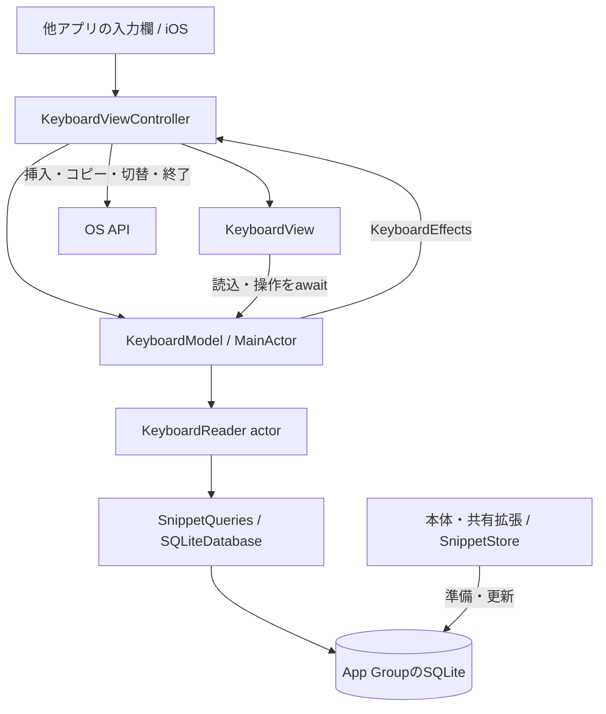

# 0005：スニペットキーボード

状態：採用。設計基準日：2026-09-19。最低対応OS：iOS 26.0。

## 目的と提供範囲

nibbleキーボードは、他アプリで入力を続けながら保存済みの文章を使うための入力面である。利用者はスニペットを選んで本文を直接挿入でき、別の場所に貼り付けたい場合はコピーを選べる。文章の作成・編集は本体アプリ、文章の利用はキーボードが担当する。

| 入口 | 担当する作業 |
| --- | --- |
| 本体 `Nibble` | 作成・編集、下書き、検索、ピン留め、削除・復元、キーボードの利用案内 |
| 共有拡張 `NibbleShare` | 他アプリから受け取ったテキスト・URLを確認して保存 |
| キーボード拡張 `NibbleKeyboard` | 保存済み本文の直接挿入とコピー |

キーボードは「すべて／ピン留め」を各50件のページで表示する。下書きと削除済みは対象外である。全文の確認と編集は本体で行い、キーボードに検索用の文字キー、独自IME、入力文脈による自動検索は設けない。

本書が機能・データ・操作の契約を定義する。[画面構成](../design/screens.md#s09-スニペットキーボード)は画面全体の読み順、[部品台帳](../design/components.md)は各要素の責務、[製品手順](../mvp.md#キーボードから使う)は利用・検証の操作を示す。実装が満たした条件は、対象ソースを持つ[検証記録](../keyboard-validation.md)で判断する。

## 用語と操作

- **入力先**：キーボードを表示している他アプリの入力欄。受け付ける文字と保存結果は入力先が決める。
- **入力キー**：タイトル、本文の要約、ピン、「入力」の動作名を含む一つのボタン。どの部分を押しても同じ本文を挿入する。
- **コピーキー**：各入力キーの隣にある独立したボタン。入力欄を変えずに本文をクリップボードへ書く。
- **フルアクセス（Full Access）**：利用者がiOS設定でキーボードへ与える許可。nibbleではコピーの利用条件とする。
- **要約とrevision**：一覧用の短い表示値と、保存済み項目の更新番号。本文取得時に更新番号を照合し、表示後に変わった項目の利用を拒否する。

| 操作 | 条件と結果 |
| --- | --- |
| 追加と切替 | 利用者がiOS設定でnibbleを追加し、入力欄のキーボード切替UIで選ぶ。本体は設定手順を説明する |
| 入力キー | フルアクセスなしで共有領域を読み、保存済み本文を`textDocumentProxy.insertText`へ渡す |
| コピーキー | フルアクセスがあれば`UIPasteboard`へ`localOnly`で本文を書く。許可がなければ設定案内を表示し、クリップボードを維持する |
| すべて／ピン留め | 保存済みの対象集合を選び、先頭ページを取得する |
| 前後のページ | 同じ対象集合の前または次の50件を取得する |
| 更新・再表示 | 選択したフィルターの先頭ページを読み直す |
| 通常入力へ戻る | OSの切替UIを使う。`needsInputModeSwitchKey`がtrueの場合に地球儀を提供する |
| 閉じる | OSへキーボードの非表示を依頼する。非表示中に完了した処理から操作を実行しない |

本文の空白・改行・Unicodeは変換しない。挿入の成功表示は「入力先へ本文を渡しました」とし、入力先での保存成功を意味させない。コピーの成功表示はクリップボードへの書込後に行う。

## レイアウトと操作の意味

画面を上段の対象選択、中央の入力キー、下段の結果・補助操作に分ける。利用者は集合を選び、文章を識別し、入力後の結果を確認する。中央だけをスクロールさせ、フィルターと終了操作は固定する。

```text
┌──────────────────────────────────┐
│       すべて       │   ピン留め    │ 対象集合
├──────────────────────────────────┤
│ タイトル          ピン  入力 │コピー│
│ 本文の要約                  │      │ 入力対象
│                 …                │ 中央をスクロール
├──────────────────────────────────┤
│ 切替  結果文    前後・頁  更新  閉じる│ 補助操作
└──────────────────────────────────┘
```

図の切替キーはOSが要求する場合、前後・頁は複数ページの場合に表示する。OS自身が描く切替・音声入力の領域は、この構成に含めない。

### 部品と配置

| 要素 | 表現と配置 | 理由 |
| --- | --- | --- |
| C45 対象選択 | 全幅を等分する標準segmented Picker。「すべて／ピン留め」を文字で示す | 同じ一覧に対する排他的な条件をまとめる。別画面への移動や更新操作とは分ける。選択は標準の面で示す |
| C46 入力キー | タイトルはsubheadline、要約はcaption・secondaryで各1行。始点を揃え、末尾にピンと青い「入力」を置く | 内容を読み比べる横幅を確保し、押した結果を動作名で明示する。ピンの有無で文字を移動させない |
| C46 コピーキー | 入力キーから隙間を空けた独立した面。許可時は`doc.on.doc`、未許可時は`lock.doc` | 挿入とコピーを別の操作として識別する。未許可でも押して案内を読めるため、権限だけを理由に無効化しない |
| C47 結果 | 下段に待機時の「nibble」または具体的な結果文を表示。長い結果は折り返す | 次に必要な操作を伝える。短い結果のために独立した段を作らず、長い案内は全文を優先する |
| C47 ページ | 前後の矢印と現在ページ。1ページだけなら省略し、移動不能な方向を無効化する | 一覧の保持件数を制限しながら全候補へ到達できる。利用できない補助表示で中央を圧迫しない |
| C47 更新・終了 | 下段末尾の固定位置。切替キーが必要なら下段先頭 | 一覧全体への操作を項目の操作と分け、スクロールせず到達できるようにする |
| C48 利用案内 | 本体の設定から開くS10。追加手順、権限、更新・ページ、入力先の制約を見出しと文章で説明する | 長い設定説明を入力面に詰め込まず、設定作業と入力作業を分ける |

タイトル・要約・「入力」は同じButtonに属し、動作名の枠を別ボタンにはしない。ピンは項目の属性であり、キーボード内で切り替える操作ではない。詳細画面への移動を示す開示矢印は置かない。

### 色と形

| 表現 | 意味 |
| --- | --- |
| `UIInputView.Style.keyboard`と透明なSwiftUIホスト | OSのキーボード周囲と連続する入力面 |
| `tertiarySystemBackground`、8pt角丸 | 押せる入力・コピーの面。公開システム色を使い、ライト／ダークへ追従する |
| `systemBlue`と10%の背景 | 「入力」の動作名。選択・成功・ピンには流用しない |
| primary / UIKitのlabel | 対象名、操作記号、結果文 |
| secondary | 本文の要約、ピン、待機時の製品名という補助情報 |
| 標準Pickerの選択面 | 選択中の対象集合 |
| キーへprimaryを12%重ねる表示 | 押している間の反応。位置や大きさを変えず、押下終了で戻す |
| キーのopacity 0.45、補助操作の0.3 | 読込・実行中の入力／コピー、移動不能なページ操作が使えないこと |

本体のブランド色を入力面に適用せず、OSの背景と項目のキー面を分ける。Liquid Glassを各キーへ重ねない。操作の意味は文字・記号・面でも示し、色だけに依存させない。キー面の色と寸法はnibbleの設計値であり、Appleの文字キーの非公開仕様を再現するものではない。

### 寸法と伸縮

| 寸法 | 役割 |
| --- | --- |
| Pickerの外周、行間、一覧の左右・下部、入力とコピーの間隔：6pt | 対象選択と項目の左右を揃え、独立した操作を離す |
| 入力キー内：左右10pt・上下6pt、タイトルと要約の間：2pt | 面の縁から文字を離し、同じ項目の情報をまとめる |
| 「入力」の内側：左右10pt・上下8pt、角丸6pt | 動作名を省略せず、識別用の文字から分ける。独立した操作領域ではない |
| 入力キー：最小48pt高、コピー：44×48pt | 2行の識別情報と反復操作の領域を確保する |
| 下段の補助操作：最小44×44pt、左右外周10pt | 記号の大きさとタップ領域を分ける |
| 内容高：288pt、vertical size classがcompactなら196pt | 入力先の可視範囲と候補の表示量を両立する提案値。制約の優先度750でOSの必須制約を優先する |

中央の一覧が残りの高さを受け取り、結果文の折り返しに応じて縮む。タイトルと要約は各1行で省略し、全文は本体で確認する。文字サイズ・太字・コントラストは`NibbleInterface`の[固定表示方針](../design/decisions/0002-fixed-interface.md)に従う。読み上げ名は「対象名を入力」「対象名をコピー」とし、入力のhintで本文の挿入を説明する。

寸法の妥当性は、同名・無題・長い日本語・絵文字、0件・複数ページ、縦横・狭幅、長い結果文で評価する。配置による識別性・誤操作率・速度の改善は測定を要し、標準部品の採用だけで達成済みとはしない。

## 構成と責務



| 所有者 | 責務と寿命 |
| --- | --- |
| `KeyboardViewController` | 入力先、権限、モデル、高さの制約、地球儀UIButtonを所有。UIKitの表示・非表示をモデルへ伝え、挿入・コピーを`KeyboardEffects`として実行する |
| `KeyboardView` | モデルを観測して表示する。読込は`.task(id: model.loadID)`、挿入・コピーは`ViewTaskStore`で所有する |
| `KeyboardModel` | 要求、取得世代、ページ、失敗、結果文、実行中の操作IDを管理する。controllerへの副作用参照はweak。controllerの寿命中保持する |
| `KeyboardReader` | actor内で要求ごとに短命の読取専用接続を所有し、保存済み要約と選択本文を返す |
| `SnippetLocation` / `SnippetQueries` | 共有DBの場所と問い合わせ。本体・拡張が検索条件・並び順を共用する |
| `SnippetStore` / `SnippetSchema` | 本体・共有拡張が保存領域・schemaを準備し、更新とWAL・SHMの保持を担当する |
| `KeyboardGuideView` | 本体の利用案内。OS設定の有効化状態を推測して表示しない |

UIとOS操作はMainActor、DB処理はReader actorで実行する。`UIHostingController`と四辺の制約、地球儀UIButtonはcontrollerの生成時に一度構成する。View更新でこれらを再生成せず、行のidentityにはスニペットUUIDを使う。独立した入力先の文章をモデルへ複製しない。

## 共有データと読み取りの契約

正本はApp Group `group.nibble.9uiLe.com`の`Library/snippets.sqlite`である。本体と共有拡張が書き込み、キーボードはschema version 1を`SQLITE_OPEN_READONLY`で読む。キーボード用のDB複製、同期、保存領域の作成、schema移行は行わない。

WALはDB本体への反映前の確定更新を保持するファイル、SHMは接続間で使う索引である。書き込み側は`SQLITE_FCNTL_PERSIST_WAL`により、最後の接続を閉じても両ファイルを保持する。共有領域へ書き込めないReaderが確定済み更新を読むための条件である。更新されるDBに`immutable=1`は指定しない。

| 読み取り | 契約 |
| --- | --- |
| ページ | フィルターとoffsetを固定した`KeyboardRequest`。読み取りtransaction内でピン優先・更新日時降順・UUID昇順の最大51件を読み、50件と続きの有無を返す |
| 要約 | UUID、タイトル、本文先頭180文字、ピン状態、revision。モデルは1ページを保持する |
| 本文 | 利用操作ごとに選択UUIDの全文を読む。未削除かつ要約とrevisionが一致する場合だけ返す |
| 未準備・未知schema・読取不能 | 空結果や別保存先へ置き換えず、案内と更新による再試行を提供する |

モデルの50件という上限は、接続やUIを含むプロセス全体のメモリ上限ではない。全文を全件保持せず、本文は操作時の1件を取得する。

revisionを照合する時点は本文取得時である。DB読取と他アプリへの挿入を一つのtransactionにはできないため、読取後の別プロセスによる更新は防げない。再表示・更新で保存状態を読み直す。DBはData Protectionのcompleteで保護し、ロック中などの読取不能も再試行可能な失敗として扱う。

## 状態と操作の寿命

選択フィルターはcontrollerの寿命中保持する。再表示・更新・フィルター変更は先頭ページへ戻り、OSがcontrollerを破棄すれば初期状態から始まる。定期polling、結果文の期限タイマー、バックグラウンド同期は持たない。

### 読み込み

`loadID`は読込要求の世代を識別する値である。要求変更と非表示で更新し、キャンセル要求とは別に結果を採用できるかを判定する。

| 状態・イベント | 表示と結果の採用 |
| --- | --- |
| 初回表示 | activeにし、新しい世代で先頭ページを取得。未取得を0件として表示しない |
| フィルター・ページ・更新 | 要求と世代を更新。取得済みページがあれば操作不可で表示し、読み込みを示す |
| 成功 | active、キャンセルなし、世代一致の場合だけ要求とページを反映。0件なら集合に応じた空表示 |
| 失敗・中断 | 有効な要求だけが進行表示を終え、理由と更新による再試行を表示。古い要求は新しい結果を変更しない |
| 非表示 | inactiveにし、世代・操作ID・ページを無効化。Viewのタスクにもキャンセルを要求 |

ページ位置と続きの有無からページ操作を導出する。別の表示用Stateへ同期しない。読み込みの状態と、挿入・コピーの結果文は独立して扱う。

### 挿入とコピー

利用操作は`keyboard.use`の`screenBound / ignoreNew`とモデルの操作IDで重複を防ぐ。`screenBound`は画面離脱でキャンセルする寿命、`ignoreNew`は実行中の追加開始を拒否する方針である。完了・キャンセル後のタップは新しい操作として受け付ける。

| 時点 | 挿入 | コピー |
| --- | --- | --- |
| 開始 | active、要求とページが一致、読込・失敗・別操作なし | 同左とフルアクセスあり |
| 本文取得 | 未削除、選択時と同じrevision | 同左 |
| await後 | キャンセルなし、active、取得世代・操作ID一致 | 同左 |
| 副作用の直前 | 入力先のdocument identifierと、本文・選択変更の世代が開始時と一致 | controllerの現在のフルアクセスを再確認 |
| 完了 | proxyへ本文を渡し、受け渡し結果を表示 | クリップボードへ書き、完了を表示 |

挿入は本文取得中の入力欄・カーソルの移動で中止する。コピーは入力欄へ作用しないため、入力先変更だけでは中止しない。画面離脱・要求更新・キャンセルは両操作の無効化条件である。利用操作のキャンセルは通常エラーとして表示せず、後始末は自分の操作IDが有効な場合だけ行う。結果文は次の操作または非表示まで保持する。

## 権限とOSの境界

`RequestsOpenAccess`はコピーを利用可能にするためtrueとする。許可は利用者がiOS設定で選ぶ。モデルに保持する権限は表示用であり、コピーはcontrollerの`hasFullAccess`を本文取得の前後で確認する。未許可ならクリップボードと入力欄を変えない。

ネットワーク通信、入力履歴の記録、クリップボードの読取、入力欄の前後の文章の取得は行わない。キーボードの自動有効化と非公開の設定URLは使わない。secure入力、phonePad・namePhonePad、他社キーボードを禁止するアプリではOSの制御に従う。

## ビルドと配布

`NibbleKeyboard`はextension point `com.apple.keyboard-service`、Bundle ID `nibble.9uiLe.com.keyboard`で本体へ同梱する。deployment target 26.0、Swift 6、strict concurrency complete、default isolation nonisolated、extension-safe APIでビルドする。Tasking・AppMacrosと必要な共有コードを使い、Rive・編集画面・書き込み用Storeはリンクしない。

Apple Developerでは本体・共有拡張・キーボードのApp IDに共通App Groupを関連付け、各配布profileへ反映する。識別子・ビルド設定はGitで管理し、認証設定・秘密鍵・profileは[配布設計](0003-testflight-distribution.md)の管理規約に従う。

[配布スクリプト](../testflight.md)は3 bundleの存在、識別子、version、最低OS、SDK、Privacy Manifest、輸出申告、extension pointを検査する。署名・アップロード、Apple側の処理・内部グループへの配信、実機での操作成立は個別の確認対象である。

## 採用理由と評価条件

直接挿入は入力先への復帰操作を省ける主操作、コピーは貼り付け先を利用者が選べる副操作である。読み取り専用の共通DBは、複製の更新遅延とキーボード側の書込責務を避ける。一列のキーは長いタイトル・本文の識別幅と即時操作の面を両立する。区切り線のリスト、二列タイルとの比較と外部指針は[UI設計の根拠](../../research/08-keyboard-interface.md)にまとめる。

| 評価対象 | 受け入れ条件 |
| --- | --- |
| データ | 読取専用、未準備・未知schemaの拒否、50件のページ境界、対象集合、原文、変更・削除の照合 |
| 操作 | 旧要求の後着、連打、取消直後の再実行、非表示中の完了、挿入先変更、コピー権限の取消 |
| OS統合 | 権限なしの挿入、許可ありのコピー、入力先の原文照合、再表示時の更新、標準キーボードへの復帰 |
| 表示 | 0件・多数・長文、狭幅・縦横、ライト・ダーク、操作名、利用案内の全文への到達 |
| 製品と配布 | 全製品テスト、本体回帰、共通検査、設計照合、3 bundleの署名・配布検査 |
| 性能 | 同じ端末・ビルド・データ・操作で容量、初回表示、スクロール、利用応答、メモリを評価 |

iOSの実行評価は26.5で行う。未実施条件は[検証記録](../keyboard-validation.md)に残し、Simulatorの成功から実機のメモリ上限・ロック中の保護・すべての入力先による文字受理を保証しない。

## 一次資料

API・指針の参照記録は2026-09-18〜19、対象SDKはXcode 26.5 / iOS 26.5である。指針の原則とnibble固有の寸法・配色を区別する。

- [Apple：Creating a custom keyboard](https://developer.apple.com/documentation/uikit/creating-a-custom-keyboard) — extension、有効化、切替、寿命。
- [Apple：Configuring a custom keyboard interface](https://developer.apple.com/documentation/uikit/configuring-a-custom-keyboard-interface) — 入力面とレイアウト。
- [Apple：Configuring open access](https://developer.apple.com/documentation/uikit/configuring-open-access-for-a-custom-keyboard) — 権限と共有コンテナ。
- [Apple：Handling text interactions](https://developer.apple.com/documentation/uikit/handling-text-interactions-in-custom-keyboards) — proxyと入力・選択変更。
- [Apple：Custom Keyboard](https://developer.apple.com/library/archive/documentation/General/Conceptual/ExtensibilityPG/CustomKeyboard.html) — 入力先・OSの制約。
- [SQLite：WAL](https://www.sqlite.org/wal.html)、[WAL file format](https://www.sqlite.org/walformat.html) — 読み取り専用接続、WAL・SHM。
- [UI設計の根拠資料](../../research/08-keyboard-interface.md) — HIG、背景・システム色API、構成比較。
