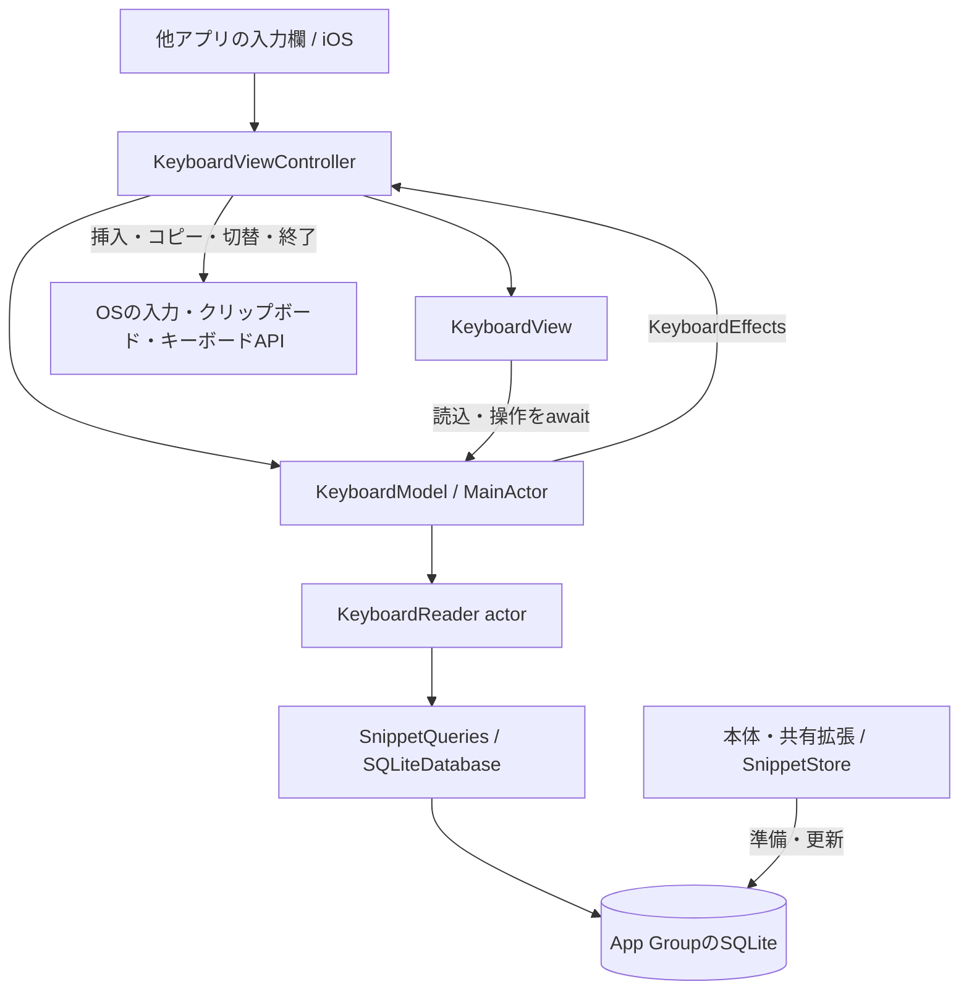

# 0005：スニペットキーボード

状態：採用。設計基準日：2026-09-18。最低対応OS：iOS 26.0。

本書は、他アプリの入力欄で保存済みスニペットを使うための機能、権限、データと操作の契約を定義する。画面と部品の配置理由は[UI設計](../design/screens.md#s09-スニペットキーボード)、操作手順は[製品手順](../mvp.md#キーボードから使う)、実施済みの評価は[キーボードの検証](../keyboard-validation.md)に記録する。

## 目的と提供範囲

利用者は他アプリの入力欄でnibbleキーボードへ切り替え、保存済みの項目をタップして本文を直接挿入する。本体へ移動して戻る操作を省き、入力中の作業を続けられるようにする。各行には独立したコピーボタンも設け、任意の場所へ貼り付ける使い方を提供する。

| 作業 | 担当する入口 |
| --- | --- |
| 作成・編集・下書き・ピン留め・削除・復元 | 本体アプリ `Nibble` |
| 他アプリのテキスト・URLを確認して保存 | 共有拡張 `NibbleShare` |
| 保存済み本文を他アプリへ挿入・コピー | キーボード拡張 `NibbleKeyboard` |

キーボードは保存済みだけを「すべて／ピン留め」で絞り、1ページ50件を表示する。下書きと削除済みは利用対象に含めない。内容の変更は本体で行う。キーボード内の検索文字入力、独自IME、周辺の入力文を使った自動検索は提供しない。

## 操作と権限

| 操作・条件 | 成立条件と結果 |
| --- | --- |
| キーボードの追加 | 利用者がiOS設定で追加する。本体の設定に手順を示し、自動有効化や非公開の設定URLは使わない |
| 項目をタップ | フルアクセスなしで共有領域を読み、`textDocumentProxy.insertText`へ保存済み本文を渡す |
| コピーボタン | フルアクセスを確認し、`UIPasteboard`へ`localOnly`で本文を書く。入力欄へは挿入しない |
| コピーの権限なし | 必要な設定を案内する。クリップボードを変更せず、コピー成功を表示しない |
| 対象の変更・更新 | フィルター変更、表示、更新ボタンで先頭ページを読み直す。ページ操作は選択した集合の次または前の50件を取得する |
| 通常入力へ戻る | OSのキーボード切替UIを使う。OSが独自の切替キーを必要とする場合だけ地球儀ボタンを表示する |
| キーボードを閉じる | OSへ非表示を依頼する。非表示時に実行中の読込・利用操作を無効にする |

`RequestsOpenAccess`はコピーを利用可能にするためtrueとする。フルアクセスの許可は利用者が選ぶ。画面に保持する権限値は表示用とし、コピーの実行可否はcontrollerの`hasFullAccess`を本文取得の前後で確認する。

本文の空白・改行・Unicodeを変換せず渡す。入力先アプリによる文字数・改行・文字種の制限は入力先の仕様であり、proxyへの受け渡しを入力先での保存成功とは扱わない。挿入後の表示は「入力先へ本文を渡しました」とする。

パスワードなどのsecure入力、phonePad・namePhonePad、他社キーボードを禁止するアプリではOSの制御に従う。ネットワーク通信、入力履歴の記録、クリップボードの読み取り、入力欄の前後の文章の取得は行わない。権限の根拠はAppleの[Open Access](https://developer.apple.com/documentation/uikit/configuring-open-access-for-a-custom-keyboard)と[Custom Keyboard](https://developer.apple.com/library/archive/documentation/General/Conceptual/ExtensibilityPG/CustomKeyboard.html)、対象OSでの確認範囲は検証記録を参照する。

## 構成と責務

| 構成 | 所有するものと責務 |
| --- | --- |
| `KeyboardViewController` | モデル、入力先変更の世代、高さの制約を所有する。UIKitの寿命・権限を伝え、`KeyboardEffects`として挿入・コピー・切替・終了を実行する |
| `KeyboardView` | モデルを観測し、フィルター・一覧・結果・ページ操作を表示する。読込は`.task(id: model.loadID)`、有限の利用操作は`ViewTaskStore`が所有する |
| `KeyboardModel` | 要求、取得世代、ページ、失敗、通知、実行中の操作IDを管理する。Readerと副作用の契約を受け取り、controllerへの参照はweakとする |
| `KeyboardReader` | actor内で保存済み要約と選択本文を読む。要求ごとに接続を開いて閉じ、作成・変更APIを持たない |
| `SnippetLocation` / `SnippetQueries` | 共有DBの場所 / 保存済みの検索条件・安定した並び順。本体・拡張で同じ定義を使う |
| `SnippetStore` / `SnippetSchema` | 本体・共有拡張でDBとschemaを準備・更新し、読み取り専用接続に必要なWAL・SHMを保持する |
| `KeyboardGuideView` | 本体の設定から追加・権限・制約を説明する。キーボードの有効化状態を推測して表示しない |

UIとOS操作はMainActor、DB処理はReader actorで実行する。`UIHostingController`とその四辺の制約はcontrollerの生成時に構成する。地球儀のUIButtonもcontrollerが一度作成し、`KeyboardInputModeButton`がSwiftUIへ接続する。表示更新でcontroller・モデル・ボタンを作り直さず、行はスニペットのUUIDで識別する。

## 共有データと読み取りの契約

3ターゲットはApp Group `group.nibble.9uiLe.com`の`Library/snippets.sqlite`を共用する。正本はこのDBであり、キーボード用の複製データや同期処理は持たない。本体・共有拡張が書き込み、キーボードは`SQLITE_OPEN_READONLY`でschema version 1を読む。未作成の保存領域を作成せず、未知のschemaを移行しない。

WALは未checkpointの確定更新を保持するファイル、SHMは接続間で使う索引である。書き込み側が`SQLITE_FCNTL_PERSIST_WAL`を設定し、最後の書き込み接続を閉じても両ファイルを保持する。共有領域へ書き込めないReaderから確定済み更新を読むための条件である。更新されるDBに`immutable=1`は指定しない。[SQLiteのWAL仕様](https://www.sqlite.org/wal.html)に従い、ページ取得は読み取りtransaction内で行う。

| 読み取り | 入力・結果・保持範囲 |
| --- | --- |
| ページ | フィルターとoffsetを固定した`KeyboardRequest`。ピン優先、更新日時降順、UUID昇順で最大51件を読み、先頭50件と続きの有無を返す |
| 要約 | UUID、タイトル、本文先頭180文字、ピン状態、更新番号。モデルは1ページを保持し、次の要求中は旧ページを操作不可で表示できる |
| 利用本文 | 選択した要約のUUIDで全文を読み直す。未削除かつ要約の`revision`と一致する場合だけ返す |

本文は利用操作ごとに1件取得し、全件の全文を保持しない。50件はモデルが保持する要約数の上限であり、接続・取得中の値・UIを含むプロセス全体のメモリ上限ではない。

revisionの照合時点は本文の読み取りである。DBの読み取りと他アプリへの挿入を一つのtransactionにはできないため、読み取り後に別プロセスが項目を更新する可能性は残る。キーボードの再表示・更新によって変更を取り込む。

保存領域が未準備なら本体での準備を案内する。Data Protectionのcompleteを適用したDBがロック中などに読めない場合は、空結果や別の保存先へ置き換えず、再試行可能な失敗として扱う。

## 状態と操作の寿命

モデルはcontrollerの寿命中保持する。選択したフィルターは再表示でも保持し、ページ位置は先頭へ戻す。OSが拡張を破棄した場合、次のcontrollerは初期状態から始める。定期polling、通知期限用タイマー、バックグラウンド同期は持たない。

### 読み込み

| 状態・イベント | 表示・結果の採用 |
| --- | --- |
| 初回表示 | activeにし、新しい`loadID`で先頭ページを読む。未取得を0件と表示しない |
| フィルター・ページ・更新 | 要求と取得世代を更新する。旧ページがあれば操作不可で保持し、読込中を示す |
| 成功 | active、キャンセルなし、取得世代一致の場合だけ要求とページを反映する。空表示はこの結果が0件の場合だけ確定する |
| 失敗・中断 | 有効な要求だけが理由と再試行の案内を表示する。旧要求の失敗で新しい結果を上書きしない |
| 非表示 | モデルをinactiveにし、取得世代・操作ID・ページを無効にする。Viewのタスクにもキャンセルを要求する |

### 挿入とコピー

利用操作は`keyboard.use`のscreenBound / ignoreNewとモデルの操作IDで重複を防ぐ。1件の本文取得中は別の挿入・コピーを受け付けず、完了またはキャンセル後のタップは新しい操作になる。

| 照合 | 挿入 | コピー |
| --- | --- | --- |
| 操作開始時 | active、要求とページが一致、読込・失敗・別操作なし | 同左に加えてフルアクセスあり |
| 本文取得 | 未削除、選択時と同じrevision | 同左 |
| await後 | キャンセルなし、active、取得世代・操作IDが一致 | 同左 |
| 副作用の直前 | document identifierと本文・選択変更の世代が開始時と一致 | 現在のフルアクセスを再確認。入力先の移動はコピーの取消条件にしない |
| 成功 | proxyへ本文を渡したことを表示 | クリップボードへの書込完了を表示 |

入力先の照合は、本文取得中に移動したカーソルや別の入力欄へ遅れて挿入することを防ぐ。コピーは入力欄を変更しないため、この照合を適用しない。両操作とも画面離脱・更新・キャンセル後の結果から副作用を実行しない。キャンセルは通常の操作エラーとして表示せず、後始末は自分の操作IDが有効な場合だけ行う。結果通知は次の操作まで表示する。

## レイアウトと操作の意味

この画面が支える行動は「入力先を保つ → 保存済みの対象を見分ける → 本文を使う → 入力を続ける」である。視覚上の優先順位は、対象名、対象集合、本文利用の操作、補助情報の順とする。入力先を隠す面積と装飾を抑えながら、対象と操作結果を区別する。

### 部品と配置

| 要素 | 伝える意味・支える操作 | 構成と採用理由 |
| --- | --- | --- |
| 上段の対象選択 | 今見ている保存済みの集合 | 「すべて／ピン留め」は同じ一覧への排他的な条件なので、標準segmented Pickerで一つのまとまりにする。独立した画面領域を示すtab barは使わない。文字ラベルで対象を明示し、選択は標準の面で示す |
| 更新 | 共有領域から現在の内容を読み直す | 一覧全体への操作として上段の末尾へ分離する。更新を選択肢に混ぜない。再表示時の自動取得に加え、表示中に本体や共有拡張で保存された内容を利用者が取得できる |
| 項目名と要約 | 同名や似た内容から対象を見分ける | 名前をmediumのsubheadline、本文先頭をcaptionで各1行にする。全文を並べるより複数候補の比較を優先する。省略による識別の限界があり、全文確認と編集は本体が担う |
| ピンの記号 | 本体で固定した項目であること | 名前の近くに置く状態表示。ここでは押す操作にしない。secondary色でも記号の有無で識別できる |
| 行の内容とコピー | 入力先への直接挿入と、クリップボードへの複製 | 広い本文領域を主操作の挿入、末尾の独立した44ptボタンをコピーにする。全文カードや文字キーの形を各行へ付ける案は、情報面積と境界が増えるため採用しない |
| 鍵付きの書類 | コピーに許可が必要であること | `lock.doc`はコピー不可の理由を示す。押すと許可の案内を読めるので、無反応なdisabledにはしない。許可時は`doc.on.doc`へ切り替え、入力操作の可否と分ける |
| 項目間の線 | 挿入対象の境界 | 標準Dividerで隣の項目との境界だけを示す。上下の操作列は配置と余白で分け、線の数を増やさない |
| 下部の結果 | 直前の操作が何を行ったか、次に何が必要か | 一覧の下、ページ操作の上に文章を置く。内容に重ねず、次の操作まで残す。成功・権限不足・失敗は具体的な文で区別し、色だけに意味を負わせない |
| ページ・切替・終了 | 別の候補を見る、通常入力へ戻る、入力面を閉じる | 一覧末尾までスクロールせず使える固定位置に置く。ページ数は等幅数字で変動を抑え、移動不能な矢印はdisabledにする。地球儀はOSが要求する場合に置き、長押しの切替を維持する |
| 小さい製品名 | 使用中のキーボードの提供元 | 下部のcaption・secondaryで識別を補う。大きなロゴや独立した見出しより、対象と操作に面積を使う |

### 配色の契約

| 表現 | 意味 | 意味を取り違えないための条件 |
| --- | --- | --- |
| `UIInputView`のkeyboard素材 | 他アプリで入力を補助するOSの入力面 | SwiftUIホストを透明にし、OS周囲と一続きにする。RGBや角丸を複製しない |
| primaryとUIKitのlabel | 読む対象名、実行する操作、必要な結果説明 | 操作可能性は色だけでなく、ボタン・配置・記号・押下反応で示す。primaryの文字をすべて操作と解釈させない |
| secondary | 名前を補う要約、ピンの状態、提供元 | 灰色は補助情報の階層を示す。コピー禁止の表示には流用せず、権限は鍵と文章で伝える |
| 標準Pickerの選択面 | 現在の表示条件 | コピー完了やピンの有無とは別の状態。常に一つを選び、チェックマークを重ねない |
| ページ操作の減光 | 現在実行できない移動 | opacity 0.3とdisabledを一致させる。押下中の0.5は一時的な反応で、選択状態ではない |
| 標準Divider | 隣接する挿入対象の境界 | 文字や選択状態の色として使わない |

本体のクリーム色・錆色はキーボードへ適用しない。他アプリの入力作業とOSの入力面の連続性を優先し、nibbleの識別は製品名とスニペットの構成で補うという製品判断である。赤・緑・ブランド色で結果を塗り分ける独自の凡例も設けない。処理結果は読むべき文章で示し、鍵・コピー・ページの形と状態で操作を区別する。

### 密度と寸法

| 寸法 | 役割と見直し条件 |
| --- | --- |
| Pickerはsmall・最大260pt | 短い2ラベルを隣り合わせで比較するための上限。幅に余裕があれば各130ptとなり、横向きで画面全幅へ間延びしない。狭幅では残り幅に縮み、更新の44ptを確保する。選択領域の高さと描画は標準部品に委ねる。ラベル追加・翻訳時には上限を再評価する |
| 左右8pt・上端4pt | 項目名・選択・区切り線・下部操作の基準線を揃え、限られた入力面で本文幅を確保する。上端の4ptはOSの縁へ操作部品が接するのを防ぐ。端末の外枠余白を再現した値ではない |
| 行の上下8pt・名前と要約2pt | 同じスニペットの2行を近づけ、隣のスニペットとは離す。固定文字サイズで縦方向に複数候補を見せる |
| 独立操作44pt以上 | コピー・更新・ページ・切替・終了の操作面積を確保する。視覚的な記号の大きさとタップできる範囲を分ける |
| 結果文の左右12pt・上端4pt | 結果を個別行に属さない独立した文章としてわずかに内側へ置く。複数行へ伸び、中央の一覧面積で吸収する |
| 内容高288pt・compactで196pt | 上下の固定操作と数件の要約を収め、入力先の見える範囲を保つ。優先度750で提案し、OSの必須制約を優先する。中央だけをスクロールさせ、長い説明は本体の設定で読む |

これらはnibbleの設計値であり、Appleの指定寸法や実測した最適値ではない。採否は、候補の識別、誤操作、入力先の可視範囲、縦横の収まりで判断する。手の届きやすさや認知負荷の改善は利用者評価が必要な仮説であり、画像が崩れないことだけで達成とはしない。

### 状態を見分ける条件

初期読込はProgressView、取得済みの0件は選択集合に応じた文章、取得失敗は中央の回復案内と更新操作で伝える。集合の変更中は旧一覧を残して操作を無効化し、読み込みを示す。本文利用中も行の重複操作を拒否する。読込の進行とコピー・挿入の結果を同じ状態として扱わない。

文字サイズ・太字・コントラストは`NibbleInterface`の[固定表示方針](../design/decisions/0002-fixed-interface.md)に従い、ライト・ダークへ追従する。項目の読み上げ名は「対象名を入力」「対象名をコピー」とし、入力のhintで本文の挿入を説明する。ページ操作にも「前のページ」「次のページ」を示す。OS所有の切替UI・権限・入力欄の挙動はOSに委ねる。

## ビルドと配布

`NibbleKeyboard`は`com.apple.keyboard-service`のextensionとして本体へ同梱する。Bundle IDは`nibble.9uiLe.com.keyboard`、deployment targetは26.0、Swift 6、strict concurrency complete、default isolation nonisolated、extension-safe APIでビルドする。Tasking・AppMacrosと必要な共有コードを使い、Rive・編集画面・書き込み用Storeはリンクしない。

Apple DeveloperのキーボードApp IDにApp Groupsを有効化し、共通のApp Groupを関連付ける。本体・共有拡張・キーボードの3つに対応する配布profileを用意する。識別子とビルド設定はGitで管理し、認証設定・秘密鍵・profileは[秘密情報の管理規約](0003-testflight-distribution.md)に従う。

配布スクリプトは3 bundleの存在、識別子、version、最低OS、SDK、Privacy Manifest、輸出申告、extension pointを検査し、欠落や未知の拡張を拒否する。署名・アップロード、Apple側の処理・内部グループへの反映、実機の利用成立は別々に確認する。[配布手順](../testflight.md)を適用する。

## 受け入れ条件

| 対象 | 確認する契約 |
| --- | --- |
| データ | 読取専用、未準備・未知schemaの拒否、50件のページ境界、対象集合、原文、変更・削除の照合 |
| 非同期操作 | 遅い旧要求の成功・失敗、連打、キャンセル直後の再実行、非表示中の完了、挿入先変更、コピー権限の取消 |
| OS統合 | フルアクセスなしの読込・挿入、許可ありのコピー、入力先の原文照合、再表示時の更新、標準キーボードへの復帰 |
| 表示 | 0件・多数・長文、狭幅・縦横、ライト・ダーク、操作名、利用案内の全文への到達 |
| 製品と配布 | 全製品テストと本体回帰、共通検査、設計照合、3 bundleの署名・配布検査 |
| 性能 | 同じ端末・ビルド・データ・操作で容量、初回表示、スクロール、利用応答、メモリを評価 |

iOSの実行評価は26.5で行う。未実施条件は[検証記録](../keyboard-validation.md)に対象と理由を残す。Simulatorの成功から実機の拡張メモリ上限・ロック中の保護・すべての入力先による文字受理を保証しない。

## 一次資料

外観のAPIと指針は2026-09-18に、Xcode 26.5 / iOS 26.5 SDKと以下のApple資料で確認した。余白・最大幅はnibbleの設計値であり、Appleの指定寸法ではない。

- [Apple：UIInputView.Style](https://developer.apple.com/documentation/uikit/uiinputviewstyle/uiinputviewstyledefault) — keyboardスタイルの背景描画。ローカルSDKの`UIInputView.h`でも公開宣言を確認する。
- [Apple：Segmented controls](https://developer.apple.com/design/human-interface-guidelines/segmented-controls) — 同じ内容に関わる選択肢のグループ化と選択状態。
- [Apple：Color](https://developer.apple.com/design/human-interface-guidelines/color) — 色の意味の一貫性、システム色の役割、文字や記号との併用。固定表示設定の採否は製品方針に従う。

- [Apple：Creating a custom keyboard](https://developer.apple.com/documentation/uikit/creating-a-custom-keyboard) — extension構成、有効化、切替キー、寿命。
- [Apple：Configuring a custom keyboard interface](https://developer.apple.com/documentation/uikit/configuring-a-custom-keyboard-interface) — 入力欄とレイアウトの制約。
- [Apple：Handling text interactions](https://developer.apple.com/documentation/uikit/handling-text-interactions-in-custom-keyboards) — proxyによる挿入と入力・選択変更の通知。
- [SQLite：WAL file format](https://www.sqlite.org/walformat.html) — WAL・SHMの寿命。
