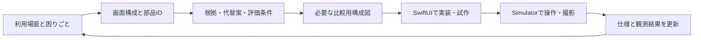

# nibbleのUI設計

nibbleは、保存した言葉を選んでコピーし、元の作業へ戻るための道具である。UIは**探せること、取り違えないこと、編集内容を失わないこと**を支える。見た目の一貫性は、何ができるかと操作後に何が起きるかを予測するために使う。

このディレクトリは、部品・画面・配置を理由付きで設計し、実装と評価へ接続するための設計台帳である。実装済みの機能契約は[製品設計](../decisions/0002-mvp-app.md)、ソースに対する観測と未解決事項は[設計監査](audit.md)で区別する。

## 読む順序

| 資料 | 答える問い |
| --- | --- |
| [共通原則と寸法](foundations.md) | 色・文字・余白・操作領域・動きには何の意味があるか |
| [画面構成](screens.md) | 何をどの順序で見せ、固定し、スクロールさせ、どこへ戻すか |
| [部品台帳](components.md) | この要素は何のためにあり、なぜここにあり、他案より何を優先するか |
| [一次資料](../../research/06-interface-design-evidence.md) | どの指針を読み、どこまで適用できるか |
| [設計監査と評価](audit.md) | 現行実装との差、確認済みの範囲、次に解く課題は何か |
| [判断記録のひな形](decision-template.md) | 新規・変更する判断をどう議論するか |

`C01`のようなIDは部品の意味、`F01`は共通ルール、`S01`は画面、`G01`は監査で見つけた課題を表す。Swiftの型を分割・改名しても、同じ責務のIDは維持する。物理的なView数と設計上の部品数は一致しなくてよい。

## 判断の優先順位

1. **内容と操作の安全性**：原文を保持し、対象と結果を識別でき、失敗から回復できる。
2. **利用可能性**：文字拡大、読み上げ、キーボード、視覚・運動の制約があっても作業できる。
3. **目的への到達**：探す・コピーする・作業へ戻る流れを短く保つ。画面内のタップ数だけで評価しない。
4. **予測可能性**：同じ役割は同じ場所・名前・振る舞いにする。ネイティブ部品の学習済みの操作を尊重する。
5. **読みやすさと製品の表情**：内容の階層、余白、色、動きで落ち着いた道具として構成する。

順位は機械的な点数ではない。たとえば内容を読めないほど密度を上げて操作数を減らす案は採用しない。主な利用頻度は製品仮説であり、計測済みの利用統計ではない。

## 根拠と状態を混ぜない

| 表記 | 意味 |
| --- | --- |
| 指針 | 発行主体の推奨。出典と適用範囲を示す |
| 判断 | nibbleの用途・制約に基づく選択。代替案と不利益を示す |
| 仮説 | 利用者や条件を変えて確かめる必要がある選択 |
| 実装済み | 対象ソースに該当する構成がある。使いやすさの実証ではない |
| 観測済み | 指定ソース・環境・手順で実行した。未実施条件へ一般化しない |
| 提案 | 実装や比較を行う候補。採用済みの仕様に読み替えない |

既存UIにも反証可能な理由を付ける。単に「今こうなっている」ことを採用根拠にせず、根拠が弱い選択は仮説、指針と衝突するものは例外として扱う。

## 設計から実装までの流れ

### 1. 利用場面を定める

「丸いボタンを置く」より先に、誰が、何を探し、何を決め、操作後どこへ戻るかを書く。空・成功だけでなく、入力中、長文、待機、失敗、中断、復旧を含める。機能の追加が不要なら配置変更だけで解決する。

### 2. 画面と部品を構成する

画面を「現在地」「対象の選択」「内容」「操作」「結果」に分ける。部品台帳のIDを対応させ、表示順序、固定・スクロール、safe area、キーボード、読み上げ順を指定する。

各判断は、**目的 → 採用理由 → 他案の不利益 → 見直す条件**の順で書く。共通の余白や色はFのルールを参照し、全画面へ同じ説明を複写しない。装飾を追加する場合も、識別・階層・ブランドのどれに貢献するかを説明する。

### 3. 不確かな部分だけ比較する

同じダミー本文・文字サイズ・画面幅で、案Aと案Bの違いを一つに絞る。情報の順序なら構成図で比較し、タップ領域、キーボード、スクロール、Liquid GlassならSwiftUIで確認する。すべての余白を毎回利用者へ確認する必要はない。

データ保護、情報構造、操作の意味を変える案は、影響と比較を判断記録へまとめる。既存契約内の調整は、エージェントが理由と検証結果を記録して進める。

### 4. 実装と確認を結び付ける

[開発ガイド](../../CONTRIBUTING.md)に従い、採用した案だけを製品へ反映する。新しい共通Viewは同じ意味と振る舞いを共有する場合に作る。余白が同じという理由だけで異なる画面を一つの汎用Viewへ押し込まない。

PRには変更したC/S/FのID、理由、画像、操作が変わる場合は録画、観測条件を記載する。文書・構成図は操作確認の代替にはしない。配布手順や秘密情報の扱いは[TestFlight手順](../testflight.md)を維持する。

### 5. 判断を更新する

レビューでは「好みか」だけでなく、目的を妨げる具体例を挙げる。たとえば「C07は無題の3件を見分けられない」「C10は大きな文字で意味を判別できない」とする。

実装が変わったら、同じ変更で部品の責務・画面構成・評価結果を更新する。SDKや主要OSの更新時は、標準部品の振る舞いと根拠資料を読み直す。学習したことは共通原則へ反映し、却下案や実験ログを採用仕様の文章へ混ぜない。

## 管理方法の選択

| 方法 | 得意なこと | 運用上の負担 | nibbleでの扱い |
| --- | --- | --- | --- |
| リポジトリ内のMarkdown・Mermaid | 理由、状態、コード、変更履歴を一緒にレビューできる | 視覚比較は別途必要 | 設計の正本 |
| SwiftUIの小さな試作・Preview | 本番の文字・部品・状態で比較しやすい | ビルドが必要。実際の操作評価はSimulatorへ進む | ネイティブ挙動の比較手段 |
| Figma等の別デザインファイル | 大きな構造の案を並べやすい | 部品、寸法、状態をコードと二重管理しやすい | 構成図では議論できない場合の任意の作業媒体 |
| HTMLのアプリ模写 | 素早い画面試作 | iOSの検索・文字・タブ・ガラスを正確に評価できない | ネイティブ動作の判定には使わない |

追加のサービス契約や常設のデザイントークン同期は前提にしない。製品の実装値はSwift、意味と判断はこの台帳、実行結果は検証文書に一度ずつ置く。新しい部品が必要になったときだけ台帳を増やす。
