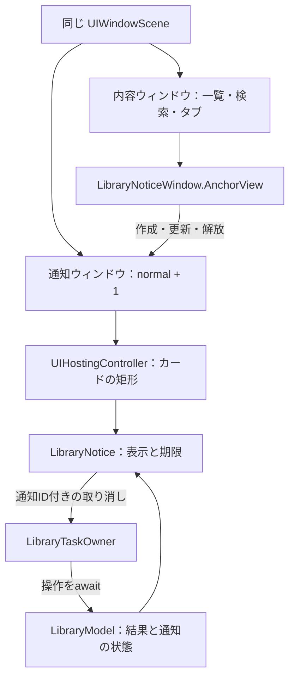

# 操作完了通知と削除の取り消し

一覧と検索の操作結果は、アプリの内容を表示するウィンドウと同じ`UIWindowScene`に属する専用`UIWindow`で表示する。タブバーまたはキーボードの上に短時間だけ通知カードを重ね、コピーの完了を伝え、削除した項目をその場で復元できるようにする。通知の表示は一覧・タブ・作成ボタンの配置と検索入力を変えない。

## 目的と適用範囲

スニペットの利用は、項目を探す、コピーする、入力先へ戻るという短い操作で完結する。成功の確認にダイアログを閉じる操作を要求しない。削除には対象を識別できる取り消しを用意し、探索を続けたまま誤操作から回復できるようにする。

専用ウィンドウの対象は一覧S01と検索S02である。設定タブ、編集シート、「削除した項目」シートの表示中は、このウィンドウを表示しない。「削除した項目」の復元・完全削除はシート内の通知を使う。編集、共有拡張、キーボード拡張の結果と失敗は、それぞれの画面が扱う。

## 利用者に示す内容

| 成功した操作 | 結果文 | 補足と操作 | 表示時間 |
| --- | --- | --- | --- |
| 本文のコピー | コピーしました | なし | 2秒 |
| 削除 | 削除しました | 対象名、「元に戻す」 | 6秒 |
| 通知からの復元 | 元に戻しました | 対象名 | 2秒 |

結果文と対象名を左、取り消しボタンを右へ置く。対象名は保存層が変更を確定した項目の名前を使い、画面に残った要約から推定しない。コピーは操作直後の完了確認に情報を絞り、対象名や本文を加えない。削除と復元は対象名を示して取り違えを防ぐ。

通知は一度に一つとし、新しい成功結果で置き換える。同じ文言の連続コピーにも別の通知IDを発行する。通知に表示できる取り消し対象は一件だけであり、複数操作を戻す履歴ではない。通知が消えた後の復旧は、設定から開く「削除した項目」で行う。

失敗は成功通知へ変換しない。復元失敗では再試行を提示し、対象が保存層に存在しない場合は再読み込みを提示する。完全削除の確認は、短時間の結果通知と独立した確認操作として扱う。

## 配置と外観

通知の面には不透明な`nibbleSelection`、文字には`nibbleOnSelection`を使う。背後の見出しや行の文字を透過させず、結果文はsemibold、対象名はfootnoteで読める強さを保つ。「元に戻す」は通知と濃淡を反転する円形ボタンにし、操作できる範囲を明示する。背景からの分離は薄い影で補助する。F02のコントラスト基準とG06に照らし、実画面で結果文・対象名・操作を確認する。

safe areaの左右16ptを空けた全幅に結果文・対象名・取り消しを置く。カード内部もmaxWidth: .infinityで領域を使う。通知はタブバーの確保領域の上に8pt空けて重ね、キーボード表示中は本体SwiftUIのsafe areaから求めた表示可能な下端へ避ける。元画面のsafe areaは変えず、作成入口・タブ・検索欄を覆わない。通知の外の行は操作でき、消去開始と同時に通知のタッチと読み上げを無効にする。業務上の並べ替えと通知自体の配置変化を分けて評価する。詳細な値は[LibraryNoticeWindow](../../../app/Nibble/Library/LibraryNoticeWindow.swift)、責務と基準はC18/C19を正本とする。

取り消しは戻る矢印のアイコンのみで、見た目36pt・操作領域44ptとする。読み上げ名は「元に戻す」、対象名はhintに保持し、処理中は無効にする。対象名は視覚上1行に省略しても読み上げでは全文を伝える。モーダルな読み上げ領域にはしない。別のSwiftUI rootにも[固定表示](fixed-interface.md)を適用する。出現と消去は名前付きAnimationScopeの0.3秒のsmoothで、不透明度と8ptの移動を補間する。連続結果では同じカードを更新し、期限を旧結果から引き継がない。

## 構成と所有者

シーンは、iOSが一つの画面表示単位として管理する`UIWindowScene`を指す。内容ウィンドウは一覧・検索・タブを表示し、通知ウィンドウは同じシーンの一段上で通知カードだけを操作可能にする。

| 所有者 | 責務 |
| --- | --- |
| `AppRootView` | 一覧・検索のモデル、タブ選択、シート、検索フォーカスを保持する。選択タブとシーンの状態から通知の表示資格を決める。GeometryReaderで本体の表示可能な下端を読み取り、通知のAuto Layout制約へ渡す |
| `LibraryModel` | 保存層への操作、結果反映、通知値、表示可能な滞在、期限、復元中の対象UUIDを管理する |
| `LibraryTaskOwner` | 同期UIイベントから`startTask`で操作を受理し、受理時の滞在を固定する。操作の寿命と重複を管理してモデルをawaitする |
| `LibraryNoticeWindow.AnchorView` | 内容ウィンドウへの接続を検知し、そのシーンに通知ウィンドウとhosting controllerを作成・保持・解放する。本体から受け取る下端位置に追従し、補助ウィンドウにキーボード監視を持たせない |
| `NoticeOverlayWindow` | key windowにならず、通知カードの矩形内だけでタッチを受け付ける |
| `LibraryWindowNotice` | 通知ウィンドウのSwiftUI root。固定表示・配色を適用し、取り消しを画面のタスク所有者へ接続する |
| `LibraryNotice` | 現在の結果と消去用の直前の表示値を描画し、表示の出入りだけを補間する。通知IDごとの期限処理をawaitする |
| `LibraryResultFeedback` / `LibraryEffects` | 常設のView modifierで成功イベントの触覚を観測する / 成功時の読み上げを実行する |

`AppRootView`は通知の有無によらず同じTabView構造と接続Viewを保持する。検索語、フォーカス、スクロール、編集中の状態の寿命は、それぞれの画面とモデルのidentityに従う。通知の表示だけで画面を作り直さない。

シーンのルートでは、通知の滞在をscenePhase・選択タブ・提示シートから更新し、onDisappearを離脱判定に使わない。初期表示の再構築でも破棄されるViewのdisappearが後から届くことがあり、同じStateを引き継いだ現在の画面の通知を無効にしてしまうためである。実際の非active化はscenePhase、タブ・シートの移動はそれぞれの状態変更で滞在を終了する。表示資格を失った時と接続Viewの破棄では通知ウィンドウを即座に解放する。表示資格がある間は通知値の有無によらずウィンドウとhostを保持する。期限消去では直前の表示値を不可視・操作不可の状態まで描画し、fadeを途中で切らない。通知値はLibraryNoticeが観測し、ルートは滞在の表示資格を接続Viewへ渡す。シートを開かない起動直後のコピーで成立を確認する。

## 表示資格と通知の寿命

`Notice`は通知ID、発生元（一覧・検索・削除シート）、結果文、対象名、復元対象UUIDを一つの値として持つ。通知IDは表示と期限と取り消しを対応付け、対象UUIDは保存済み項目を識別する。両者を混用しない。

`NoticeContext`は、ある画面が通知を表示できる一回の滞在を識別する値である。一覧・検索では、シーンがactive、対象タブが選択中、編集と削除一覧のシートが閉じている場合に表示を許可する。UIからの操作は所有者が受理した時点、操作APIの直接呼出しは処理開始時点のcontextを保存する。

| イベント | 通知の扱い |
| --- | --- |
| 同じ滞在で操作が成功 | 新しい通知IDで結果を置き換える |
| 初めて表示 | `.task(id: notice?.id)`が`expireNotice(id:)`をawaitし、期限を確定する |
| 同じ通知IDで再マウント | 確定した期限を引き継ぎ、表示時間を延長しない |
| 別の通知の期限処理が遅れて完了 | 現在のIDと一致しないため、その通知を消さない |
| 検索フォーカス・キーボードの変化 | 滞在と通知IDを維持する |
| タブ移動・シート表示・シーンの非active化・画面終了 | 滞在を終了し、通知と期限を消去する |
| 画面へ戻る | 新しい滞在を開始する。前の滞在で始めた処理の結果を通知しない |

コピー・削除・復元のasync APIは、受理した処理と結果反映を完了して戻る。表示期間の2秒・6秒は業務操作の完了に含めない。画面を離れても確定済みのコピーや書き込みは取り消さず、通知できる滞在かどうかを結果反映と分けて判定する。

「元に戻す」は表示中の通知IDをモデルへ渡す。モデルが現在のIDとの一致を確認し、その通知に保存した対象UUIDだけを復元する。タスク所有者の重複抑止とモデルの復元中UUID集合で同じ対象の同時復元を防ぎ、処理中はボタンを無効にする。

読み上げと触覚は、有効な滞在で受理した成功結果に一度だけ対応付ける。通知Viewの再出現やbodyの再評価、期限処理を成功イベントとして扱わない。

## ウィンドウの接続、入力、解放

接続Viewは、自身が属する内容ウィンドウの`windowScene`を取得する。アプリ全体からシーンを検索しない。表示資格と通知があり、接続先シーンを取得できた場合にだけ通知ウィンドウを作る。同じシーンの表示更新ではそのウィンドウを再利用する。

ウィンドウレベルは`UIWindow.Level.normal + 1`とする。`canBecomeKey`はfalse、表示は`isHidden = false`で行う。キーボード入力を受け取るkey windowと入力欄のfirst responderを内容ウィンドウに残し、通知の取り消しでも検索入力を終了させない。

通常のUIViewControllerをrootとし、その子のUIHostingControllerを通知カードの矩形だけに制約する。`sizingOptions = .intrinsicContentSize`でカードの高さを反映し、hosting側のsafe area適用を無効にして配置制約を一か所で管理する。ウィンドウの`hitTest`はこの矩形の外側でnilを返し、内側は通常のhit testingへ委ねる。透明なSwiftUI Viewの内部階層を調べる実装には依存しない。

通知の消去、接続Viewの切断、representableの破棄では、ウィンドウを非表示にしてrootViewControllerと所有参照を解放する。別のシーンへ接続した場合は接続先変更前のウィンドウを解放し、新しいシーンのウィンドウを作る。representableの破棄時は表示資格と内容も消去し、接続コールバックによる再表示を防ぐ。

## 構成の理由と制約

専用UIWindowが通知の表示階層と内容画面のレイアウトを分け、通知外の操作と検索入力を継続できるようにする。safe areaを変えずに結果を表示するため、シーンへの接続、key windowの維持、hit testing、解放を明示的に管理する。通知ウィンドウが別の入力先にならないことと、滞在を終えた表示が残らないことをテストする。

## 評価条件

モデルと所有者のテストで、操作完了、期限の交差、滞在を越える遅延結果、取り消し対象、重複、失敗を確認する。ウィンドウのテストで、同じシーンへの接続、key windowとfirst responderの保持、カード内外のhit testing、再利用、切断・破棄時の解放を確認する。

Simulatorでは、コピー・連続コピー・削除取り消し・検索入力・タブ移動・シート開閉・背景復帰を操作し、表示前・中・消去後の配置を比較する。小画面、長い対象名、ライトとダーク、末尾までスクロールした一覧で、結果と取り消しの可読性および通知外の操作を確認する。残る評価課題は[G13](../audit.md#g13-b--検索入力中の通知配置)・[G14](../audit.md#g14-b--一時通知によるタブバーの再配置)に対応付ける。

最低対応OSはiOS 26.0、実行検証はiOS 26.5のみとする。コンパイル、AX、画像、抽出フレーム、動画の全編再生は保証する範囲が異なる。VoiceOver音声、触覚の体感、実機性能をSimulatorの結果から推定しない。操作の実行は[製品の検証手順](../../ios-verification.md#操作完了通知の検証)、未確認条件は[検証範囲](../../testing.md#検証範囲と制約)に従い、観測は対象ソースを持つrunへ記録する。
