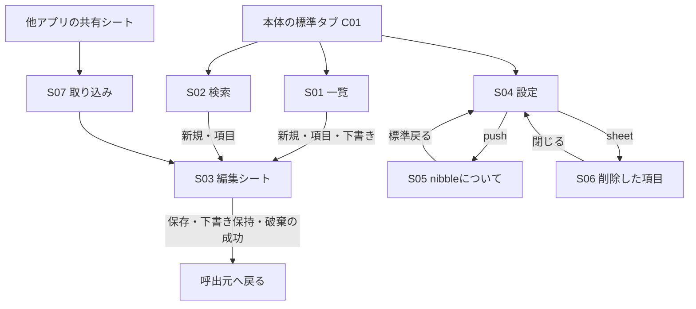
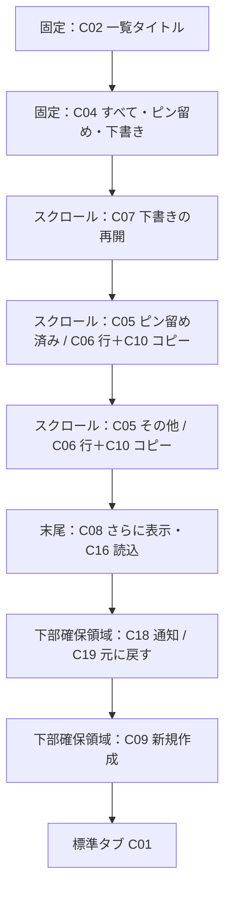
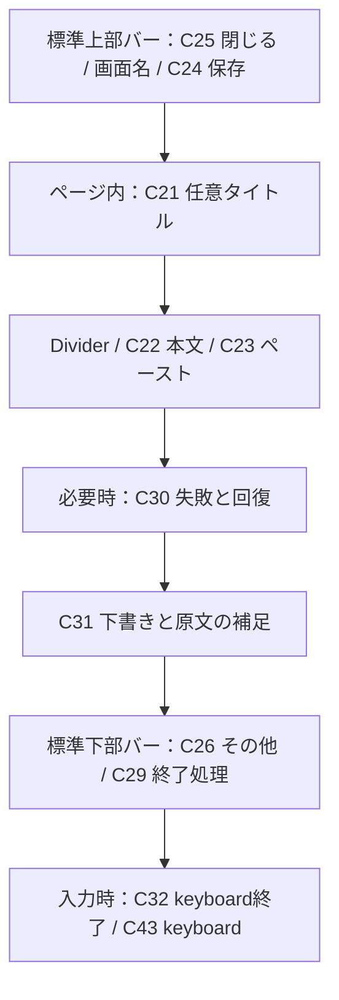
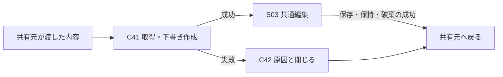

# 画面構成と状態

画面は、利用者が今行う作業、必要な情報、操作、終了後の行き先で構成する。C番号は[部品台帳](components.md)、F番号は[共通原則](foundations.md)に対応する。寸法を示さない領域は内容とシステムのsafe areaへ適応する。図は情報の配置関係であり、iOSの外観を模した実装ではない。

## 画面間の関係

検索終了はシステムの検索状態を終了する。常に一覧へ移動すると固定せず、検索を始めた文脈との関係を確認する。URLからの一覧・新規作成は一覧タブへ到達するが、編集中の内容を別の編集で上書きしない。

## S01 一覧

**目的**：見覚えのある項目を選んでコピーする、または中断した編集を再開する。

図は「すべて」の構成。D・P・Oは空なら省く。通知は存在するときだけ表示する。背景はC03でつなぎ、区分の意味は見出し、項目の境界は区切り線で伝える。

| フィルター | 内容 | 選択を変えた結果 | 理由 |
| --- | --- | --- | --- |
| すべて | 下書き、ピン留め済み、その他 | 取得上限・縦スクロールを初期化 | 保存済みと未完了を一つの入口で扱う。再開とコピーは異なる行で示す |
| ピン留め | 未削除でピン留めした保存済み | 同上。ピンを外した項目は集合から外れる | 頻繁に使うと利用者が指定した内容へ絞る |
| 下書き | 下書きのみ | 同上。保存した下書きは集合から外れる | 未完了の作業を集め、利用可能な保存済みと混ぜない |

保存済みはピン状態、更新日時、IDの順。これは学習するランキングではなく決定的な順序である。検索も同じ保存済みの順序を使う。関連度順を提供すると説明しない。

**固定する理由**：フィルターを見失わず集合を変更できる。**縦スクロールする理由**：任意の件数・長い文字を一画面へ押し込まない。下部の作成・通知はF06に従い、最終行をその上まで動かせるようにする。

**読み上げ・代替操作**：画面名→フィルターと選択→区分→行の識別と操作→続き・通知・作成という意味が分かるようにする。実際のフォーカス順はネイティブ要素で確認する。全行を一つの読み上げ要素へまとめてコピーが失われないようにする。

**空・待機・失敗**：初回はC15の説明と作成、ピン0件は「すべてを見る」、下書き0件は保持・再開の説明。初期読込はC16、失敗はC17。空状態を読込・エラーより先に確定しない。

**見直す点**：下書きが多いとコピー対象まで遠くなる、同名を識別できない、ピン・削除を発見できない条件を[監査](audit.md)で扱う。

## S02 検索

**目的**：覚えている言葉から保存済みの項目を見つけて使う。検索対象は未削除の保存済みタイトル・本文。下書き・削除済みは含めない。

| 領域 | 構成・配置 | 理由 |
| --- | --- | --- |
| 上部 | C02「検索」を入力中も保持 | 入力へ集中しても現在地を確認できる |
| 内容 | C13検索前案内、C06/C10結果、C14検索0件、C16/C17状態 | 一覧と同じ項目の識別とコピーを再利用する |
| 入力中の下部 | C12標準検索欄と終了、C43 keyboard | 入力開始・修正・終了を同じ場所で扱う。独自の検索欄を重ねない |
| 入力終了後の下部 | OSの検索状態に従うUI、C09新規作成 | 本文の操作面積を取り戻す。新規作成は入力を覆わない |

検索選択→即入力、入力→結果更新、検索キー→keyboardを閉じる、clear→入力を空にする、終了→検索状態を終える、という異なる操作を区別する。フィルターは一覧の状態を変えず、検索の結果0件でも一覧を空にしない。

検索語を消すまでは値を保持する。共有元から戻る、編集から戻る、追加取得、古い検索の遅い結果を含めて状態を確認する。入力の確定と日本語変換の確定は別の条件である。

**設計上の注意**：検索前の案内は失敗・進行の覆いになってはならない。現行コードの優先順位の課題はG05。検索していないときの作成の有用性は製品仮説で、主目的を妨げるなら一覧だけへの限定案と比較する。

## S03 作成・編集・下書き再開

**目的**：入力を失わずに一つのテキストを作り、保存済み内容へ反映するか、中断するかを選ぶ。

タイトルと本文は一つの縦スクロール面に置く。タイトルは任意、本文は空白だけでは保存できない。本文の高さを固定し、入力欄とページの二重スクロールを強制する構成は選ばない。

| 状態・操作 | 保持する内容 | 終了・復帰 |
| --- | --- | --- |
| 新規・既存・再開・共有 | 同じ入力部品と下書きの契約 | 入口ごとに別の編集手順を覚えさせない |
| 入力中 | 入力番号ごとの下書き。保存済みは確定まで変更しない | 自動保持の失敗は入力欄とともに示す |
| 保存 | 最新入力を固定して反映する | 成功時だけ呼出元へ戻る |
| 閉じる | 意味のある下書きを保持。無変更・空の処理は保存層の契約 | 保持成功時だけ戻る |
| 破棄 | 確認の取消なら全入力を保持。確定なら下書きを除く | 保存済み内容は変えない |
| 保存競合 | 画面内の入力と失敗理由を保持 | 対応可能な失敗では「新しい項目として保存」 |
| 終了処理中 | 二重終了・追加編集を受け付けない | 完了か失敗を待つ。失敗なら操作可能に戻る |

**例外の理由**：シートのスワイプ終了は現在無効。最新入力の永続化に成功した後にだけ閉じる契約を守るためである。これは通常のiOSの期待と異なるため、永続化を保ったまま標準終了へ近づけられるかをG09で比較する。

## S04 設定

**目的**：日常の項目操作から離れて、操作位置を変え、復旧と説明へ移動する。

| 読む順序 | 要素 | 理由 |
| --- | --- | --- |
| 1 | C02 設定 | 現在地 |
| 2 | C33 操作ボタンの位置・左右選択・説明 | 現行の主な全体設定。選択と適用範囲を同じまとまりで読む |
| 3 | C34 ライブラリ・削除した項目 | データの復旧を外観設定と区別する |
| 4 | C35 nibbleについて | 詳しい説明への階層移動 |
| 下部 | C01 タブ | 設定を終えたらすぐ利用へ戻れる |

内容は縦スクロールする。＋は置かない。設定数を水増しして空間を埋めず、余白は現在の少ない選択肢を表すものとして残す。設定内の自作dark mode・文字サイズ・Reduce Motionは設けず、OSの選択に従う。

## S05 nibbleについて

**目的**：製品が何をするか、他アプリとの使い方、データがどう扱われるかを読めるようにする。

標準のinlineタイトルと戻る、C36の縦スクロールする説明Listで構成する。短い製品文→基本操作→共有・URLによる入口→端末内保存・復元・完全削除・アプリ削除の影響、の順で理解を積み上げる。実装上の型名や内部の非同期処理を利用者向けの説明へ持ち込まない。

戻る先は設定。説明の文字は省略せず、Dynamic Typeで読み切れるようにする。ここだけを操作の発見手段にせず、主要な操作は対象画面でも発見できるようにする。

## S06 削除した項目

**目的**：使う対象から除いた項目を見つけ、復元または完全削除する。

上部はC39のタイトルと閉じる、内容はC37の名前・要約・復元、下部は自動削除しない説明と標準検索。C09の作成とC10のコピーはない。復元対象と再利用対象を混在させないためである。

- 空：削除済みがないことと復元できる場所であることを説明する。
- 検索0件：語句を修正できる。通常一覧の検索語を変更しない。
- 復元成功：この集合から外れ、同じ項目として通常一覧へ戻る。
- 完全削除：C38で対象と回復不能を確認し、取消なら維持する。
- 失敗：対象と検索語を残し、可能な操作を示す。
- 閉じる：設定へ戻る。シートを重ねて編集へ移動しない。

## S07 共有拡張

**目的**：他アプリで選んだテキストまたはURLを確認して保存し、共有元へ戻る。

共有元から受け取る形式と件数の契約を守り、本文を確認せず自動確定しない。取込開始と編集可能状態を区別する。現在の待機画面は状態説明が不足するためG12の改善対象。

編集画面のscene状態は本体と同じ意味とは限らない。共有拡張が表示されているだけで本体用の非アクティブ覆いを表示しない。共有元ごとの振る舞いは本体Simulatorの成功だけでは保証できない。

## S08 非アクティブ時

**目的**：アプリ切替時に本文をそのまま見せない。

C40の内容のない面を最前面に出す。タブや本文をコピーする入口としては使わず、activeへ戻ると元の作業へ戻す。これはナビゲーション先ではなくライフサイクルに応じた表示である。

アクセシビリティ、sheet上の表示、OSのsnapshotとのタイミング、共有拡張での条件をそれぞれ確認する。単なる背景色の描画を、保存ファイル・クリップボード・すべての画面取得からの保護と説明しない。

## 全画面に適用する評価条件

| 条件 | 確認する関係 |
| --- | --- |
| 空・少数・多数 | 画面の目的と次の操作、追加取得、下書きが主内容を押し下げる量 |
| 同名・無題・長い本文 | 読み比べて対象を識別し、全文へ到達できるか |
| 最大文字・狭い幅 | 切詰め、操作領域の重複、横スクロールの到達、説明と操作の分離 |
| keyboard・IME | 内容の末尾、保存・閉じるへの到達、変換中の文字と選択 |
| light/dark・Increase Contrast・Reduce Transparency | 文字、背景、選択、ガラスの合成 |
| VoiceOver・代替入力 | 要素名、対象、順序、操作、結果。ラベルを付けただけで合格としない |
| Reduce Motion | 状態が消えず、不要な動きが残らないか |
| 失敗・遅延・繰返し | 内容を失わない、対象を取り違えない、二重処理しない、回復できる |

これは評価の設計であり、すべて実施済みという表ではない。対象ソースごとの実施範囲は[設計監査](audit.md)と[製品検証](../mvp-validation.md)を参照する。
