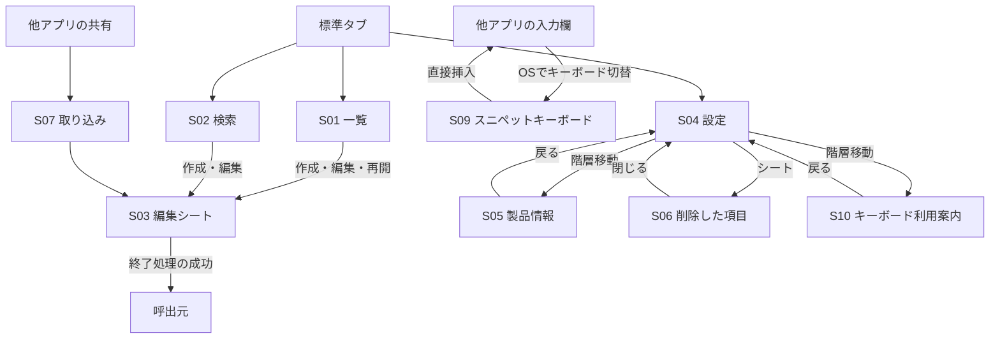
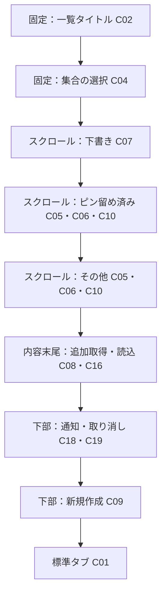
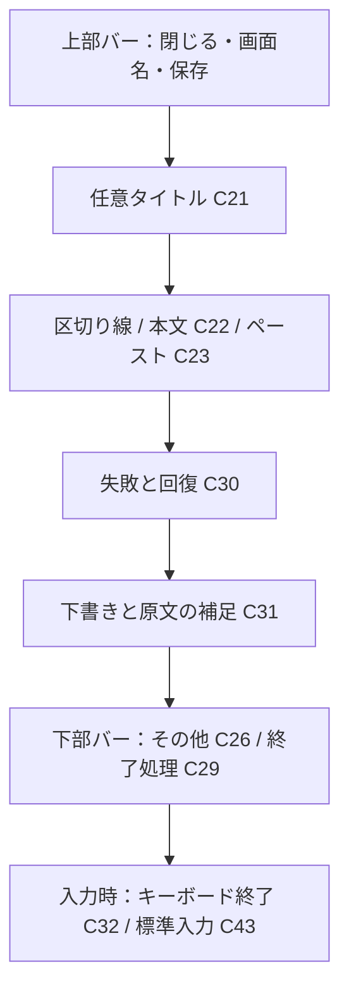
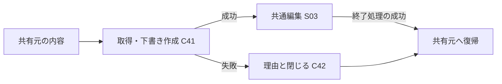

# 画面構成と状態

nibbleの画面は、内容を利用する、編集する、管理する、外部から取り込むという作業に分ける。各画面は目的、内容の順序、操作の配置、終了後の行き先を持つ。用語は[UI設計](README.md)、C番号は[部品台帳](components.md)、F番号は[共通原則](foundations.md)に定義する。

構成図は情報と操作の関係を示す。実際の外形、システムのバー、キーボードはネイティブ部品へ委ねる。表に記す評価条件の実施範囲と実装上の課題は[設計監査](audit.md)で確認する。

## ナビゲーション

一覧・検索は、それぞれ独立した表示状態を持つ。検索終了はシステムの検索状態を終え、開始した文脈に応じて復帰する。URLの一覧・作成の入口は一覧タブへ接続する。編集中の画面は別の編集要求で置き換えない。

## S01 一覧

**目的**：見覚えのある項目を選んでコピーする、または未完了の編集を再開する。

図は「すべて」の構成。空の区分と通知のない領域は表示しない。共通背景を使い、区分は見出し、隣接する項目は区切り線で識別する。ピン留めと削除一覧は単一の集合であり、画面名と重複する区分見出しを置かない。

| フィルター | 内容 | 選択変更の結果 |
| --- | --- | --- |
| すべて | 直近3件の下書きと全下書きへの入口、ピン留め済み、その他 | 取得上限と縦スクロールを初期化する |
| ピン留め | 未削除でピン留めした保存済み項目 | 同上。ピンを外した項目は集合から外れる |
| 下書き | 未完了の編集。100件単位で追加取得 | 同上。保存した下書きは集合から外れる |

下書きはタイトル・本文要約・更新日時で識別し、更新日時の降順・IDの昇順で並べる。「すべて」で取得する要約は次項目の有無を判定する1件を加えた4件までとし、全文は編集開始時に読む。

保存済みの行にはC11の整理操作を適用する。左スワイプを削除、右スワイプをピン留め／解除に割り当て、可視メニューと同じ操作を実行する。

保存済みはピン留めを先頭にし、各区分は更新日時の新しい順、同じ日時ではIDの昇順で並べる。検索にも同じ順序を使う。内容の関連度を計算するランキングは持たない。

タイトルとフィルターは現在地と集合を保持し、内容は縦にスクロールする。下部の作成と通知はF06の確保領域へ置く。末尾の項目をボタンの上まで移動できることを評価する。

**状態**：初期読込はC16、失敗はC17、空はC15で示す。「すべて」と「下書き」の空状態には作成、「ピン留め」の空状態には全体へ戻る入口を置く。文言付き作成を表示する空一覧では浮く＋を表示しない。対象の有無が分かる前に空状態を確定しない。フィルター選択と取得結果の反映を分け、F07に従って結果と区分を同時に置き換える。一覧のスクロール位置は新しいフィルターの結果が届いた時点で先頭へ戻す。

**確認条件**：集合の選択、行の識別、編集とコピー、整理、追加取得を順に理解できる。文字設定にかかわらず内容の横にコピーと可視の「その他」を置く。読み上げでは区分と対象、独立した操作を保つ。多数の下書き、同名、無題、最大文字を含めて評価する。

## S02 検索

**目的**：覚えている言葉から保存済みの項目を探して利用する。対象は未削除の保存済みタイトル・本文。下書きと削除済みは専用の領域で扱う。

| 領域 | 構成 | 配置理由 |
| --- | --- | --- |
| 上部 | C02「検索」 | 入力中も現在地を保持する |
| 内容 | C17失敗、C13検索前案内またはC06/C10結果・C14検索0件、C16進行 | 項目の識別と操作を一覧と統一する |
| 入力中の下部 | C12標準検索欄と終了、C43キーボード | 語句の入力・修正・終了を同じ場所で扱う |
| 入力終了後の下部 | 標準検索UIとC09新規作成 | 結果の操作面積を確保し、作成にも進める |

| 操作・状態 | 結果 |
| --- | --- |
| 検索タブを選ぶ | 標準検索欄を入力状態にする |
| 空白のみの語句 | 検索対象の案内を示す |
| 語句を入力する | 対象を絞り、要求に対応する結果を表示する |
| 一致しない | 語句の変更を案内する |
| 検索キーで確定する | キーボードを閉じる |
| 検索欄の消去 | 語句を空にする |
| 標準検索を終了する | システムの検索状態を終える |

一覧の選択集合と検索状態は独立させる。検索0件でも一覧の内容は変わらない。検索欄、読み込み、結果、失敗の関係を明確にし、必要な回復操作へ到達できることを評価する。

**確認条件**：日本語変換と検索確定、編集からの復帰、追加取得、古い要求の遅い結果を含めて、入力と対象を保持する。検索中は新規作成を隠し、結果のコピーを操作できる面積を確保する。一覧・検索・削除一覧で取得が中断された場合はC16の再開操作を示し、確定済みの内容と検索語を保持する。離脱した画面の編集開始は提示せず、再入場の要求を受け付ける。

## S03 作成・編集・下書き再開

**目的**：一つのテキストを作り、保存済み内容へ反映するか、下書きを保持して中断するかを選ぶ。

任意タイトルと本文を一つの縦スクロール面へ置く。入力欄は内容に応じて伸びる。本文が空白だけの場合は保存できない。貼り付けは本文末尾へ追記し、タイトルと本文の原文を保持する。

| 状態・操作 | 内容の扱い | 終了条件 |
| --- | --- | --- |
| 新規・保存済みの編集・再開・共有 | 共通の入力と下書きの契約を使う | 入口ごとに異なる保存手順を持たない |
| 入力中 | 入力番号ごとに下書きを保持する | 保存済みは確定まで変更しない |
| 保存 | 最新入力を固定して保存済みへ反映する | 成功時だけ呼出元へ戻る |
| 閉じる | 再開対象の下書きを保持し、空または未編集の下書きを除く | 保持・除去の成功時だけ戻る |
| 破棄 | 確認を経て下書きを除く | 保存済み内容を維持する |
| 保存競合 | 入力と理由を画面に残す | 対応可能な場合は別項目として保存できる |
| 終了処理中 | 追加編集と二重終了を受け付けない | 成功なら戻り、失敗なら編集可能に戻る |

閉じる際に除くのは、タイトルと本文がともに空文字の下書き、または保存済み項目から開いて一度も入力を変更していない下書きである。空白や改行も入力として保持する。

終了は最新入力の永続化に成功した操作が担当する。この契約のため、シートのスワイプ終了は無効とし、上部の閉じる・保存を使い、入力欄の後で「閉じる」による下書き保持を案内する。本文が保存条件を満たさないときは理由を表示し、終了処理の進行は保存・保持・破棄を区別する。標準の終了期待との適合は評価対象とする。

一覧と検索の編集シートはシーンのルート`LibraryView`が提示し、入力とフォーカスは`SnippetEditor`が編集セッション中保持する。タブ内容の離脱は提示済みシートの終了条件に含めず、バックグラウンドからの復帰で同じ入力を維持する。編集終了後は呼出元の一覧または検索のモデルを再取得する。

**確認条件**：長文の末尾、キーボード併用、日本語変換、保持中の中断、保存失敗、繰り返し終了で内容を失わない。共有からの入口でも同じ終了契約を使う。

## S04 設定

**目的**：本体の操作位置を調整し、復旧・キーボード利用案内・製品情報へ進む。

| 順序 | 構成 | 配置理由 |
| --- | --- | --- |
| 1 | C02 設定タイトル | 現在地を示す |
| 2 | C33 操作位置、左右の選択、適用範囲の説明 | 本体の新規作成・コピーに共通する設定を一つのまとまりで理解する |
| 3 | C34 ライブラリ区分と削除した項目 | 外観の調整とデータの復旧を分ける |
| 4 | C48 nibbleキーボード | 他アプリで使うためのOS設定と権限を確認する |
| 5 | C35 nibbleについて | 製品全体の説明へ進む |
| 下部 | C01 標準タブ | 日常の利用へ戻る |

内容は縦スクロールする。新規作成は配置しない。選択肢の少なさに合わせて余白を保ち、文字サイズ・太字・コントラスト・演出は[表示設定の固定](decisions/0002-fixed-interface.md)に従う。ライト・ダーク外観はOSへ追従する。

**確認条件**：左右の選択が新規作成・コピーへ同時に反映し、再起動後も保持される。標準検索の位置はこの設定の対象ではないと理解できる。

## S05 nibbleについて

**目的**：基本操作、外部からの利用、データの扱いを理解する。

標準のinlineタイトルと戻るを上部に置き、C36の説明を一つのScrollViewで読む。本文は単一の背景面に左揃えで置き、見出しも本文と一緒にスクロールする。

| 読み順 | 内容 | 構成の理由 |
| --- | --- | --- |
| 導入 | 製品の短い説明 | 何のための道具かを先に伝える |
| 使う流れ | C44のコピー・保存イラスト、短い文章 | 導入の直後で、コピー元の文章と保存される複製の関係を示す |
| 基本の使い方 | コピー・編集、ピン留め・削除 | 行動を太字で示し、必要な説明を探しやすくする |
| ほかのアプリから | 共有メニューからの保存 | アプリをまたぐ入口を独立した節にする |
| ショートカットで開く | 設定方法、用途ごとのURL | 長いURLを日本語の段落から分け、選択・コピーできる文字として示す |
| データについて | 保存範囲、復元と完全削除、アプリ削除、広告・解析の有無 | 利用方法を読んだ後に、保持と喪失の条件を確認できるようにする |

C44は、メモ画面の文章を選び、元の文章を残したまま複製をnibbleへ保存する流れを示す。480:300比率の透過イラストを本文幅に収め、本文と一緒にスクロールさせる。固定した演出で読書領域を狭めず、周囲と同じ背景面を使う。

6.2秒周期で自動ループし、途中から見ても流れを追えるようにする。再生・停止ボタンは設けず、Reduce Motionの設定にかかわらず自動ループする。図の下の「選ぶ → コピー → nibbleに保存」が説明と意味の読み上げを担い、図自体はタッチと読み上げの対象から除く。読み込み中・失敗時も文章を保持し、失敗時には再読み込み手段を示す。停止・復帰・配色の契約は[演出設計](../decisions/0004-rive-presentation.md)に定義する。

説明文は操作行ではないため、行ごとの区切り線、カード、固定される節見出しを設けない。節の間32 pt、段落と見出しの間16 ptで情報の階層を示す。左右と上下は24 pt、本文の最大幅は600 ptとし、狭幅では利用可能な幅へ縮む。本文はbody・primary色、節見出しはheadline、行間の追加は4 pt。数値は製品の設計値であり、R03・R13・R14の階層・簡潔さ・文字の階層を適用する。文字設定の扱いは製品の固定方針に従う。

製品情報は設定の下位階層であり、終了には標準の戻るを使う。固定高、行数制限、文字の縮小を使わず、標準文字で末尾まで縦に読めるようにする。見出しにアクセシビリティの見出しtraitを付け、本文は段落単位で保持する。アプリ内部の型や処理構造は開発文書が担当する。

**確認条件**：375 pt幅で端末を通常文字・最大アクセシビリティ文字に設定しても同じ配置を保ち、各節と最後の段落まで到達できる。ライト・ダークで本文を判読でき、見出しと本文が重ならない。保存場所、コピーの範囲、削除と完全削除、アプリ削除による影響が理解できる。操作の入口は対象画面でも発見できることを評価する。

## S06 削除した項目

**目的**：通常の利用対象から除いたスニペットを見つけ、復元または完全削除する。

上部はC39のタイトルと閉じる、内容はC37の名前・要約・復元、検索は削除済みのみを対象にする。新規作成とコピーは置かず、復旧に操作を限定する。自動で消去しないことを本文で伝える。

| 状態・操作 | 結果 |
| --- | --- |
| 空 | 削除した項目がないことと復元場所の役割を説明する |
| 検索0件 | 語句を修正できる。通常検索の値は変更しない |
| 復元 | 同じ項目が通常一覧へ戻り、削除一覧から外れる |
| 完全削除 | C38で回復不能を確認し、取消なら維持する |
| 失敗 | 対象と検索語を残して回復方法を示す |
| 閉じる | 設定へ戻る |

**確認条件**：名前と要約から対象を選び、同じUUID・原文で復元できる。完全削除と復元を取り違えず、確認から安全に取り消せる。

## S07 共有拡張

**目的**：他アプリで選んだテキストまたはURLを確認して保存し、共有元へ戻る。

受け取る内容は1件とし、保存前に共通編集で確認する。取得中、編集可能、取得失敗を異なる状態として扱う。終了は共有元への完了または取消通知と対応させる。

共有拡張のscene状態は本体と異なる条件で報告されるため、本体用の非アクティブ表示をそのまま適用しない。

**確認条件**：遅い取得、非対応形式、失敗、取消、共有元の終了で状態を理解でき、二重終了や意図しない確定保存を起こさない。評価は共有元アプリとデータ形式を記録する。

## S08 非アクティブ表示

**目的**：アプリ切替時に本文の露出を抑える。

本体が非アクティブな間はC40の内容のない面を前面へ置く。編集シートにもそのライフサイクルに応じた覆いを設ける。これは移動先となる画面ではなく、アプリの活動状態に対応する表示である。再び操作可能になると作業を継続する。

**確認条件**：シート、読み上げ、OSの画面取得時点、共有拡張の表示条件を確認する。保存ファイルやクリップボードの保護は別の仕組みとして評価する。

## S09 スニペットキーボード

**目的**：他アプリの入力先を離れず、保存済みの本文を使う。

上段は「すべて／ピン留め」の標準セグメント（C45）、中央は一列の入力キーと独立したコピーキー（C46）、下段は結果・必要なページ操作・更新・切替・終了（C47）とする。対象集合を選んでから内容を読む順序を保ち、限られた高さの伸縮を一覧へ割り当てる。背景はOSのkeyboardスタイルに委ね、ホストViewを透明にする。キーの面と隙間で操作範囲を示し、常設の青い「入力」で押した結果を伝える。タイトルと要約の始点を揃え、内容の確認と実行のラベルを分ける。背景とキーはニュートラルなシステム色とし、OSのキーボード周囲との連続性を保つ。1ページのみの矢印と番号は省き、短い結果は待機時の製品名と同じ領域に表示する。

対象選択は小さいサイズ・最大260ptの標準segmented Picker。上段と下段の左右8pt、上端4ptの余白を取り、一覧の文字・区切り線も8ptへ揃える。更新・コピー・ページ・終了には44pt以上の操作領域を保つ。区切り線は項目間に置き、上下の操作領域は余白で分ける。製品名は小さいsecondary色で、本文と操作を主役にする。

挿入は本文領域、コピーは独立したボタンで実行する。フルアクセスなしのコピー操作には必要な設定を案内し、挿入は使える。空結果の表示は該当する読込の完了後とし、読込中の旧ページからの操作は受け付けない。

**確認条件**：権限なしの挿入と権限ありのコピー、本文の完全一致、ページ移動、削除・変更後の拒否、本文取得中の入力先変更による挿入の中止、権限取消によるコピーの中止、非表示中の完了を検証する。横向き、ライト・ダーク、長いタイトル、0件・51件以上で操作領域を保つ。標準キーボードと同じ入力先で切り替え、背景の境界、選択状態、文字と操作の識別を確認する。[技術仕様](../decisions/0005-snippet-keyboard.md)がOS制約とデータの責務を定める。

## S10 キーボード利用案内

**目的**：利用者がOS設定でキーボードを追加し、必要な権限を判断できるようにする。

設定内のC48から標準のNavigationLinkで開く。利用目的、追加手順、コピー権限、更新とページ操作、使えない入力欄の順に見出しと文章を一列で配置する。手順の全文が読める自然な高さとスクロールを使い、OS設定を再現する独自スイッチや、取得できない有効化状態は表示しない。

**確認条件**：nibble未追加の利用者が手順を追える。挿入とコピーの権限の違い、入力先の制約を理解できる。標準の戻るで設定へ復帰できる。

## 全画面の評価条件

| 条件 | 確認すること |
| --- | --- |
| 空・少数・多数 | 目的と次の操作、追加取得、主要内容への到達 |
| 同名・無題・長文 | 対象の識別と全文への到達 |
| 文字設定変更・狭幅 | 固定した文字・配置、操作領域、全選択肢への到達 |
| キーボード・日本語変換 | 内容末尾、保存・終了、未確定文字と選択 |
| 外観と視覚設定 | ライト・ダーク、コントラスト強調、透明度低減での識別 |
| VoiceOver・代替入力 | 名前、対象、順序、操作、結果 |
| Reduce Motion | 通知と説明イラストの動きが変わらないこと |
| 失敗・遅延・繰り返し | 入力保持、対象の同一性、重複防止、回復 |

実施した条件は[製品検証](../mvp-validation.md)、ソース上の適合と未評価事項は[設計監査](audit.md)に記録する。
