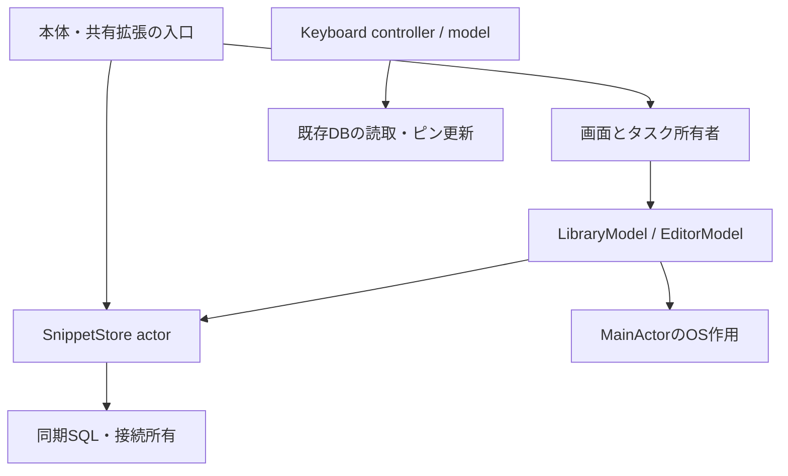
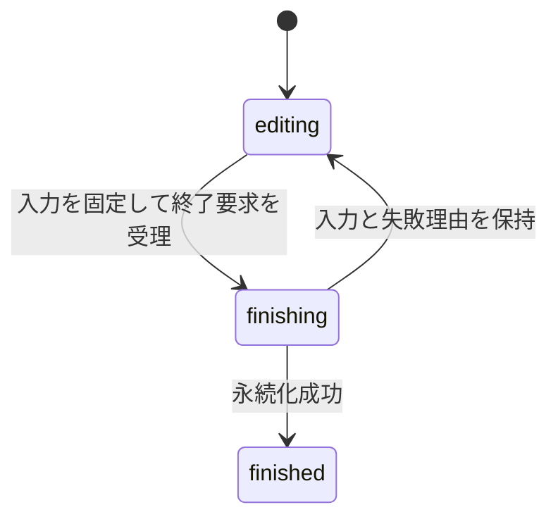

# nibbleの製品仕様・要件

nibbleは、端末内のテキストを保存し、検索・コピー・キーボード挿入で再利用するiOSアプリである。作成や修正の途中でも入力を失わず、利用対象と編集中の内容を取り違えないことを中心に設計する。

## 目的と提供範囲

本体は一覧・検索・編集・整理、Share Extensionは他アプリからの取り込み、Keyboard Extensionは入力欄への挿入を担う。アカウント、通信による同期、独自export/import、アプリ削除後の復旧は提供しない。最低対応はiOS 26.0、製品の実行評価はiOS 26.5 Simulatorとする。

機能の意味と状態契約を本書、UIの配置と評価を[UI設計](design/README.md)、Swiftの宣言を[実装規約](library-policy.md)、実行方法を[製品の検証手順](ios-verification.md)で管理する。

## 利用者と主要な利用場面

定型文・URL・メモなどを繰り返し入力する人が、自分のiPhoneで必要な本文を素早く呼び出すことを対象とする。他アプリの文章を保存する、保存済み項目を探してコピーする、入力先でキーボードから挿入する、途中の編集を下書きから再開する、という流れを提供する。チーム共有やクラウド上の管理は提供範囲に含めない。

## 機能要件と受け入れ条件

本書は現行製品の規範である。要件の採用と対象ビルドでの検証完了は区別し、実施結果はソース付きrunで照合する。

| 要件 | 利用者から見た成立条件 | 詳細な契約 |
| --- | --- | --- |
| 保存した本文を再利用する | 一覧・検索から本文全文をコピーでき、「コピーしました」の表示と振動で成功を確認できる。タイトルを混ぜず、原文の空白・改行・Unicodeを保持する | [原文](#原文と検索用の値)、[操作完了](#非同期操作の完了契約) |
| 必要な項目を見つける | 一覧のすべて・ピン留め・下書きを選べる。検索は一覧フィルターから独立して保存済み全体を対象にする。0件・取得中・失敗を区別する | [一覧と検索](#検索と一覧の性能)、[画面構成](design/screens.md) |
| 入力を失わず編集する | 新規作成・既存編集・下書き再開ができ、保存で確定、閉じるで下書きを保持する。競合や保存失敗では入力を残して回復できる | [編集開始](#編集の開始と再開)、[編集終了](#入力の保存と編集の終了) |
| 項目を整理し、削除から回復する | ピン留め・解除、削除、通知からの取り消し、削除一覧からの復元を提供する。完全削除は対象を確認し、関連下書きも消す | [操作完了](#非同期操作の完了契約)、[通知](design/rationale/result-notices.md) |
| 他アプリとの間で利用する | 共有されたテキスト・URLを編集して保存できる。Keyboardでは行タップ1回で本文を1回挿入し、全文表示やコピーと混同しない | [共有](#呼び出しと共有の契約)、[Keyboard仕様](architecture/keyboard.md) |
| 操作位置と読みやすさを保つ | 一覧・検索・設定の状態は標準TabViewで保持し、移動はOS標準のタブバーを使い、スクロールで縮小しない。作成はルート画面右上の＋、行操作は右側に固定する。検索は欄をタップして入力を始める。本文の文字組を一覧・編集・説明で統一し、共通見出しと任意の補足を使う。編集の画面下部とキーボード上の操作は排他的に表示する | [共通原則](design/foundations.md)、[部品](design/components.md) |
| 使い方とデータの扱いを伝える | 設定からキーボードの追加・権限とアプリ情報を読める。説明イラストを操作完了の証拠にしない | [画面とフィードバック](#画面とフィードバック) |

## 品質要件と提供しない機能

原文保持、更新の整合性、入力を保持する失敗回復、操作への素早い応答を優先する。コピー・保存・削除の完了を、通知や演出の終了まで待たせない。性能改善は同じ条件で測定し、画面の見た目や自動操作の所要時間だけで断定しない。評価条件は[性能手順](performance-verification.md)に定める。

本文・検索語を外部へ送らず、通信同期、アカウント、独自export/import、アプリ削除後の復旧は提供しない。表示設定・OS所有UIの境界は[表示固定方針](design/rationale/fixed-interface.md)に従う。Simulatorの検証、Appleへのアップロード、実機での確認は別の工程とし、未確認条件は[検証範囲](testing.md#検証範囲と制約)へ明示する。

## データの意味と永続化

保存済み項目は利用する内容、下書きは編集中の内容である。入力は下書きだけを更新し、明示的な保存で利用対象へ反映する。

| 用語 | 意味 |
| --- | --- |
| Snippet | UUIDを持つ保存済みのタイトル・本文・ピン・使用情報・更新番号・削除状態 |
| Draft | 独立したUUIDを持つ編集セッション。既存項目の編集では対象UUIDと編集開始時の更新番号も持つ |
| Summary | 一覧で対象を識別する要約。全文の代わりにタイトルと本文先頭180文字等を渡す |
| revision / baseRevision | 保存済み項目の変更番号 / 編集開始時の番号。別の編集による更新競合を検出する |
| sequence | 同じ下書き内の入力番号。遅れた書込が新しい入力を上書きしないために使う |
| request / snapshot | 選択した検索・フィルター・取得範囲 / 同じ要求とDB読取時点の結果を固定した組 |

### 原文と検索用の値

共通エディターはMarkdownの見出し・太字・斜体・コード・引用・リンク・取り消し線を入力中の文字へ反映する。装飾は表示だけに適用し、Markdown記号、空白、改行を入力・保存・コピーから取り除かない。未確定のIME入力には装飾を適用せず、確定後に更新する。

タイトルと本文の空白・改行・タブ・NUL・UnicodeのUTF-8を保持する。表示用要約と正規化検索キーは別の値であり、原文へ逆反映しない。挿入・コピーはDBから読み直した保存済み本文の全文を使う。

原文の同一性はUTF-8で比較する。SwiftのString比較では等しい「が」と「か＋結合濁点」も区別する。連続バッファを比較し、長文入力ごとの要素反復を避ける。

確定保存と共有取込は、空白・改行だけでない本文、タイトル512 UTF-8 bytes以内、本文1,000,000 bytes以内を要求する。入力制約に違反しても編集内容を画面に残し、修正できるようにする。

## 構成と責務

入口が依存を組み立ててinitializerで渡す。UIからグローバルな保存層を探索しない。本体の一覧・検索・削除一覧は保存層を共有し、要求・結果・失敗は各モデルが独立して持つ。共有拡張は別プロセスの保存層を同じ編集機能へ渡す。

モデルは処理と状態、UIは開始・寿命・重複、保存層は接続と更新整合性を所有する。OS作用はLibraryEffectsを通してMainActor上で同期的に完了させる。テストは一時DBと記録用effectsを注入でき、OSを使う統合は明示して直列実行する。

### 状態の寿命

一覧・検索のモデルはシーンのルートAppRootView、画面操作は各LibraryTaskOwner、編集入力とフォーカスはSnippetEditorが所有する。編集シートもルートから提示する。タブ内容の一時離脱・背景移行で提示元を失い、編集中のシートが閉じないようにするためである。

Viewの比較用inputRevisionは親入力の更新を表し、SwiftUIのidentityや永続データのIDには使わない。Bindingや操作先の差し替えで入力・フォーカス・タスク所有者・Rive Sessionを破棄しない。詳細は[比較規約](library-policy.md#viewの比較境界)に従う。

## 保存形式と接続

本体・共有拡張・キーボードはApp Groupの`Library/snippets.sqlite`を共有する。登録する識別子は[配布手順](testflight.md#1-appleの識別子とapp-groups)、schemaとSQLの実装は[保存層](../app/Shared/Persistence/SnippetStore.swift)を参照する。

SnippetStore actorが一つの接続を所有し、同じ接続の処理を直列化する。別プロセスの排他はSQLiteが担う。同期SQLはactorの実行中だけ接続を借り、transaction内でawaitしない。書込は即時transactionで照合と更新を一体に確定し、失敗時はrollbackを試みて元のエラーを返す。

WALと完全同期で確定を管理し、書込接続終了後も読取専用接続が使うWAL・SHMを保持する。競合の待機は有限とする。未対応schema・破損はエラーにし、既存データを消して初期化しない。列構造の変更はmigrationと原文・UUID・下書き・削除状態の検証を必要とする。

KeyboardReaderは要求ごとの短命な読取専用接続を持つ。フルアクセス確認後のピン更新だけが既存DBへ書き込む。DB作成・migration・索引作成は行わない。schema 1/2の扱いとWAL条件は[Keyboard設計](architecture/keyboard.md#共有データと読み取りの契約)に従う。

準備済みSQLは接続内で上限付き再利用を行う。実行中のstatementをcacheから外し、入れ子の同じSQLには別statementを貸す。正常終了はresetとbinding解放を確認し、失敗したstatementは破棄する。これにより再利用時に本文や引数、実行途中の状態を持ち越さない。引数はbindingで渡し、個数不一致を拒否する。

### 操作に必要な値だけを取得する

一覧は要約、利用は対象1件の本文、編集開始は対象の下書きまたは全文を読む。利用前に未削除状態と必要なrevisionを検査する。長い本文を行の更新や対象属性の照合のためだけに複製しない。

削除・復元等の通知対象名は更新を確定するtransactionで取得する。画面の古い要約を変更結果の正本にしない。確定後にモデルが一覧と通知を更新する。

## 検索と一覧の性能

### 一覧要求と表示の整合性

一覧の選択要求と表示中snapshotは別に保持する。各取得にもIDを割り当てる。同じ検索語を再実行した場合でも、先行処理の遅い結果が新しい成功や失敗を上書きしないためである。

取得は要求とIDを固定し、一つの読取transactionで要約・続きの有無・保存済み/ピン留め/下書きの総数を得る。総数は検索語と取得上限から独立し、本文を取得せず集計する。未取得の件数を0として表示しない。モデルへ戻るとキャンセル・取得ID・要求を照合し、有効な処理だけが結果・失敗・後始末を反映する。

| 状態 | 表示と操作 |
| --- | --- |
| 未取得 | 進行中として扱い、0件と表示しない |
| 別の集合を取得中 | 古い内容を操作不可で保持し、取得中の集合を示す |
| 同じ集合の更新・追加取得 | 表示中の内容を保持する |
| 成功 | 要求と結果を一緒に反映し、一覧または0件案内を表示 |
| 失敗 | snapshotを保ち、要求に対応する再試行を表示 |
| 中断 | 進行表示を終え、同じ要求の「読み込みを再開」を表示 |

本体一覧は初回にすべて・ピン留め・下書きの各ページを同じ読取transactionで取得し、シーンのモデルに保持する。フィルターとメインタブの切替やactive復帰だけでは再取得せず、保持済みの集合を直ちに表示する。外部変更はPull to Refreshで3集合へ取り込む。保存・コピー・ピン・削除・復元などアプリ内の操作後は3集合を更新する。各フィルターの取得上限は切替をまたいで保持し、未取得分を手元の「すべて」から抽出してピン留めを欠落させない。検索・削除一覧は独立した要求として再取得する。

検索語の変更は取得上限を100件へ戻す。「すべて」は保存済み100件と直近の下書き1件、下書き専用は100件単位とする。続きは1件多く読んで判定し、「さらに表示」で上限を100件増やして先頭から再取得する。下書きが多数でも利用対象へ到達できるよう、表示予算を分ける。

行はUUID、Listは表示中結果のフィルターで識別する。保持済みフィルターへの切替では内容を即座に反映して先頭へ戻す。検索・削除一覧の取得待ちには古い結果を別の集合として操作させない。

### 検索条件と読込量

検索キーはNFC正規化、日本語localeの大小・半角全角folding、NUL置換を行い、原文と別に保存する。検索語の前後空白を除き、`instr`で日本語1文字から部分一致する。かな/カナ、清音/濁音は区別し、`%`・`_`・バックスラッシュは通常文字として扱う。

本体のすべて・ピン留め・検索は使用回数降順、更新日時降順、UUID昇順。削除一覧は更新日時降順、UUID昇順。下書きは検索語で絞らない。[使用の意味](design/rationale/usage-order.md)はコピー完了を基準とする。Keyboardのピン優先順とは用途が異なる。

空検索は部分一致を評価せず、固定した述語と索引で集合を選ぶ。部分一致には全件走査が生じるため、検索時間はデータ量と語句を揃えて測る。要約のメモリ、保存層の時間、実画面の描画は別の指標として評価する。

## 編集の開始と再開

新規作成は独立した下書き、保存済みの編集は未削除を確認して対応する最新下書き、下書き再開は指定UUIDの全文を取得する。対応下書きの検索と作成は同じ書込transactionで行い、同時再開による重複を防ぐ。

モデルは表示中または有効な提示要求の処理中に追加開始を受け付けない。URL受信でも既存入力を維持する。提示要求IDを離脱時に無効化し、結果・失敗・後始末を同じIDで照合する。取消後の古い処理を待たず新しい提示要求を受け付けられるが、古い結果を表示しない。

提示していない新規の空下書きは通常の保持操作で可能な範囲で除去する。既存項目の下書きと再開対象は保持する。本体はルート、共有拡張はcontrollerが共通エディターを提示し、終了通知を各入口で扱う。

## 入力の保存と編集の終了

### 自動保存

setterはメモリ上の入力だけを更新する。UTF-8が変わるとsequenceを増やし、画面が固定snapshotを`.task(id: snapshot.sequence)`から直接awaitして保存する。DBは既存の同じ下書きに対して、より大きいsequenceだけを適用する。保存・破棄後に遅い書込が届いても下書きを再生成しない。

SwiftUIによる更新の集約を許容し、全キーストロークと異常終了直前の未確定入力の保存は保証しない。保存・閉じるは自動保存の開始に依存せず、現在入力を固定して永続化する。

### 終了状態と確定条件

入力と終了要求を受け付けるのはeditingだけとする。二重終了とシートのスワイプ終了を防ぎ、成功を受け取って閉じる。

| 操作 | 成功時の確定 |
| --- | --- |
| 保存 | 保存済み項目の作成/更新と下書き除去を同時に行う |
| 新しい項目として保存 | 別UUIDへ保存し、置換可能な下書きだけ除去 |
| 閉じる | 下書きを保持。タイトルと本文がともに空文字、または既存項目でsequenceが0なら除去 |
| 下書きを破棄 | 下書きだけを除去し、保存済みを維持 |

通常の保存・保持・破棄はtransaction内で下書きUUID・対象UUID・baseRevisionを照合する。入力番号はDBより大きいか、同じ番号かつタイトル/本文のUTF-8一致を要求する。既存項目への保存には、未削除かつrevisionとbaseRevisionの一致も必要である。

### 失敗と回復

更新競合・下書き照合不一致・対象消失は入力を残し、別項目への保存を提示する。空本文・サイズ超過は修正を、保存先・DB・schemaの問題はデータを維持した再試行を可能にする。別項目への保存でDBの下書きを置換できなければ、その下書きも残す。

遅れた自動保存エラーは入力番号と編集状態を照合し、新しい入力や終了結果へ反映しない。キャンセルは停止要求であり、確定済みの変更を巻き戻さない。受理した書込と終了処理は確定まで待ち、永続化成功後はキャンセルが届いていても成功を返す。

## 非同期操作の完了契約

操作APIは受理した処理と状態反映を完了まで待つ。取得だけでなく、書込後の一覧更新と失敗状態も戻り時点で観測できる。UIは[開始・所有規約](library-policy.md#操作apiと開始api)に従う。

コピーは読込の前後でキャンセルを確認し、未削除の本文をlocalOnlyでOSへ渡す。OS書込呼出しの戻りをコピー完了とし、使用情報を記録する。使用記録が失敗しても「コピー失敗」にはしない。OSとDBの二つの確定を一つのtransactionにはできない。詳細は[使用順の設計](design/rationale/usage-order.md)に定める。

削除・復元は同じUUIDの状態を変え、本文とピンを保持する。完全削除は削除済み項目と関連下書きを一体に除く。通知の表示期間は操作の完了に含めず、[通知の寿命](design/rationale/result-notices.md)で管理する。

## 操作の寿命と整合性

| 操作 | 所有と重複 |
| --- | --- |
| 一覧取得・本体コピー | LibraryTaskOwnerのsceneBound、同じ操作IDの先行処理へ取消を要求 |
| 編集開始 | LibraryTaskOwnerのscreenBound、実行中は追加要求を拒否 |
| ピン・削除・復元・完全削除 | sceneBound、操作種別とUUIDごとに重複を拒否 |
| 編集終了・共有読込 | 各画面のscreenBound、実行中の追加要求を拒否 |
| 下書き保存・通知期限 | SwiftUI taskの入力番号/通知IDで所有 |
| Keyboardの取得・利用 | [Keyboard設計](architecture/keyboard.md#状態と操作の寿命)で入力先と可視性も照合 |

sceneBoundの有限処理はシート開閉や一時的な非active化をまたいで完了する。background化は編集開始を止め、通知を消す。画面終了は編集終了・共有読込へ取消を要求する。

取消と結果反映の資格は別に確認する。取得ID、提示要求ID、通知IDと滞在context、入力番号を使い、古い成功・失敗・後始末が別の操作を変更しないようにする。

## 画面とフィードバック

画面構成は[S台帳](design/screens.md)、部品の責務と理由は[C台帳](design/components.md)に定める。[表示固定方針](design/rationale/fixed-interface.md)に従い、文字サイズ・太字・コントラスト・独自演出を固定し、ライト/ダークと意味情報を維持する。

SwiftUIの変化はScopedAnimation、説明図内はRMLが所有する。説明図はコピーや保存の実処理ではなく、演出完了を業務成功に使わない。[演出設計](architecture/presentation.md)がホストの責務を定める。

## 呼び出しと共有の契約

`nibble://library`は一覧の検索語とフィルターを初期化し、`nibble://new`は新規下書きを開く。この2種類だけを受け付け、path・query・fragment・認証情報・port付きURLを拒否する。custom schemeは所有権を保証しないため、本文や保存・削除指示をURLへ載せない。

共有拡張は最初の対応providerから1件を読み、plain textを優先し、URLは文字列として扱う。取得前後と下書き作成後に取消を確認する。離脱後はeditor/alertを追加せず、取り込み済みの下書きは保持する。provider callbackの即時停止は保証しない。

共通編集が成功して終了したら共有元へ完了を通知する。「閉じる」の下書きは本体で再開できる。非対応形式と取得失敗は説明して終了可能にする。Web本文取得とclipboardの自動読取は行わず、ペーストは利用者が開始する。

## 技術選定と配布容量

SQLiteはApp Groupの別プロセス接続、revision照合、項目と下書きの同時確定を直接管理するために使う。SQL/migrationの保守は製品側が担う。日本語の短い部分一致は原文と別の検索キーで扱い、全件走査の費用を測定する。

SwiftUI/Observationが表示状態、Taskingがタスク所有、AppMacrosが比較宣言、ScopedAnimationが変化の範囲を担う。依存のAPIと固定条件は[実装規約](library-policy.md#依存とビルド)に従う。Rive runtimeは本体だけに含める。

Releaseはサイズ最適化・whole-module・testability無効とし、テスト時だけ実行基盤がtestabilityを有効にする。容量は同条件の本体・拡張・runtime・アセットで比較し、cache・dSYM・テストを除く。App Storeの圧縮/端末別削減後の容量とは区別する。[性能手順](performance-verification.md)で応答と容量の負担を評価し、保守停止、OS不適合、実測悪化、要件拡大で見直す。

## データ保護と配布

保存先とDBにData Protectionのcompleteを指定する。本体は非activeの一覧とbackgroundの編集で本文を隠す。独立sceneを持たない共有拡張へ同じscene条件の覆いを適用しない。属性の設定だけで実機のロック保護を検証済みとはしない。

本文・検索語をログ、システム検索、analyticsへ送らない。Privacy ManifestとAPI・依存のデータフローを更新/配布時に照合する。WALを欠いたDB単体コピーはbackupとして扱わない。

TestFlightの識別子・署名・本人用配信と秘密情報は[配布手順](testflight.md)、検証範囲は[確認条件](testing.md#検証範囲と制約)を参照する。
