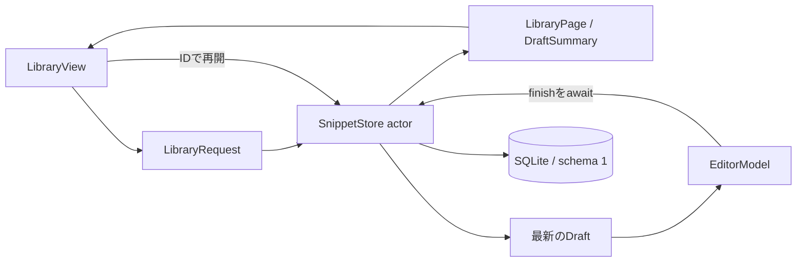

# 一覧と下書きのリファクタリング検証

## 対象と目的

2026-09-16に、最新の `origin/main`（`8dfbb18`）を基準として製品のSwift、Xcode構成、検証スクリプトとテスト、設計・実装規約を確認した。対象はiOSのスニペットアプリnibbleと共有拡張。目的は「端末内で原文を保存し、素早く探してコピーする」体験を維持し、一覧の読込と編集終了の契約を読み取りやすくすること。

対象実装コミットは `888dec0aaee636277bb7ac8ac758bf6fcb7eb74d`。製品テストrunはこのコミットと入力hashを照合して成功した。

保存形式はschema version 1、最低対応OSは26.0、依存の固定版とlockを維持する。既存データの消去・変換は行わない。実行検証はiOS 26.5 Simulator。

## 評価と変更

| 観点 | 見つかった問題 | 変更 |
| --- | --- | --- |
| 認知負荷 | 編集のbusy・finished・error・conflictと3つの終了メソッドを合わせて読む必要があった | `EditorModel.finish(_:)`に終了処理を集約し、phaseと回復方法を含むfailureで状態を表す |
| 正しさ | 自動保存はsequenceを比較する一方、保存・閉じる・破棄は新しいDB入力を失わせる場合があった | 終了操作もトランザクション内で下書きを照合。古いsequenceと同じsequenceの異なる原文を拒否 |
| データ回復 | 別の操作で下書きが消えた後、閉じる操作が保存成功を報告し得た | 存在しない下書きの終了は失敗とし、入力を保持。明示した「新しい項目として保存」で救済できる |
| 読込の正しさ | 一覧に保持した古いDraftを直接編集画面へ渡していた | 一覧にはDraftSummaryだけを保持。下書きの再開はIDから読み直し、既存項目の編集はDB内で再開・作成を決定 |
| 性能 | 検索ごとに全下書きの本文を取得し、MainActorの一覧モデルに保持していた | 下書き一覧はUUIDと最大180文字のタイトルのみ。本文は開く1件だけ取得 |
| 非同期処理 | 検索条件を文字列で連結し、ページ上限のリセットを複数のView callbackに分散していた | 不変のLibraryRequestへ集約。モデルでページ数を更新し、要求世代と条件の両方を確認して結果を反映 |
| 一覧の整合性 | 保存済み項目と下書きを別のactor呼出しで取得していた | 1つの読取トランザクションでLibraryPageを取得 |
| 通知の整合性 | 通知本文・ID・取り消し対象を別々に更新していた | 1つのNoticeへ集約し、期限と取り消し対象を同じ通知に結び付ける |
| 保守性 | LibraryViewに所有者・About画面、SnippetEditorに色定義も混在していた | LibraryTaskOwner・AboutView・NibbleThemeを別ファイルへ移し、画面の分岐を平易な条件へ整理 |
| テストの妥当性 | 1ファイルに保存・UI所有・表示比較・測定が混在し、別suiteのクリップボード操作が並行し得た | テストを契約ごとに分割。UI integrationの親suiteを直列化し、使い捨てDBを共通fixtureで削除 |

`Draft`が入力のUTF-8の変化に応じてsequenceを増やすため、モデルやテストが手動で番号を更新する必要もなくした。SwiftのString比較は正準等価なUnicodeを等しいとみなすので、原文の同一性を判定する箇所ではUTF-8を照合する。

新しい項目として保存する際は、別の編集経路の新しい下書きを消去しない。自動保存の遅延書込は従来どおり、存在する行へのUPDATEに限定し、保存・破棄した下書きを再生成しない。

## 構造と契約



編集終了は `editing → finishing → finished`。失敗時だけ `editing`へ戻す。終了処理中・終了後の入力変更と追加の終了操作を受け付けず、受理した永続化は完了までawaitする。

保存層の接続・statement・トランザクションは引き続き1つのactor内に閉じ込める。汎用repository protocol、架空の保存adapter、独自schedulerは追加しない。本体と共有拡張が同じ実装を使う。詳細な採用契約は[製品設計](decisions/0002-mvp-app.md)、構文・所有の規約は[ライブラリ規約](library-policy.md)を参照する。

## 検証した環境

- macOS 26.2 / arm64
- Xcode 26.5（17F42）、Swift 6.3.2
- iPhone 17 Pro Simulator / iOS 26.5（23F77）
- 専用端末：`D099A849-386F-4EAE-AE12-02D8DC623AF2`
- 構成：Release、App Group用のad hoc署名

### 共通検査と製品テスト

| 検査 | 結果 |
| --- | --- |
| `nix flake check --no-update-lock-file --print-build-logs` | 変更前・変更後とも成功。aarch64-darwinの全5 check |
| 変更前のNibble / NibbleShareビルドと製品テスト | 28件成功、失敗・skipなし |
| 変更後のNibble / NibbleShareビルドと製品テスト | 41件成功、失敗・skipなし |

製品テストは次の実在するproject・schemeを共通driverで実行した。

```sh
nix develop --command python3 scripts/ios.py test \
  --project-config app/project.json --configuration Release \
  --device D099A849-386F-4EAE-AE12-02D8DC623AF2
```

変更前runは `20260915T232847Z-test-59a87f`、変更後runは `20260915T233326Z-test-03e6a8`。各runのmanifest、xcresult、test-summaryはworktreeの `artifacts/ios/` に保存した。

追加テストは実際のSQLiteと製品のinterfaceを使用し、次を検査した。

- 新しい自動保存がある状態からの古い保存・閉じる・破棄の拒否。
- 同じsequenceでもUTF-8が異なる日本語の競合と原文保持。
- 救済保存後も最新の下書きが残ること。
- 一覧取得後に別接続で更新・削除された下書きの再開。
- 別接続から同時に既存項目を開いた際の下書きの再利用。
- 下書きの本文を要約に含めず、再開時には全文を取得できること。
- ページの追加1件によるhasMore、フィルタ、モデル単体での上限リセット。
- 終了失敗後の再編集、終了後の入力・二重保存の拒否、除去された下書きの救済保存。

従来の原文・検索・削除復元・更新競合・未知schema・破損DB・タスク所有・コピー・表示比較のテストも維持した。

### 検索の測定

同じ端末・Release構成で、同じダミー本文を0・20・1,000・10,000件保存し、保存層の検索を各30回測定した。数値は中央値（ms）。MainActor・描画・IMEを含む操作時間の測定ではない。

| 件数 | 検索語 | 変更前 | 変更後 |
| ---: | --- | ---: | ---: |
| 0 | 東 | 0.020 | 0.020 |
| 20 | 東 | 0.038 | 0.038 |
| 1,000 | 東 | 0.140 | 0.118 |
| 10,000 | 東 | 0.115 | 0.123 |
| 0 | 見つからない語句 | 0.020 | 0.020 |
| 20 | 見つからない語句 | 0.025 | 0.024 |
| 1,000 | 見つからない語句 | 0.407 | 0.325 |
| 10,000 | 見つからない語句 | 4.481 | 5.576 |

両方向の変動があり、特に10,000件の不一致検索は遅く観測された。検索SQL・検索キー・indexは変更していないが、この2回だけでは原因を切り分けられず、高速化や性能非劣化を保証する結果とはしない。個別の測定値は `artifacts/refactor-baseline/search-timing*.json` に保存した。

今回の性能面の確定した変更は「一覧の下書き本文を転送・保持しない」ことであり、処理時間やプロセス全体のメモリ削減量は別の測定を要する。下書き件数に比例する要約一覧、部分一致検索の全件走査、1 MB本文の入力追従は今後も性能評価の対象になる。

## 画面検証と残る制約

変更前の空の一覧は `20260915T233259Z-screenshot-023603` で撮影し、背景・検索欄・フィルタ・作成操作を目視確認した。この単独撮影はビルドを含まないため、ソース照合の証跡には使用しない。

通常のUI driverは、変更前からsim-use 0.14.0のプロセス一覧取得と、一度のApple CLI起動タイムアウトで失敗した。失敗runは `20260915T231759Z-mvp-ui-f096d6`、`20260915T232728Z-mvp-ui-bf83ac`、`20260915T233138Z-mvp-ui-d7d8ab` として保存し、成功へ書き換えていない。

補助driverはAppleの `launchctl list` で起動PIDとbundleを確認し、sim-useで実画面を操作する。sim-useのcrash detectionの基準状態をリセットできたという申告は行わない。補助driver原文は `artifacts/refactor-ui.py`、初回の原文は `artifacts/refactor-ui-v1.py` に保存し、各runにSHA-256を記録する。初回run `20260915T233713Z-mvp-ui-7e5758` は、Native TextFieldのAX valueが前後空白を省くため、画面値との完全一致判定で失敗した。後続runは表示値を照合したうえで、再開した編集画面の保存・コピー後に全UTF-8を比較する。失敗runを合格へ変更していない。

追加run `20260915T235201Z-refactor-ui-followup-6a523e` では、削除済み一覧から同じUUIDの項目を復元し、通常一覧への再表示を確認した。その後、表示済みの削除メニューに対するsim-useの再取得がtranslation objectエラーで失敗した。`SIM_USE_NO_CRASH_DETECT=1`・`SIM_USE_NO_DAEMON=1` を使用してもこの問題は残った。失敗runと補助driver `artifacts/refactor-ui-followup.py` を保存した。

さらに `artifacts/refactor-ui-final.py` では、直前のUI読取で識別した要素のaliasを使い、二重のAX取得を避けた。run `20260915T235502Z-refactor-ui-final-a19552` は、削除後の行消失、取り消しボタンの表示とタップまで成功したが、直後のsim-useのUI取得プロセスが終了コード `-11` で停止した。run全体は失敗のまま残した。後続の読取 `artifacts/refactor-final-state.json` では同じUUIDの項目が一覧へ戻っていることを確認した。この後続観測を理由に、失敗したrunや証跡検査を成功へ変更していない。

### 部分成功runの観測

`20260915T234100Z-mvp-ui-262307` では次の操作まで成功した。最後の削除取り消しボタンの解決時には6秒の通知期限を過ぎており、run全体の結果は失敗のまま保存した。

- 新規入力 → 閉じる → 下書き再開 → 保存。
- 一意な日本語検索語で項目を特定し、コピーしたUTF-8が入力の空白・改行・結合文字・絵文字と完全一致。
- タイトル・本文の編集後、同じUUIDの項目を更新し、コピーしたUTF-8が編集後の全文と完全一致。
- 編集画面を再度開いて変更せず閉じる、ピン留め、削除後の行消失と取り消し通知の表示。

追跡したダミー項目は `9D9739C0-D5C0-4B58-B203-80A83CDC7EBF`、検索語は `日本語コピー face850f`。各操作のUI JSON、コピー原文、PNG、MP4をrunに保存した。

`resumed-draft.png` と `edited.png` を開き、編集欄、操作ボタン、本文、検索結果を確認した。370.947秒の録画から24.745・178.595・331.317秒を抽出し、新規編集欄、日本語編集メニューとキーボード、ピン留め済み検索結果を目視確認した。全編再生、遷移の滑らかさ、操作遅延の評価はしていない。フレームは失敗runの終了後に追加し、元のmanifestと成否を書き換えていない。実際の確認範囲は同じrunの `review.json` に記載した。

### 起動済みアプリへの追加観測

`20260915T235808Z-refactor-ui-observation-8342c1` は起動済みアプリに対する短い補助確認として成功した。新たなビルドを含まないため、単独ではソースを証明するrunとして扱わない。補助driverは `artifacts/refactor-ui-observation.py`。

- 取り消し後の項目を同じUUIDで確認し、復元後のコピーが編集済み本文のUTF-8と完全一致した。
- 編集画面 → その他 → 下書きを破棄 → 確認の導線を操作した。
- 編集画面が閉じ、対応する下書きが一覧からなくなった。保存済み項目は残り、コピーは破棄前の原文と完全一致した。

復元後の一覧、編集画面、破棄確認、完了後の一覧の4枚を開いて確認した。52.302秒の録画は0・26.222・44.275秒の抽出フレームを確認し、一覧、編集画面、シートを閉じる途中の状態を観測した。全編再生や遷移速度の評価はしていない。ローカルの観測は `review.json` に記録し、アップロード先URLと外部閲覧の欄は未記入にした。

### 未完了の検証条件

通常のUI driver全体が成功したrun、およびビルドから全UI導線までを含む単一の証跡は得られていない。製品テスト41件とソース照合の成功、部分成功runの観測、起動済みアプリへの追加観測を区別する。標準driverのプロセス取得・AX取得の問題を解消し、PR公開時は画像・動画の添付と外部閲覧確認を完了する必要がある。

実機、iOS 26.0での実行、VoiceOver、IME変換、共有元アプリをまたぐ取り込み、1 MB入力の描画計測、長時間利用、署名配布は今回の追加検証範囲に含めない。GitHubへのpush・PR作成・媒体アップロードは行っておらず、ローカル媒体をPRの添付完了として扱わない。
