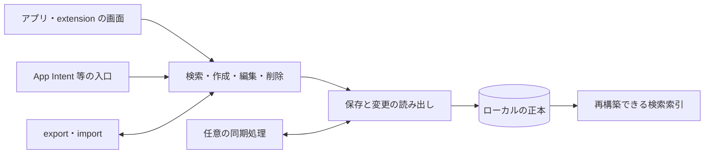

# データ・検索・同期・アプリ構成

MVPはApp Group内のApple同梱SQLite、専用actor、原文と検索キーの分離、revisionによる競合検出を採用し、同期は提供しない。SwiftData・Core Data・同期方式等は比較候補として扱う。採用契約は[製品設計](../docs/decisions/0002-mvp-app.md)、製品での成否は[MVPの検証結果](../docs/mvp-validation.md)を参照する。

対象は **iOS 26.0以上**。一次資料の確認日：2026-09-13。保存原文、検索、プロセス間共有、移行・復元、同期の設計条件を整理する。保存方式の比較と採用構成の評価に使う。

「事実」は一次資料の本文・API宣言、「推奨」はnibbleへの適用案、「未確認」はSDK・実機・試作で確認すべき条件を示す。Apple DocCの参照範囲は公式JSONの本文とmetadata。APIの使用時には個別のavailabilityを確認する。

## 1. 保存と利用の受け入れ条件

**設計上の推奨:** 保存方式を比較するため、次の体験を共通の受け入れ条件とする。

- 呼び出したら、ネットワーク待ちをせず最近使ったスニペットを読める。
- 作成・編集・削除の完了後、アプリと呼び出し先で古い内容を使わない。
- 保存失敗を成功として表示せず、入力した内容を回復できる。
- アプリ更新・強制終了・同期競合・インポートで本文を失わない。
- 検索しやすい表記と、貼り付ける原文を分ける。コード、改行、空白を勝手に変えない。

**事実:** SwiftData は SwiftUI との接続と保存を少ない記述で構成できる。一方、別プロセスからの変更反映、共有ストアの読み取り権限、CloudKit スキーマの制約、検索仕様は別途設計が必要である。`@Query` や App Groups を導入するだけでこれら全体が解決するとは読めない。[D01] [D06] [D09] [D10] [D20]

## 2. iOS 26.0 と API の確認範囲

| 技術 / API | 一次資料で確認した availability | nibble での扱い |
| --- | --- | --- |
| SwiftData `ModelContainer` / `ModelActor` | iOS 17.0 から。両 API の DocC metadata を確認 | 26.0 の候補。個別メソッド・新しい macro は別に確認する。[D02] [D05] |
| SwiftUI の Observation 対応 | 記事本文・metadata とも iOS 17.0 から | `@Observable` と依存するプロパティに絞った画面更新の候補。[D03] |
| SwiftData `HistoryDescriptor` | API metadata は iOS 18.0 から | 別プロセス更新の取り込みを検討できる。記事の全サンプルを 26.0 でコンパイル確認したわけではない。[D09] |
| Core Data `NSPersistentCloudKitContainer` | API metadata は iOS 13.0 から | ローカルストアを CloudKit に同期する候補。[D11] |
| `CKSyncEngine` | Swift API metadata は iOS 17.0 から | 独自ストアと CloudKit の同期を構成する候補。[D12] |
| Foundation `NSString.folding(options:locale:)` | API metadata は iOS 2.0 から | 検索用の文字比較に使える。locale と比較仕様は別途固定する。[D18] |
| App Groups / custom keyboard の読み取り権限 | 現行記事に動作説明があるが、記事自体に導入 OS の metadata はない | 導入OSは文書から確定できない。iOS 26.5の実機でentitlementと権限を確認する。[D06] [D20] |
| Swift の isolation / `Sendable` | 言語仕様。iOS の deployment target とコンパイラ設定は別の軸 | Xcode・Swift language mode・isolation 関連設定を採用時に記録する。[D04] |
| SQLite / FTS5 / trigram tokenizer | SQLite 公式仕様を確認。iOS 26.5 SimulatorではSQLite 3.51.0・ENABLE_FTS5・trigramを実測。実機は未確認 | 実機でライブラリの版と実際の tokenizer 作成・検索を確認し、利用可能と推測しない。[D14] [D15] |

## 3. 保存方式を比較する

| 候補 | 確認できた機能 | nibble で評価する点・負担 | 採用を後押しする条件 |
| --- | --- | --- | --- |
| SwiftData | `@Model` は永続化と Observation に対応。`ModelContainer` / `ModelContext` が保存を管理し、`@Query` / `FetchDescriptor` が検索・並び順・取得数等を扱う。App Group を指定でき、履歴 API と CloudKit 自動同期がある。[D01] [D02] [D09] [D10] | モデル変更、別プロセスの更新反映、extension の短い起動経路、必要な日本語検索を小さく試す。CloudKit 利用時はローカルだけの場合よりスキーマ制約が増える。 | 主要な呼び出し導線で初回読み込み・保存・更新反映が性能予算を満たし、検索と移行を無理なく表せる。 |
| Core Data | context の queue 分離、永続履歴、軽量移行、CloudKit に対応するストアを持つ。[D07] [D08] [D11] [D19] | managed object の queue 制約、モデルの版、履歴 token、context への merge を明示的に扱う。SwiftUI への接続方法も一貫させる。 | 履歴・競合・移行を細かく制御する必要があり、その実装負担より製品上の便益が大きい。 |
| SQLite を直接扱う構成 | WAL のトランザクション、FTS5 の全文検索、オンライン backup API がある。[D14] [D15] [D16] | モデルの符号化、SQL と schema migration、観測・変更通知、競合、同期、検索 index の整合性をアプリ側で設計する。使用する Swift ラッパーも別の依存選定。 | 独自検索・取得範囲・ストア操作の制御が不可欠であり、実機で得た効果が保守負担を上回る。 |

比較表の「評価する点・負担」と「採用を後押しする条件」は評価軸であり、Simulatorの単発保存・全件取得と30反復の検索結果は [実行検証](experiments/ios-26-5-validation.md) に記録する。実機のベンチマークは未取得。採用候補は同じデータと操作で比較し、機能、測定結果、保守負担を根拠に判断する。

**比較条件:** ResearchProbeはSwiftData・Core Data・SQLiteを同じID・タイトル・本文・revisionで評価する。3方式の独立接続と明示保存を基準にし、共有・移行・検索の受け入れ条件を照合する。構成は[研究用アプリの設計](../validation/RESEARCH.md#保存と検索)に定義する。表の基本APIはiOS 26.0の候補となる。Core Data/SwiftData が管理する内部ストアへ独自 SQL や FTS テーブルを書き足すことは、参照した公式資料に統合方法の裏付けがないため、検証を要する構成とする。

## 4. 状態と並行処理の境界

### APIの契約

SwiftUI は `body` が読み取った observable なプロパティへの依存を記録する。読んでいないプロパティだけが変わった場合、その依存による view 更新は起こらない。モデルを画面から分けることは Apple が modularity と testability の利点として説明している。[D03]

SwiftData の SwiftUI environment の `modelContext` と `container.mainContext` は main actor に結び付く。自動保存は未保存変更を定期的に確認して行われ、`save()` による明示保存も可能である。自動保存の存在は「ボタンを押した時点でディスク保存が完了した」という保証ではない。[D01]

actor は同じ actor の可変状態への同時アクセスを制限する。ただし `await` をまたいで別の処理が進むため、待機前の状態がそのまま保持されると仮定できない。`Task { ... }` は周囲の actor isolation を引き継ぐ。キャンセルも協調的であり、キャンセルを要求しただけで処理や結果反映が直ちに止まるわけではない。[D04]

Core Data の managed object は context と同じ queue に結び付く。Apple は managed object 自体を queue 間で渡さず `NSManagedObjectID` を使うこと、重い import を UI の main queue に載せないことを明示している。SwiftData には `Actor` に準拠する `ModelActor` があり、モデルへの排他的アクセスを表す。[D08] [D05]

### 設計上の推奨

画面、操作、保存、検索索引、同期・入出力の責務を分ける。次の図は候補となる責務の関係を示す。実際のmodule・protocol・packageの境界は、採用機能とテストの必要性から決める。

- UI の選択・フォーカス・編集中の下書きは、保存済みの本文と混同しない。保存が失敗したら再試行できる状態を残す。
- プロセス内では保存処理の隔離を明確にする。画面には安定 ID と表示に必要な値を渡し、context に属する可変オブジェクトを無条件に `Sendable` 扱いしない。
- main actor 上で `Task` を作っただけで重い正規化・検索・import が UI から分離したと判断しない。使用するコンパイラ設定で実行位置を確認し、Instruments で測る。
- 編集の `baseRevision` 等を持つ案を比較する。`await` 後の古い読み出し結果で最新の本文を上書きしない。
- 検索のキャンセルに加え、リクエストの世代番号等で「現在の入力に対応する結果だけを表示する」条件を持つ。
- 入口ごとに保存ロジックを複製せず、extension から使えない API と純粋なモデル処理を分ける。必要な入力から必要な出力を得られる狭い境界にする。

## 5. App Groups と複数プロセスの共有

### 共有領域と更新の整合性

App Groups は同じ開発チームのアプリ・extension が共有 container にアクセスする仕組みである。Apple は、少量の設定なら `UserDefaults(suiteName:)`、ファイルなら `containerURL(forSecurityApplicationGroupIdentifier:)` を入口として示している。単に同じ場所へアクセスできることと、競合解決・キャッシュ更新が行われることは別である。[D06]

Core Data は永続履歴と remote change notification を用いて関連する store transaction を読み、view context に merge する方法を示す。SwiftData History も、Widget や App Intent など別プロセスの変更を読み取って UI に反映する用途を明示している。token を永続化して差分を取得でき、履歴を消した後の古い token には失効エラーがある。[D07] [D09]

SQLite WAL では読み手と書き手が並行できるが、同時に書けるのは 1 接続である。長い読み取り transaction は checkpoint の進行を妨げ得る。actor はそのプロセス内の状態を扱う仕組みなので、アプリと extension に同名 actor を置いても共有ファイル全体の排他制御にはならない。[D14] [D04]

**設計上の推奨:** プロセスごとに context / DB 接続と変更取り込み位置を持つ。通知は再読み込みの契機とし、再開時・再呼び出し時にも履歴または版を確認する。履歴を消す担当と、全利用者が取り込んだと判断する条件を設計する。token が失効した場合は全体の再読み出し・検索 index 再構築へ戻れるようにする。共有 defaults をスニペット全件の DB や同時更新のロック代わりにしない。

### キーボードからの読取専用アクセス

現行 Apple 記事では、Full Access を許可していない custom keyboard も、containing app の shared group container を**読み取り専用でアクセス可能**としている。書き込みとネットワークアクセスには open access の設定およびユーザーによる許可が必要である。この記事自体は、この読み取り仕様の導入 OS を示していない。[D20]

SQLite は read-only WAL の可否に `-shm` / `-wal` の存在・読み取り権限等の条件を持つ。したがって「ファイルの read 権限がある」から「任意の SwiftData/Core Data/SQLite ストアをそのまま開ける」とは断定できない。[D14]

**未確認:** iOS 26.5のFull Accessなしキーボードから、選んだ保存方式の初期化・schema 検査・sidecar 読み取り・再読み込みが成功するか。読み取り中にアプリが保存・移行した場合の挙動も未確認。

**設計上の候補:** 権限と実測が許せば共有ストアを読む構成、難しければ containing app が用途を限定した読み取り用 snapshot を発行する構成を比べる。snapshot 案では版・原子的な公開・更新反映・含める項目を設計し、別の正本を作らない。変更されるライブ DB を `immutable` と偽って開いて権限問題を回避しない。

### SQLite の保守情報

SQLite 公式 WAL 文書は、複数接続が同時に write/checkpoint すると稀に破損につながる **WAL-reset bug** を説明している。修正は 3.51.3、バックポートは 3.44.6 / 3.50.7 にある。文書の更新日は 2026-08-25。公式自身が稀な条件であり緊急事態とはしていないが、修正版への更新を勧めている。[D14]

**未確認:** iOS 同梱版の修正・Apple のバックポート状況。この情報だけで iOS 26.0 や SwiftData/Core Data の破損を断定しない。SQLite を候補にする際は、実機の `sqlite_version()` / `sqlite_source_id()`、Apple の修正情報、依存更新の経路を確認する。upstream の版番号だけで Apple の修正有無を判定しない。

## 6. 日本語・Unicode・検索

### 原文と検索表現を分ける

Unicode の NFC/NFD は正準等価、NFKC/NFKD は互換等価を扱う。Unicode Standard Annex #15 は、NFKC/NFKD を任意の本文へ無条件に適用すると意味上重要な区別を消し得るため、むやみに適用してはならないと明記する。[D17]

Foundation の folding は大小・幅・ダイアクリティカルマーク等を比較時に無視するための文字列を作れるが、locale によって結果が異なる。Apple は折り畳んだ結果を表示用に適さないことがあるとし、内部処理用としている。[D18]

**設計上の推奨:** 保存・コピー・export は入力された原文を保つ。必要なら検索専用の派生列を作り、変換規則と版を記録して再構築可能にする。タイトル、本文、タグ、ショートカットのどこを検索するか、完全一致・前方一致・部分一致の順位を先に定義する。locale を変えたときに既存 index と新規検索で異なる規則を使わない。

### 日本語の部分一致とFTS5の制約

FTS5 の `unicode61` tokenizer は Unicode 6.1 の文字種で separator と token を区別し、連続した token 文字を 1 token にする。日本語の形態素解析をする仕様ではない。この規則から、空白のない日本語文中の任意部分が、語の完全一致と同じように見つかるとは期待できない。`porter` は英語用の stemming と明記される。[D15]

FTS5 の trigram tokenizer は部分一致を支援するが、全文検索 query で 3 Unicode 文字未満の部分文字列は一致しない。`LIKE` / `GLOB` の index 利用にも条件があり、常に index だけで短い検索が済むわけではない。external-content FTS は本文テーブルとの整合性を利用側が保つ責任を持ち、不整合時の結果は予想外になり得る。[D15]

**設計上の推奨:** 部分一致と並び順の正答集合を定義し、必要なデータ量・実測に応じてindexを比較する。trigram のみで 1〜2 文字の日本語検索を済ませない。FTS の検索構文と SQL の parameter binding は別なので、利用者が入力した引用符・記号等をどこまで検索式として扱うかを定義する。本文と index の更新、削除、import 後の再構築を一緒に検証する。

**検索コーパス:** ResearchProbeは結合濁点・半角カナ・英字大小幅・かな/カナ・絵文字・記号を比較し、期待集合と結果を[E10〜E12](experiments/ios-26-5-validation.md)に定義する。製品の検索評価には次の条件を含める。 `が` と結合濁点、`ｶﾞ` と `ガ`、全角英数・半角英数、ひらがな・カタカナ、絵文字と ZWJ、英大文字・小文字、空白・改行・タブ、URL、`_`・引用符・括弧を含むコード、1〜2 文字の検索、非常に長い本文。ひらがなとカタカナの同一視は Unicode 正規化で自動的に済む仕様ではなく、別の製品上の選択にする。

## 7. ローカルを基本にした任意同期

### APIの契約

SwiftData は CloudKit entitlement から自動同期を構成し、`NSPersistentCloudKitContainer` を利用する。自動同期を無効にするには `ModelConfiguration(cloudKitDatabase: .none)` を明示できる。[D10]

CloudKit を有効にした SwiftData の schema には unique constraint と nonoptional relationship の制約がある。また CloudKit の production schema は加算的で、公開済みの型を削除したり既存属性を変更したりする設計には制約がある。[D10]

Core Data の CloudKit 構成は、ローカル専用ストアと同期するストアを別々に設定できる。必要な entitlement / capability は iCloud、CloudKit、push、background の remote notifications を含む。[D11]

`CKSyncEngine` は通信状態・バッテリー・アカウント状態等に応じて同期するため、定期同期の時刻は不定である。内部状態の永続化、受信した変更のローカル保存、アカウント変更への対応はアプリ側の責任である。public database の同期には使わない。[D12]

`CKSyncEngine` は一部の一時エラーを再試行するが、`serverRecordChanged` のような製品固有の競合は解決しない。CloudKit は client / server / ancestor の record を提供し、再保存時は server record に変更を merge する必要がある。[D12] [D13]

### 設計上の推奨

- 呼び出し・検索・編集はローカル保存だけで成立させ、同期成功を操作完了の条件にしない。同期が未完了であることとローカル保存失敗を区別する。
- 同期は採用の有無から未決定とする。導入するなら、同期する本文・同期しない端末設定・機微なスニペットの扱いを先に決める。
- 安定したアプリ独自 ID、更新の版、削除の識別方法を考える。端末時計の `updatedAt` だけで本文の勝者を選ぶ方針を、無損失と呼ばない。
- 同じ本文の同時編集は、競合した内容を別候補として保持する方式と merge 方式を比較する。編集中の画面を無言で書き換えない。
- 削除と編集の競合、長期間オフラインの端末からの再送、アカウント切替、同期の無効化・再有効化を仕様に含める。別アカウントへ以前のローカルデータを自動送信しない。
- SwiftData/Core Data の自動同期と `CKSyncEngine` の自前同期を同じデータに重ねない。まず、どちらが同期を所有するかを一つに決める。

自動同期からclient/server/ancestor recordを直接受け取る競合callbackは、確認した公開API一覧には見つからなかった。[P08〜P09](experiments/primary-source-validation.md)に制御範囲を記録する。**未確認:** 製品のconflict UXを満たすモデル、`CKSyncEngine`で必要になる実装・運用量。どの案も2端末の通信・復旧試験はしていない。

## 8. モデル変更・移行・export/import・削除

SwiftData の `ModelContainer` は自動移行を行い、自動移行の範囲を超えるときに `SchemaMigrationPlan` を渡せる。Core Data の軽量移行にも扱える変更の条件があり、改名には renaming identifier を用いる。移行前後のモデルを見つけられる必要がある。[D02] [D19]

SwiftData History の `persistentModelID` はローカルストアの範囲での識別子で、端末やサービスをまたぐ安定 ID が必要なら別の属性を保持する例が示されている。削除後の識別に必要な属性を tombstone に残せるが、履歴自体にも容量・削除方針が必要となる。[D09]

WAL は DB の永続状態の一部である。開いたままの DB 本体だけをコピーし、WAL と切り離すとコミット済み内容が失われたり DB が破損したりし得る。SQLite の Online Backup API は稼働中の DB を整合した snapshot としてコピーするための仕組みである。[D14] [D16]

**設計上の推奨:**

1. 初版から schema の版を扱い、出荷した版の fixture を保存する。直前の版からだけでなく、更新を飛ばした古い版からの移行を確認する。
2. 読み込み・移行エラー時にストアを消して作り直す回復策を標準にしない。元データを残し、再試行・書き出し等の回復経路を設ける。
3. migration の最中に extension が古い schema で開く場合を想定する。移行を行う担当と、その他の入口が待つ・説明する条件を決める。
4. **利用者向け export** と **内部バックアップ** を分ける。export は独自の versioned format とし、ID・本文・タイトル等の意味を保つ。内部保存方式の置換や他アプリへの移行ができるようにする。
5. import はサイズ・形式・版・必須項目を検査し、一時領域で確認してから反映する。ID 重複、同じファイルの再 import、既存本文の上書き方針、途中失敗時の状態を明示する。
6. import の読み込みから保存まで原文が変わらず、export → import で往復できることを確かめる。検索用の派生 index は再生成可能にし、利用者向け正本にしない。
7. 削除は本文、検索 index、snapshot、履歴、バックアップ、同期先でそれぞれ何が残るかを整理する。削除履歴が必要でも本文まで無条件に保持しない。UI から消えたことを物理的な完全消去と同一視しない。

SwiftData/Core Dataの内部DBへSQLiteのbackup APIを直接使う構成には、frameworkの移行・保存と整合する公式の裏付けが必要となる。モデルを経由するexportも比較対象とする。

## 9. 避けたい失敗と検証条件

| 避けたい失敗 | 原因になる思い込み | 検証・設計で確認すること |
| --- | --- | --- |
| 保存直後に extension で古い本文が出る | `@Query` と共有 container だけで全プロセスに反映される | 保存完了 → 他入口の読み直し、履歴 token、再開時の取り込み。[D01] [D06] [D09] |
| 連続入力で画面が止まる | `async` / `Task` を付ければ main actor の仕事が軽くなる | CPU 処理と DB 操作の isolation、検索の世代、キャンセル、main-thread の占有。[D04] [D08] |
| Full Access なしでは使えない設計になる | 読み取りにも必ず Full Access が要る、または任意の DB を read-only で開ける | 現行の権限説明と、実機での DB 初期化・sidecar 条件を別々に確認。[D20] [D14] |
| 日本語の短い検索で結果が消える | `unicode61` / trigram がすべての部分一致を支援する | 1〜2 文字、分かち書きなし、記号、表記ゆれのコーパス。[D15] [D17] [D18] |
| コピーしたコードが元と違う | 検索用の正規化を本文へ上書きする | 原文の保持と export/import の往復。[D17] [D18] |
| 更新・障害回復でデータを失う | 自動移行は任意の変更に対応する、DB 本体のコピーで十分 | 旧版 fixture、移行失敗時の保持、WAL を含む整合した backup。[D02] [D19] [D14] [D16] |
| 他端末で消した内容が復活する / 編集が消える | 同期が自動なら削除・編集競合も製品の期待どおりになる | 同時編集、削除対編集、オフライン復帰、アカウント変更。[D09] [D12] [D13] |

### ローカル Mac / iOS 実機で行う比較試作

保存・検索・軽量移行・履歴・SQLite別プロセスの試作結果は [E01〜E15](experiments/ios-26-5-validation.md) に記録する。実extension・実機・同期・長期利用は未実施。ResearchProbeは`validation/research-project.json`で[共通基盤](../docs/ios-verification.md)へ接続し、実際のextensionと製品のtargetにも対応する設定を用意する。iOS 26.5のみを対象に、実機のRelease構成で、端末・OS・件数・本文長・検索内容・反復回数をそろえて比較する。

| 試作 | 観察・測定すること | 判断に使う結果 |
| --- | --- | --- |
| 保存方式 2 案以上の小さな CRUD | 初回 open、初回取得、保存完了、起動時のメモリ、エラー処理 | 同じ条件の中央値・失敗数。p95 は [03 の測定条件](03-ux-and-performance.md)に従い試行数と算出方法を決める。採用理由を ADR に残す。 |
| アプリと実際の extension の共有 | 同時編集・連打・プロセス終了・復帰後の内容と待ち時間 | データ欠落の有無、古い表示の解消時間、必要権限。 |
| キーボードの権限なし読み取り | Full Access の有無、初回生成前、更新・移行中、sidecar がない場合 | 成功可否と fallback。成功した OS・API だけを対応表へ反映。 |
| 日本語検索 | 例として 0 / 20 / 1,000 / 10,000 件と長文混在で比較。これは暫定負荷で、製品上限ではない | 正答集合、1〜2 文字検索、入力から結果までの遅延、index 容量。 |
| schema migration / import | 更新を飛ばす、旧版・重複・不正形式・容量不足・途中終了 | 元本文の保持、整合性、再試行・復旧可能性。 |
| 任意同期 | 2 台の実機、オフライン編集、削除との競合、遅延、アカウント切替 | 無言の本文消失がないこと、状態表示、復旧操作。 |
| 長期利用 | import・編集・削除の反復、history/WAL/index の増加 | 容量の上限設計、起動・検索の劣化、再構築と cleanup の所要時間。 |

画面・操作ができた段階では、スクリーンショットと画面録画に加えて計測結果を保存する。動画だけでレイテンシや性能向上を断定しない。クラウド Ubuntu は文書・純粋ロジック・形式等の検査を担当できるが、Apple の保存 API・extension・同期・UI の成立はローカル検証の責務である。

## 10. 資料台帳

すべて 2026-09-13 に閲読。年・更新日が本文に見つからなかった資料は「更新日不明」とし、copyright 年や API の導入 OS から公開年を推定しない。関連 API の availability を確認した場合は、本文と metadata を区別して記す。資料の全文はリポジトリに収録していない。

| ID | 著者・組織 / 資料・URL | 年・更新 / 実際の閲読範囲 | 制約 |
| --- | --- | --- | --- |
| D01 | Apple, [Preserving your app’s model data across launches](https://developer.apple.com/documentation/swiftdata/preserving-your-apps-model-data-across-launches) | 更新日不明。本文: `@Model`、属性、保存構成、App Group、自動/明示保存、取得。 | 現行の説明。掲載サンプル自体の実行結果ではない。ResearchProbeの実行結果は26.5に限定する。 |
| D02 | Apple, [ModelContainer](https://developer.apple.com/documentation/swiftdata/modelcontainer) | 更新日不明。本文・宣言・iOS availability metadata。 | 自動移行と migration plan の存在を確認。任意の schema 変更の安全性は保証しない。 |
| D03 | Apple, [Managing model data in your app](https://developer.apple.com/documentation/swiftui/managing-model-data-in-your-app) | 更新日不明。本文: Overview、observable model、view の依存追跡、collection と個別 view の例。availability metadata。 | 本文の該当部分を閲読。画面・性能の実測ではない。 |
| D04 | Apple / Swift project authors, [The Swift Programming Language — Concurrency](https://docs.swift.org/swift-book/documentation/the-swift-programming-language/concurrency/) | 更新日不明。本文: async/await、task、cancellation、isolation、MainActor、actor、Sendable。 | 言語説明。採用予定の Xcode・language mode・ビルド設定を確定するものではない。 |
| D05 | Apple, [ModelActor](https://developer.apple.com/documentation/swiftdata/modelactor) | 更新日不明。概要・protocol 宣言・iOS availability metadata。 | 本文は短い API reference。executor の実測や性能特性は未確認。 |
| D06 | Apple, [Configuring app groups](https://developer.apple.com/documentation/xcode/configuring-app-groups) | 更新日不明。本文: 登録、capability、共有 container、defaults、ファイル API。 | 追加の extension 権限や同時更新の製品仕様は規定しない。 |
| D07 | Apple, [Consuming relevant store changes](https://developer.apple.com/documentation/coredata/consuming-relevant-store-changes) | 更新日不明。本文: 履歴有効化、remote change、token、filter/merge、tombstone、purge。 | notification の配送時間や nibble の実装を保証しない。 |
| D08 | Apple, [Using Core Data in the background](https://developer.apple.com/documentation/coredata/using-core-data-in-the-background) | 更新日不明。本文全節: context の queue 制約、background import、object ID の受け渡し。 | concurrency の原則。測定値はない。 |
| D09 | Apple, [Fetching and filtering time-based model changes](https://developer.apple.com/documentation/swiftdata/fetching-and-filtering-time-based-model-changes) / [HistoryDescriptor](https://developer.apple.com/documentation/swiftdata/historydescriptor) | 更新日不明。前者は本文: 別プロセス、transaction、token、削除と保持。後者は宣言・availability metadata。 | 2 ページ。DefaultStore の例であり、すべての custom store が履歴を提供するわけではない。 |
| D10 | Apple, [Syncing model data across a person’s devices](https://developer.apple.com/documentation/swiftdata/syncing-model-data-across-a-persons-devices) | 更新日不明。本文全節: capability、CloudKit schema 制約、初期化、container 選択、`.none`。 | 現行ガイド。サンプルの schema 初期化を実行していない。 |
| D11 | Apple, [Setting Up Core Data with CloudKit](https://developer.apple.com/documentation/coredata/setting-up-core-data-with-cloudkit) / [NSPersistentCloudKitContainer](https://developer.apple.com/documentation/coredata/nspersistentcloudkitcontainer) | 更新日不明。前者は本文: capability、local/cloud store 構成。後者は概要・宣言・availability metadata。 | 2 ページ。複数端末での動作・競合試験は未実施。 |
| D12 | Apple, [CKSyncEngine](https://developer.apple.com/documentation/cloudkit/cksyncengine-5sie5) | 更新日不明。本文: scheduling、state、send/fetch、error handling、accounts。宣言・availability metadata。 | 現行 API。本文にある全メソッドの導入 OS を個別に確認したわけではない。 |
| D13 | Apple, [CKError.Code.serverRecordChanged](https://developer.apple.com/documentation/cloudkit/ckerror/code/serverrecordchanged) | 更新日不明。本文: client/server/ancestor record と再保存。 | CloudKit の直接利用の説明。SwiftData 自動同期で同じ制御が公開されると推定しない。 |
| D14 | SQLite project, [Write-Ahead Logging](https://www.sqlite.org/wal.html) | 2026-08-25 更新。本文: §§1–6、9、11。並行性、checkpoint、sidecar、read-only、BUSY、WAL-reset bug。 | upstream SQLite の仕様と修正情報。Apple 同梱版の修正有無は未確認。 |
| D15 | SQLite project, [SQLite FTS5 Extension](https://www.sqlite.org/fts5.html) | 更新日不明。本文: Overview、§4.3 tokenizers、§4.4 external/contentless tables と不整合・rebuild。 | 文書全体の全 API を調査したわけではない。26.5 Simulatorのunicode61/trigramはE10で確認、実機は未確認。 |
| D16 | SQLite project, [SQLite Backup API](https://www.sqlite.org/backup.html) | 更新日不明。本文: §§1、1.1、3、3.1。online backup、snapshot、並行更新と lock。 | 直接 SQLite を扱う場合の参考。framework 管理ストアへの直接適用は未検証。 |
| D17 | Unicode Consortium / editor Ken Whistler, [Unicode Standard Annex #15: Unicode Normalization Forms, revision 57](https://www.unicode.org/reports/tr15/tr15-57.html) | Unicode 17.0.0、2025-07-30。本文: header/status、§1.1–1.3、正準/互換等価、NFKC/NFKD の注意。 | 正規化仕様であり、検索順位・日本語分かち書きの仕様ではない。閲読時の latest はこの版。 |
| D18 | Apple, [NSString.folding(options:locale:)](https://developer.apple.com/documentation/foundation/nsstring/folding(options:locale:)) | 更新日不明。本文・宣言・availability metadata。 | locale と option に依存。E11の試作用期待集合は実測済み。製品の最終仕様は未決定。 |
| D19 | Apple, [Migrating your data model automatically](https://developer.apple.com/documentation/coredata/migrating-your-data-model-automatically) | 更新日不明。本文全節: 可能な変更、改名、source/destination model、推論可否。 | Core Data のガイド。SwiftData に個々の移行条件をそのまま当てはめない。 |
| D20 | Apple, [Configuring open access for a custom keyboard](https://developer.apple.com/documentation/uikit/configuring-open-access-for-a-custom-keyboard) | 更新日不明。本文: open access、read-only shared container、Full Access、利用者の信頼。 | 現行説明。読み取り仕様の開始 OS と DB ライブラリの実動作は未確認。 |

[D01]: https://developer.apple.com/documentation/swiftdata/preserving-your-apps-model-data-across-launches
[D02]: https://developer.apple.com/documentation/swiftdata/modelcontainer
[D03]: https://developer.apple.com/documentation/swiftui/managing-model-data-in-your-app
[D04]: https://docs.swift.org/swift-book/documentation/the-swift-programming-language/concurrency/
[D05]: https://developer.apple.com/documentation/swiftdata/modelactor
[D06]: https://developer.apple.com/documentation/xcode/configuring-app-groups
[D07]: https://developer.apple.com/documentation/coredata/consuming-relevant-store-changes
[D08]: https://developer.apple.com/documentation/coredata/using-core-data-in-the-background
[D09]: https://developer.apple.com/documentation/swiftdata/fetching-and-filtering-time-based-model-changes
[D10]: https://developer.apple.com/documentation/swiftdata/syncing-model-data-across-a-persons-devices
[D11]: https://developer.apple.com/documentation/coredata/setting-up-core-data-with-cloudkit
[D12]: https://developer.apple.com/documentation/cloudkit/cksyncengine-5sie5
[D13]: https://developer.apple.com/documentation/cloudkit/ckerror/code/serverrecordchanged
[D14]: https://www.sqlite.org/wal.html
[D15]: https://www.sqlite.org/fts5.html
[D16]: https://www.sqlite.org/backup.html
[D17]: https://www.unicode.org/reports/tr15/tr15-57.html
[D18]: https://developer.apple.com/documentation/foundation/nsstring/folding(options:locale:)
[D19]: https://developer.apple.com/documentation/coredata/migrating-your-data-model-automatically
[D20]: https://developer.apple.com/documentation/uikit/configuring-open-access-for-a-custom-keyboard
