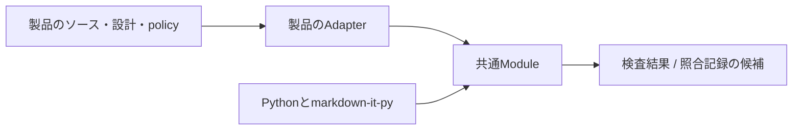

# UI設計と照合のツールキット

UIを利用者の目的から構成し、部品の意味・配置理由・評価条件を保守するためのModuleである。設計の手順、判断記録のひな形、実装と文書の未確認変更を検出するCLIを一つのディレクトリで管理する。

製品は仕様・根拠資料・検証結果・検査範囲を所有する。Moduleはそれらを配置するディレクトリ名、UIフレームワーク、OS、Gitホストを前提にしない。

## 所有するもの

| 所有者 | 内容 |
| --- | --- |
| 共通Module | [設計手順](workflow.md)、[ひな形](templates/decision.md)、ファイルの照合、MarkdownのID・参照検査、CLI、テスト、Python依存の宣言 |
| 利用する製品 | 利用場面、画面・部品、色・寸法・文言、根拠の採否、実行評価、policy、照合記録 |
| 製品のAdapter | 設定ファイルの選択、既存コマンドとCIへの接続、Moduleの配置場所と使用revisionの固定 |



[engine.py](ui_design/engine.py)は製品のモジュールをimportせず、Git・ネットワーク・UI実行環境も呼び出さない。共通化するのは設計と照合の仕組みであり、製品固有の画面構成やデザイン値は製品側へ置く。

## 実行環境

Python 3.12以上とmarkdown-it-pyを使う。Python依存は[python-packages.nix](python-packages.nix)、単独用runtimeは[default.nix](default.nix)で宣言する。利用側のNixでnixpkgsを固定して渡す。親リポジトリの追加Python依存を共有Moduleが要求することはない。

```nix
# pkgsは利用側がlockで固定したnixpkgs。
uiDesignPython = (import ./tools/ui-design/default.nix) pkgs;
```

Python環境の取得後は、このディレクトリをPythonの検索先に置く。CLIのrootは検査する製品を指定し、カレントディレクトリやModuleの配置場所から推定しない。

```sh
PYTHONPATH=/path/to/ui-design python3 -m ui_design \
  --root /path/to/product --config design/policy.json check
```

## Interface

公開するPythonの操作は2つとする。[__init__.py](ui_design/__init__.py)からimportする。

| 操作 | 結果・契約 |
| --- | --- |
| `check(root, config)` | `inputs`、`ids`、`errors`を持つJSON互換dict。照合記録を変更しない |
| `snapshot(root, config, summary, references)` | 明示的な設計照合後に、記録の候補をdictとして返す。ファイルへの反映や承認を行わない |

`root`は製品のルート、`config`と`references`はそのルートからの相対パス。設定やファイルの不正は`ValueError` / `OSError`で返す。検査エラーがある状態ではsnapshotを作れない。ID検査やファイル列挙など内部の関数へ利用側から依存しない。

CLIは`--root`、`--config`、`check`または`snapshot`を受け取る。`snapshot`には`--summary`と一つ以上の`--reference`が必要。stdoutはJSON、設定・読取エラーはstderrへ出し、成功は終了コード0、検査・設定エラーは1、引数の不正は2とする。照合は対象ファイル全体を読み、処理量はその合計サイズに比例する。

## 製品設定の形式

policyと照合記録はversion 1。未対応version、必須項目の欠落、未知の項目、重複キーを拒否する。暗黙の設定や自動的な形式変換は持たない。

```json
{
  "version": 1,
  "record": "design/review.json",
  "inputs": [
    {"path": "src", "kind": "tree", "exclude_directories": ["cache"], "exclude_files": ["*.tmp"]},
    {"path": "design", "kind": "tree", "references": true}
  ],
  "registries": [
    {"prefix": "C", "path": "design/components.md", "format": "table", "columns": 4},
    {"prefix": "S", "path": "design/screens.md", "format": "heading"}
  ]
}
```

| 項目 | 契約 |
| --- | --- |
| `record` | 照合記録の保存先。入力のhashからは除外し、内容と形式を検査する |
| `inputs` | `tree`は配下を列挙、`file`は1ファイル。指定先が欠落した場合やtreeが空の場合は失敗する |
| `references` | `true`の入力に含まれるMarkdownをID・参照の検査に使う。既定は`false`で、変更の照合のみ行う |
| 除外 | treeだけが指定できる。ディレクトリ名・ファイル名に対する大小文字を区別したglob。パス区切りを含めない |
| `registries` | IDの接頭辞、Markdownの場所、見出しまたは表。表では列数も指定し、空欄を拒否する |
| 接頭辞 | 重複しない英大文字。IDは接頭辞と2桁以上の数字。数値は2桁を最小幅とし、それ以上の不要な先頭0を付けない |
| パス | 製品ルート内の正規化された相対POSIXパス。絶対パス、`..`、symlinkを拒否する |

利用側は、Moduleのrevisionを固定するlockまたは取り込んだModuleのディレクトリもinputsに含め、共通ルールの更新時に影響を確認する。policy自身は必ず照合対象に含む。対象を減らす、除外を広げる、台帳を差し替える変更も見直しが必要になる。照合記録の一覧から入力を削っても範囲は狭まらない。台帳は`references: true`のinputsに含まれている必要がある。共通ツールの説明やソース内のREADMEを製品のID台帳として扱わないため、ファイルの照合対象と設計参照の対象を分ける。

見出しまたは表の先頭欄をIDの定義として扱い、文書内のIDと範囲参照を照合する。コメントやコードブロック内の見本は定義にならない。設定に宣言していない接頭辞の文字列はIDとして扱わない。

## 設計と照合記録の更新

[設計手順](workflow.md)で目的と仕様を整理し、[ひな形](templates/decision.md)で判断を残す。対象のソース・仕様・観測を見直した後、snapshotの候補と前の記録を比較する。候補を採用してからcheckを実行する。CIにsnapshotの自動反映を組み込まない。

照合記録は`version`、`summary`、`references`、`files`を持つ。`files`は相対パスとSHA-256の対応であり、差分の追加・変更・削除を検出する。Moduleを別の絶対パスへ移しても、製品内のパスと内容が同じなら照合結果は変わらない。

## 独立した検証

このディレクトリと上記runtimeだけを使って実行する。

```sh
python3 -m unittest discover -s /path/to/ui-design/tests -v
```

テストは一時ディレクトリに製品を構成する。異なる製品設定、別の接頭辞・表の列数、ファイルの追加・改名・削除、不正なpolicy、検査範囲の縮小、記録の欠落を扱う。ディレクトリ全体を別の場所へコピーし、そのコピーのCLIからWeb用fixtureを検査するケースも含む。実際の製品やGit checkoutを必要としない。

## 別リポジトリへの移行

移行単位は**このディレクトリ全体**とする。履歴を保持して抽出する場合は、このパスを単位に扱う。

1. Module、設計手順、ひな形、テスト、Nix依存宣言を移す。製品のpolicy・仕様・照合記録は製品側に残す。
2. 移行先のNixで依存を固定し、独立テストとコピー後のCLIテストを実行する。
3. 利用側は外部リポジトリのrevisionを固定して取得し、Adapterのimport先またはCLI呼出先を置き換える。自動追従するブランチを依存先にしない。
4. 利用側の通常の必須検査からcheckを実行し、既存記録の照合、新規ファイルの検出、policy欠落時の失敗を確認する。
5. バージョンや形式を変更する場合は、互換条件と記録の更新手順を定義する。設定読取に失敗した状態を検査省略へ変換しない。

共通Moduleの変更はこのディレクトリに集約し、製品固有の例外はpolicyへ置く。外部の配布先・取得方法は利用側が決めるため、このModuleはダウンロードや更新の機能を持たない。

## 保証範囲

検査は記録した内容の一致とIDの構造を確認する。設計理由の正しさ、利用者評価、実際に見直した事実、外部指針の更新は証明しない。確認せず記録を再生成することはレビューで防ぎ、UIの挙動は利用する製品の実行環境で評価する。
