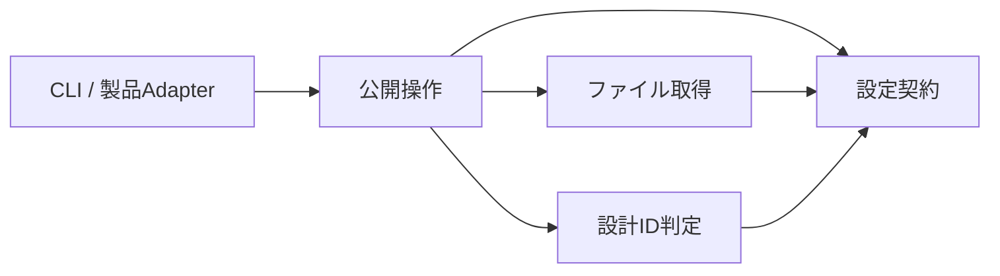

# UI設計と照合のツールキット

このツールキットは、UIの各画面・部品に目的、配置理由、評価条件を持たせ、実装と設計資料を同じ変更単位で保守するための開発基盤である。[設計手順](workflow.md)、記録のひな形、Pythonによる照合処理、コマンドラインから使うCLI、テストを提供する。

利用する製品は、自分の画面・部品・デザイン値と検査対象を定義する。ツールキットはその定義を読み、設計IDの不整合と、確認済みの内容から変わったファイルを報告する。利用者に適した設計かどうかは、根拠の検討と対象環境での評価によって判断する。

## 用語と管理対象

| 用語 | 意味と所有者 |
| --- | --- |
| 設計台帳 | 画面・部品・共通原則などをID付きで記す製品のMarkdown文書 |
| 設計ID | 意味と責務を識別する名前。接頭辞と番号で表し、実装の型名とは独立して管理する |
| policy | 検査対象、除外、台帳の形式、照合記録の保存先を指定する製品のJSON設定 |
| 照合記録 | 確認したファイルのSHA-256、判断の要約、確認文書を保持するJSON。SHA-256はファイル内容を照合するための値 |
| Module | 一つの責務を、呼出側に公開する操作と内部実装で提供する単位 |
| Interface | 呼出側が守る操作・入力・結果・失敗・性能の契約 |
| Adapter | 製品の設定、コマンド、CIを共通Moduleへ接続する処理 |

| 管理場所 | 管理するもの |
| --- | --- |
| このディレクトリ | 設計手順、ひな形、照合の実装、CLI、テスト、Python依存の宣言 |
| 製品のリポジトリ | 利用場面、画面・部品、色・寸法・文言、根拠、検証結果、policy、照合記録 |
| 製品のAdapterと依存設定 | policyの選択、必須CIへの接続、ツールキットの配置場所と使用revision |

製品のデザイン値と技術選定は製品が所有する。共通Moduleは、製品のディレクトリ名、UIフレームワーク、OS、Gitホストを前提にしない。

## 設計と照合の流れ

1. [設計手順](workflow.md)に従い、利用場面、画面・部品の責務、採用理由、評価条件を製品の台帳へ記す。
2. 実装と台帳を確認し、必要な実操作・テストの結果を対象ソースとともに記録する。
3. `snapshot`で照合記録の候補を生成し、その内容をレビューしてpolicyの保存先へ反映する。
4. `check`をローカルと必須CIで実行する。記録と異なる追加・変更・削除、およびIDの不整合がある場合は失敗する。

初回の照合記録がない状態も`check`は失敗として扱う。`snapshot`は、設定・入力・設計ID・判断要約が成立していれば候補を作れる。候補の生成は、設計の承認やファイルへの書き込みを意味しない。CIは`check`を実行し、照合記録を自動更新しない。

## Interface

公開するPythonの操作は[__init__.py](ui_design/__init__.py)の2つである。内部の関数や型は製品から直接利用しない。

| 操作 | 入力と結果 |
| --- | --- |
| `check(root, config)` | 入力ファイル数`inputs`、接頭辞ごとのID件数`ids`、診断文字列の配列`errors`を持つdictを返す |
| `snapshot(root, config, summary, references)` | `version`、`summary`、`references`、`files`を持つ照合記録の候補をdictで返す |

`root`は製品のルート。`config`はpolicyの相対パス、`references`は実際に確認した設計文書の相対パスを並べたリスト、`summary`は設計への影響と判断を記す空でない文字列とする。参照先はpolicyでID検査の対象にしたMarkdownから選ぶ。

`check`は照合記録の欠落・不正・不一致と設計IDの問題を`errors`へ返す。設定や入力の不正、ファイル読取の失敗は`ValueError`または`OSError`になる。`snapshot`は不正な入力や設計IDを拒否し、照合記録の候補を作れない理由を例外で返す。返却値は呼出しごとに独立する。

CLIも同じ2操作を使う。結果のJSONは標準出力、設定・読取エラーは標準エラーへ出す。終了コードは成功が0、検査・設定エラーが1、引数の不正が2である。

## 製品設定の形式

policyと照合記録の形式はversion 1。必須項目の欠落、未知の項目、重複キー、未対応versionを拒否する。以下は`src/`を実装、`design/`を設計資料として使う製品の例である。

```json
{
  "version": 1,
  "record": "design/review.json",
  "inputs": [
    {"path": "src", "kind": "tree", "exclude_directories": ["cache"], "exclude_files": ["*.tmp"]},
    {"path": "design", "kind": "tree", "references": true}
  ],
  "registries": [
    {"prefix": "C", "path": "design/components.md", "format": "table", "columns": 4},
    {"prefix": "S", "path": "design/screens.md", "format": "heading"}
  ]
}
```

| 項目 | 契約 |
| --- | --- |
| `record` | 照合記録の保存先。hashの入力からは除外し、記録の形式と内容を検査する |
| `inputs` | `tree`は配下を列挙、`file`は1ファイル。指定先の欠落や空のtreeは失敗になる |
| `references` | `true`の入力に含まれるMarkdownをID・参照検査に使う。既定の`false`はファイル内容の照合だけを行う |
| 除外 | treeのディレクトリ名・ファイル名へ適用する、大文字小文字を区別したglob。パス区切りは含めない |
| `registries` | 重複しないID接頭辞、台帳のパス、見出し`heading`または表`table`を指定。表では`columns`も必須 |
| ID | 接頭辞は英大文字。番号は2桁以上とし、2桁を超える不要な先頭0は付けない |
| パス | 製品ルート内の正規化された相対POSIXパス。絶対パス、`..`、symlinkを拒否する |

台帳は`references: true`の入力に含める。見出しや表の先頭欄をID定義として読み、重複、未定義参照、不正な範囲、表の必須欄不足を検査する。コメントとコードブロックは定義にならない。policyで宣言した接頭辞がIDの検査対象となる。

照合記録の`files`は相対パスとSHA-256の対応である。入力一覧はpolicyと実ファイルから決めるため、照合記録の一覧を削って検査範囲を狭めることはできない。policy自身も必ず照合する。利用側は共通Moduleのディレクトリ、またはそのrevisionを固定するlockも入力へ含め、共通ルールの変更をレビュー対象にする。

## 内部の責務と依存



| Module | 責務と理由 |
| --- | --- |
| [設定契約](ui_design/_policy.py) | JSONを検証し、変更不能な入力・台帳の定義にする。処理中の設定変更を防ぐ |
| [ファイル取得](ui_design/_sources.py) | 列挙、除外、パス検査、読取、hash計算を担当する。ファイル操作の影響と失敗を一か所で扱う |
| [設計ID判定](ui_design/_catalog.py) | 取得済みの文字列から件数と診断を作る。ファイルを開かず、同じ入力に対して同じ判定を返す |
| [公開操作](ui_design/engine.py) | 取得と判定を組み合わせ、照合記録を比較するか候補を返す。呼出側は処理の内部順序を管理しない |
| [CLI](ui_design/cli.py) / 製品Adapter | 引数、製品設定、import先、結果表示を担当する。実行環境固有の処理をここへ置く |

下位Moduleは公開操作・CLI・製品のコードをimportしない。設定とIDの判定は値だけを扱い、実ファイルの読取はファイル取得Moduleへ集約する。hashと文書解析には同じ読取内容を使い、policyも実際に解釈した内容からhashを計算する。

## 性能と実行中の状態

- 重なる検査範囲に含まれる入力も、1回の検査では1回だけ読む。
- ソース・アセットのhashは128 KiBずつ計算する。設計文書は解析に必要な本文を保持する。
- Markdownの構文木は文書ごとに処理して解放する。表は行とセルを順に走査する。
- 保持量はパス・hash、設計文書の本文・ID・診断、最大の文書の構文木に依存する。
- parserと収集結果は呼出しごとに所有する。同じprocessから独立した検査を並行して呼べる。1回の検査内の列挙・解析は直列とする。

この構成は、入力サイズに応じた読取と必要な文書解析に処理を限定する。ファイルシステム全体の書込ロックは提供しないため、検査中の対象ファイルを別processから編集しない。

## 導入と実行

Python 3.12以上とmarkdown-it-pyを使う。依存は[python-packages.nix](python-packages.nix)、単独実行用のPython環境は[default.nix](default.nix)に定義する。利用側がlockで固定したnixpkgsを渡す。

```nix
uiDesignPython = (import ./tools/ui-design/default.nix) pkgs;
```

製品側でpolicy、台帳、入力ファイルを用意し、このディレクトリをPythonの検索先へ指定する。次のパスは利用環境に合わせる。`snapshot`の要約は実際に行った確認を記す。

```sh
PYTHONPATH=/path/to/ui-design python3 -m ui_design \
  --root /path/to/product --config design/policy.json snapshot \
  --summary '対象の実装と設計を確認した判断の要約' \
  --reference design/components.md

PYTHONPATH=/path/to/ui-design python3 -m ui_design \
  --root /path/to/product --config design/policy.json check
```

最初のコマンドが出力する候補をレビューし、`record`で指定したファイルへ反映してから次のコマンドを実行する。必須CIへは`check`を接続し、設定や入力の読取失敗もジョブの失敗として扱う。

## テストと測定

[独立テスト](tests/test_engine.py)は、一時ディレクトリの製品に対して公開Interfaceを検査する。欠落・変更・不正な入力の拒否、1回読取、分割ハッシュ、返却値と並行呼出しの独立性を確認する。ツールキットを別の場所へコピーし、異なるパス・ID体系・表の列数でCLIを実行する検証も含む。利用する製品は、必須検査との接続を自分のテストで確認する。

```sh
python3 -m unittest discover -s /path/to/ui-design/tests -v
python3 /path/to/ui-design/benchmarks/measure.py \
  --toolkit /path/to/implementation --samples 7
```

[性能測定](benchmarks/measure.py)は、小規模、1,500部品、32 MiBアセットの固定入力を使う。API時間、process起動を含むCLI時間、Python割当のピーク、実行ソースサイズをJSONで返す。時間は同じ端末・実行環境で直列に比較し、ピークメモリは時間と別に測る。Python割当とprocess全体のRSSは区別する。測定値は対象実装と条件に結び付け、読取回数などの性能契約は回帰テストで維持する。

## 配置と配布の契約

配布・移管の単位は、このディレクトリ全体である。製品のpolicy・仕様・照合記録は製品側で管理する。別リポジトリに配置する場合は、利用側が取得するrevisionを固定し、Adapterのimport先またはCLI呼出先を設定する。

配置先を変更したら、独立テスト、コピー先のCLI、製品の必須検査を実行する。入力の相対パスと内容が同じなら、ツールキットの絶対パスに関係なく照合結果は同じになる。設定形式やInterfaceの版を変更する場合は、互換条件と記録の更新手順を定義する。

## 保証範囲

機械検査はファイル内容とID構造の整合性を確認する。設計理由の正しさ、実際にレビューした事実、利用者への適合、外部指針の更新は判定しない。レビューでは判断要約と実差分を照合し、UIの挙動と使いやすさは製品の実行環境で評価する。
