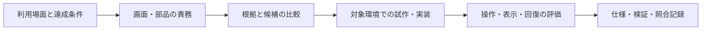

# UI/UXを構成し、判断を保守する手順

目的は、各画面と部品を利用者の行動に結び付け、変更理由と評価方法を共有できるようにすること。外部指針、製品の採用判断、効果の仮説、観測結果を区別して記録する。

## 設計から評価まで

| 段階 | 決めること | 成果物 |
| --- | --- | --- |
| 利用場面 | 利用者の目的、対象データ、利用環境、操作後の復帰先 | 製品の目的と制約 |
| 構成 | 現在地、対象選択、内容、操作、結果、入力・待機・失敗・中断・復旧 | [画面](templates/screen.md)と[部品](templates/components.md)の責務 |
| 候補の比較 | 配置理由、代替案、外部指針の適用範囲、未確認の効果 | [判断記録](templates/decision.md)、[根拠](templates/evidence.md) |
| 実装 | 共通表現、状態の所有者、操作の完了、対象プラットフォームの制約 | 製品コードと試作 |
| 評価 | 対象の識別、到達性、入力保持、失敗からの回復、操作・表示条件への適応 | 対象ソース・環境・手順を持つ観測 |
| 維持 | 採用構成、未解決事項、再検討の条件 | [監査](templates/audit.md)、照合記録 |

画面・部品には目的、構成、配置理由、代替案の利点と負担、評価条件を持たせる。複数画面で共有する文字・色・余白・動きは[共通原則](templates/foundations.md)へまとめる。情報構造や操作の意味を決める選択には判断記録を作り、契約内の調整には対象の台帳へ理由を残す。

## 根拠と仮説

| 種類 | 残す情報 |
| --- | --- |
| 外部指針 | 発行主体、出典、確認日、読んだ範囲、対象環境と適用限界 |
| 製品判断 | 利用場面、制約、選んだ案、代替案とのトレードオフ |
| 仮説 | 期待する効果、その期待を確かめる条件、見直す条件 |
| 観測 | 対象ソース、環境、データ、手順、結果、未実施項目 |

配置・寸法・待ち時間の値は、役割と制約に結び付ける。比較には同じデータ、表示条件、入力方法を使い、利用者の学習や試行順の影響を記録する。少数の評価結果は、その参加者と利用場面の範囲で解釈する。

## 試作と製品仕様の管理

情報の順序は構成図、入力・スクロール・素材・支援技術の挙動は対象環境の試作で確認する。補助的なデザインツールを使う場合は比較目的を決め、採用した仕様を製品の設計資料へ反映する。

部品IDは意味と責務に結び付け、実装上の型の分割・改名と分けて管理する。テンプレートは記載項目のひな形であり、製品の台帳を上書きする生成元にはしない。製品の色・寸法・ナビゲーション・技術選定は製品が所有する。

## 変更時の照合

1. 変更したソース・設定・アセット・文書と、対象IDを対応させる。
2. 仕様を変える場合は文書を更新する。維持する場合は、その判断の根拠を要約する。実装上の不足は監査へ残す。
3. 必要なテスト・実操作を行い、対象ソースと条件を持つ検証記録を残す。
4. 確認した文書と判断の要約から照合記録の候補を生成し、差分をレビューして採用する。
5. 必須CIでcheckを実行し、実装・設計・照合記録を同じ変更単位で扱う。

設定の追加・除外・対象変更もレビューする。CIによる記録の自動反映は禁止する。機械検査は更新忘れと構造的な不整合を検出し、設計理由と実際の使いやすさはレビュー・実操作・利用者評価が担当する。
